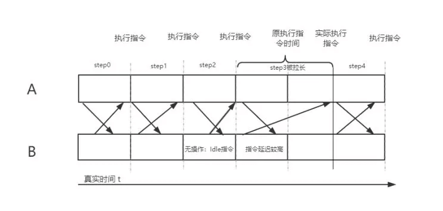

# 一、网络同步和网络架构

> 网络同步的目标就是保证多个客户端的游戏表现完全一致。    

> 网络同步 = 数据同步 + 表现同步    

> 两种主要架构：P2P架构、CS架构。    
> 两种同步方式：帧同步、状态同步。  

### 帧同步和状态同步：    

最大区别是战斗核心逻辑在哪，状态同步在服务端，帧同步在客户端。    

- ⭕状态同步：    

在状态同步游戏中，客户端实质上是服务端数据的渲染器。    

> 所有MMO游戏例如《魔兽世界》必须把战斗逻辑写在服务器端，所以MMO游戏必须是状态同步的，因为客户端无法计算整个世界的所有行为。    

- ⭕帧同步：    

帧同步要求绝对一致。

> 早期的帧同步是都是P2P架构的。    
> 在CS架构下的帧同步，服务器只负责转发指令，不进行任何逻辑计算。    
> 格斗游戏和RTS类游戏一般会采用帧同步。    

- ⭕区别：    

> 帧同步响应下较差，需要发送指令至服务器再等服务器返回按帧执行。状态同步可以更好地进行预表现优化。    
> 帧同步的流量消耗小。    
> 帧同步回放好做，只需要保存所有人的操作。    
> 帧同步安全性比状态同步低。因为状态同步所有逻辑和数值是在服务器计算的。    
> 帧同步服务器压力更小。    
> 帧同步开发效率高很多。同一套方案可能可以给不同类型的游戏使用。    
> 帧同步需要注意平台差异。注意随机数等问题。状态同步跨平台容易。        
> 状态同步的掉线重连好做，帧同步的掉线重连很困难。    

- ⭕选择：  

> Mack：大部分类型游戏，两种同步方式都可以使用，但绝大部分游戏使用状态同步，大量玩家战斗的游戏只能使用状态同步。

 
 
 

# 二、LockStep       

> LockStep被翻译为帧同步，是一种翻译上的失误。        

> LockStep的目标是保证多台机器的游戏表现**完全一致**，即两边客户端通过完全一致的操作计算出完全一致的状态。    
> 由于网络延迟存在，时刻保持相同是不可能的，尽可能在一个turn内保持一致。    
> 如果有人因为网络延迟等原因没有同步推进，那么就需要等他，这就是LockStep（或者说一种停等协议）。    
> LockStep是很朴素的一种思想，很早就用于计算机仿真模拟、计算机数据同步等领域。    
> 早期的LockStep被广泛应用于局域网游戏中，延迟很低，所以这种策略很有效。    

### 基本原理：    

LockStep每个回合的触发，并不是由收到网络包驱动，也不是由渲染帧驱动，而是采用客户端内在的时钟稳定按照一定间隔(例如100ms)的心跳前进。    
游戏的一开始，玩家在本地进行操作，操作指令会被缓存起来。在回合结束前(网络延迟50ms内)，我们会收到所有其他客户端的指令数据，然后和前面缓存的指令一同执行并推进到下一个回合。如果玩家在一个回合开始到50ms（网络延迟的一半）都没有任何操作，我们就可以认为玩家发出了一个IDLE指令，打包发给其他客户端。    

### 补充：    

LockStep做回放很容易。把指令都存储起来，就可以推演出整场比赛。    

LockStep发送指令而不是状态，其实跟当时的网络带宽相关。玩家每个回合能做的操作也是有限甚至是不操作，所有玩家的指令一共也占不了多少带宽。换成状态的话数据量会大大膨胀。    

从原则上说，锁步数据既可以是游戏角色的状态信息，也可以是玩家的操作指令，只是由于各种原因没有采取状态数据罢了。    

### 缺点：    

网络条件差的客户端很容易影响其他玩家游戏体验。（后来有很多优化手段：乐观帧锁定、渲染和同步拆开，客户端预执行、指令流水线化、操作回滚等）    

很难保证命令一致的情况下，所有客户端的计算结果完全一致（特别是跨平台）。包括浮点数误差、容器排序不确定性、随机数计算不统一等。（可以考虑使用定点数、随机计算使用一样的种子等）    

### 乐观帧锁定：    

针对传统严格帧锁定算法中网速慢会卡到网速快的问题，实践中线上动作游戏常用“定时不等待”的乐观方式在每次Interval时钟发生时固定将操作广播给所有用户，不依赖具体每个玩家是否有操作更新。    

 
 
 

# 三、状态同步    

> 在二十年前，相比于使用LockStep还是状态同步，开发者更关心的是网络架构的实现方式(P2P/CS)。换句话说，当时业内看来，P2P架构虽然延迟低但是由于作弊、跨平台、难以维护大型网络游戏等问题，人们更希望使用CS架构取代P2P。同时，开发者虽然可以继续在CS架构下使用逻辑简单的LockStep，但是不少开发者都认为刚刚诞生的**状态同步**貌似更符合CS架构的同步理念。    

> 帧同步和状态同步并不是简单对立的，其中的差异包括："数据格式与内容"、“逻辑的计算位置”、“是否有权威服务器”。随着时间推进，两种算法互相借鉴发展早已不是当年的样子。    

### 快照同步：    

> 快照(snapshot)是一个通用的行业术语，即在任何给定时刻记录设备的状态并在设备出现故障时进行还原。    
> 严格来说，快照同步应该属于状态同步的前身。    
> 代表：《雷神之锤》，ID舍弃了之前的P2P而改用CS架构。        

服务器每帧接收客户端的输入来计算整个世界的状态，然后将结果快照发送给所有客户端。“快照”就是把整个游戏世界里所有对象的状态做一次临时保存（更强调可视化状态，例如位置和旋转等）。通过快照，我们可以还原出这一刻世界的状态应该是什么样。    

> 所有核心逻辑都在服务器进行，所以不需要锁步，只需要接收到服务器消息后执行渲染就好。客户都只是一个渲染器。    
> 带宽占用很大。    
> 对于网络环境差的玩家，按下一个按钮后，可能很长时间没有反应。当收到服务器快照信息后，你可能已经被网络好的玩家击杀了。  

### 状态同步（增量快照同步）：    

> 当物体数量一多，快照同步的带宽占用直线上升。所以我们希望不要每帧都把整个世界的数据都发过去，而是只发送那些产生变化的对象数据（可以称为**增量快照同步**）。    
> 更进一步地，我们还可以希望将数据拆分得更细一些，并根据客户端得特点发送不同的数据。基于这种思想，《星际围攻：部落》得开发者开始对网络架构进行抽象和分层，构造出来一套比较完善得“状态同步”系统，并以此开发出Tribe游戏系列。    
> Tribe引擎使用三个高级管理器：**Ghost管理器（属性同步）**、**事件管理器（RPC）**、**移动管理器（移动数据需要高频捕捉和发送故单独封装）**。    

> 这是一个比较完善的状态同步系统，用于对信息进行分类过滤。后来的《光环》、《虚幻竞技场》、《守望先锋》、《Doom》等都是在Tribe引擎的基础上不断完善的状态同步，形成了如今的架构模型。    

### 客户端预测与回滚(Client-side predicion and rollback)：    

> TimeWrap算法：多个物体同时进行模拟，当一个物体收到了一个过去某个时刻应该执行得事件时，他应该回滚到那个时刻得状态，并且回滚前面所有行为与状态。    

> 1996年得《毁灭公爵3D》里面，为了提高客户端得表现与响应速度，首次采用客户端预测来进行优化（主要是移动预测）。即在服务器确认输入并更新游戏状态之前，让客户端立即对用户输入进行本地响应。    

关于预测，就是本地先执行。所以并不需要特别的算法，反倒是预测后的客户端与服务器的同步处理有很多值得优化的地方。由于玩家的行为是没办法完全预测的，所以你不知道玩家会在什么时候停下或者转弯，以至于经常会发生预测失败的情况。    

如果玩家本地的预测结果与服务器几乎一致，那么我们认为预测是成功有效的，玩家不会受到任何影响，可以继续操作。    

- 如果客户端结果与服务器不一致--分为两种情况：    

Ⅰ、在没有时间戳的条件下，收到了一条过时的服务器位置数据。    

> 你在本地的行为相比服务器是超前的，假如你在time=10ms和time=50ms的时候分别发送了一条指令。由于网络延迟的存在，当你已经执行完第二个指令的时候才收到服务器对第一条指令的位置同步。很明显，我们不应该让过时的服务器数据来纠正你当前的逻辑。解决方式就是在每个指令发出的时候带上它的时间戳，这样客户端收到服务器反馈时就知道它处理的是哪条信息。    

Ⅱ、指令里添加了时间戳，并收到了一条过时的服务器数据。    

> 这个时候我们可以用类似TimeWrap在本地进行纠正，大体方案就是把玩家本地预执行的指令都记录好时间戳并存放到一个MOVE BUFFER列表里。如果服务器的计算结果与你本地预测相同，可以回复你一个ACMOVE。如果服务器发现你的某个移动位置有问题时，会把该指令的时间戳以及正确的位置打包给你。当你收到ACKMOVE的时候，你可以把MOVE BUFFER里面的数据从表里移除，而当你收到错误纠正信息时就需要本地回滚到服务器指定位置，同时把错误时刻后面MOVE BUFFER里面的指令重新执行一遍。    
> 为什么不直接拉回？因为这时候他想纠正的是之前的错误而不是现在的错误，如果简单地拉回就会让你觉得莫名其妙地拉回到以前的一个位置。同时，考虑到已经在路上的指令以及后续你要发送的预测指令，会让服务器后续的二校验与纠正变得复杂且奇怪。      

### 事件锁定与时钟同步(EventLocking and Clock Synchronization)：    

相比帧同步会受到其他客户端延迟的影响，事件锁定是基于事件队列严格按序执行的，客户端只管发消息然后等待服务器响应即可，其他时候本地正常模拟不需要等待。    
目前常见游戏中很少听说到事件锁定这种同步方式，因为事件锁定的本质就是通过RPC产生事件从而进行同步（也就是排除属性同步的状态同步）。事件锁定在CS架构非常自然，相比帧同步，可以定义和发送更灵活的信息，不必担心作弊。    

不过由于事件中经常会含有时间相关的信息（比如在X秒开火）以及服务器需要对客户端不合法操作进行纠正，所以我们需要尽可能保持客户端和服务器时间同步。  
实现时钟同步最常见方式就是*网络时间协议(NTP)*。NTP属于应用层协议，下层用UDP实现，被应用在多个计算机领域。    
NTP对于游戏来说过于复杂，有人提出了“消除高阶的流式时间同步”，其精髓在于丢弃和中间值偏差超过一个标准偏差的数值，目的是为了取出TCP中重传的数据包。    

### 插值技术(Interpolation And Extrapolation)：    

- ⭕插值：    

插值技术在早期的帧同步就被应用在游戏中，或者说更早的时候就被应用到其他领域。    

插值分为内插值(Interpolation)和外插值(Extrapolation)两种。    

> 外插值是从已知数据的离散集合中构建超过原始范围的新数据的方法，也可以指根据过去和未来的发展趋势推断未来，属于统计学概念。    

内插值包括：线性插值、片段插值、多项式插值、样条曲线插值等。    
外插值包括：线性外推、多项式外推、锥形外推、云形外推等。    

> 游戏中以线性插值和简单多项式插值为主。    

- ⭕应用：    

早期的LockStep算法，当一个客户端在收到下一帧信息之前，为了避免本地其他角色静止卡顿，会采用外插值来推断接下来一小段时间的移动路径。    

在状态同步中，由于客户端每次收到的是其他角色的位置信息，为了避免突变，本地会采用内插值来位置过渡。    

### 延迟补偿(Lag Compensation)：    

《半条命》在Quake引擎的网络同步上做出不小的改动，提出了一种名为延迟补偿的技术。    

延迟补偿就是弥补客户端到服务器同步延迟的一项技术，该技术的核心是：服务器在指定时刻对玩家角色进行位置的回滚与计算处理。    

> 服务器会在定时记录所有玩家的位置。假如客户端到服务器的延迟为X，当服务器收到一个客户端开枪事件后，它会立即把所有玩家回退到X之前的位置并计算是否命中（计算后服务器立即还原其位置），从而抵消延迟带来的问题。    
> 延迟补偿技术对于网络好的玩家不公平。（CRE：会出现明明躲开了但是还是被击中的情况）    

### 状态同步小结：    

> Jerish：我认为，如今的状态同步是指包含增量同步、事件同步(RPC)两种同步手段，并且可以在各个端传递任何游戏信息（包括输入）的一种同步方式。    

 
 
 

# 网络同步技术优化总结    

 

## 1、表现优化    

- 插值优化：    

客户端采用插值技术，使得移动表现更平滑，避免突变。    

内插值的目的是解决客户端离散信息更新导致的突变问题。    
外插值的目的是解决网络延迟过大或者抖动导致间歇性收不到数据的卡顿问题。    

两种方案不冲突，可以同时采用。    

- 客户端预测+回滚：    

预测的目的是让玩家输入后，本地先执行，提高游戏体验。    

回滚是为了保证服务器权威性。      

 

## 2、延迟     

- 延迟补偿：  

服务端收到客户端操作后，对角色位置回滚再进行计算处理。    

- 命令缓冲区：    

把远端数据缓存在一个Buffer中，然后按照固定频率从Buffer里面取出，可以解决客户端卡顿和网络抖动。    

但是缓冲区缓存数据越多，代表延迟越大。    

- 假表现：    

真实开发环境下，我们可以根据游戏的具体情况，加一些前摇动画掩盖延迟。    

   

## 3、丢包    

- 使用TCP：    

TCP不会丢包，对于延迟不敏感的游戏优先使用TCP。    

- 冗余UDP数据包：    

一次性发送多个帧的数据来对抗丢包。    

对于数据量比较小的游戏，可以采用冗余UDP方案，即后续的UDP包会冗余一定量前面已发送的UDP包。    

 
 
 

# 参考    

> 浅析帧同步和状态同步：https://zhuanlan.zhihu.com/p/357973435
> 再谈网游同步技术：http://www.skywind.me/blog/archives/1343  
> https://edu.uwa4d.com/lesson-detail/281/1300/0
> 两种同步模式: https://zhuanlan.zhihu.com/p/36884005 
> 帧同步和状态同步该怎么选:https://zhuanlan.zhihu.com/p/104932624 
