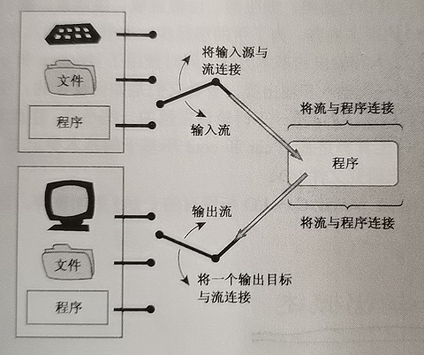

# 序 流和缓冲区      

## 流(stream)的概念    

流是一种抽象，它负责在数据的生产者和数据消费者之间建立联系，并管理数据流动。    
对于程序而言，文件对象有的特征流对象也有。所以程序将流对象看作文件对象的化身。    

  

- **提取和插入**：      

一般意义的读操作在流数据抽象中被称为(从流中)提取，写操作被称为(向流中)插入。  

## 缓冲区(Buffer)    

- **缓冲区用途**：    

通常，使用缓冲区可以更高效地处理输入和输出。缓冲区是用作中介的内存块，它是**信息从设备传输到程序**或者**从程序传输到设备**的**临时存储工具**。    

> CRE：主要是因为设备和程序的读写速度、读写方式不匹配。例如磁盘如果要逐字节读取是不现实的。        

- **缓冲区刷新(Flush)**：  

输出时，程序首先填满缓冲区，然后再把整块数据传输给硬盘，并清空缓冲区，以备下一批输出使用。这被称为**Flush**缓冲区。    

> 对于键盘输入，C++程序通常在用户按下回车键时Flush缓冲区。  
> 对于屏幕输出，C++程序通常在用户发送换行符时Flush缓冲区。    


## iostream管理流和缓冲区    

### 相关类定义：  

iostream(以前为iostream.h)文件中包含一些专门设计用来管理流和缓冲区的类。    

- `streambuf`类：为缓冲区提供了内存，并提供了用于填充缓冲区、访问缓冲区内容、flush缓冲区和管理缓冲区内存的方法。  

- `ios_base`类：表示流的一般特征，如可否读写、二进制流还是文本流。  

- `ios`类：基于ios_base，包括了一个指向streambuf对象的指针成员。  

- `ostream`类：派生自ios，提供了输出方法。  

- `istream`类：派生自ios，提供了输入方法。  

- `iostream`类：基于istream和ostream，因此继承了输入方法和输出方法。    

### 对象代表流：  

当iostream文件为程序声明cout或者cin对象时，该对象将包含存储了与输入输出相关的信息的数据成员，还有缓冲区streambuf的指针。    

- `cin`对象：对应标准输入流。默认情况下关联到标准输入设备（通常为键盘）。处理wchar_t类型的为wcin对象。  
- `cout`对象：对应标准输出流。默认情况下关联到标准输出设备（通常为显示器）。wchar_t对应的是wout对象。  
- `cerr`对象：标准错误流。没有被缓冲，直接发送给屏幕不会等待缓冲区填满或者换行符。`clog`对象：这个流被缓冲。  

<br />
<br />
<br />
<br />


# 第一节 输出流    

## 重要的三个输出流    

`ostream`:(包含文件ostream)（基类）  预定义的ostream类对象cout\cerr\clog用来向标准设备的输出。（默认输出到屏幕）

`ofstream`:(包含文件fstream)  ofstream支持磁盘文件输出。可以接受二进制或者文本模式数据。（基类ios和ostream的所有功能可以用于ofstream类对象）

`ostringstream`:(包含文件sstream) 字符串流类。


## 使用插入运算符<<和操纵符    

> 操作符`<<`默认含义是左移位运算符，但是ostream重定义了这个运算符，方法是将其重载为输出（即*插入运算符*）。很多操纵符都定义在ios_base类中，以及ismanip头文件中。  

插入运算符被重载，使之能识别C++中的所有基本类型：`unsigned char`、`signed char`、`char`、`short`、`unsigned short`  、`int`、`unsigned int`、`long`、`unsigned long`、`long long`、`float`、`double`、`long double`等。    

### **输出字符串和指针**：  

C++用指向字符串位置的指针来表示字符串，所以下面所有cout语句都会显示字符串。  

```CPP  
char name1[10] = "ABC...";
char * name2 = "BCD..";
cout << "CDE...";
cout << name1;  
cout << name2;  
```

要显示字符串地址，必须转换为其他指针类型。  

```CPP  
cout << (void*)str << endl;  
```  

### **拼接输出**：  

插入运算符的返回是`ostream&`，所以可以实现拼接输出。    


### **其他ostream方法**：  

其他显示方法：`out.put(char)`和`cout.write(const char*, streamsize)`。    


### **Flush缓冲区**：  

1. 换行符`endl`会flush缓冲区。  
2. 控制符`flush`会flush缓冲区。(`cout << x << flush;`)    
3. 多数C++实现都会在输入即将发生时候flush缓冲区。  
4. 可以调用`flush(cout)`来flush缓冲区。  

### **格式**：  

- **显示时使用的**：  

使用例如`hex(cout)`或者`cout << hex`。  
（控制符实际上是函数，但是通常使用方式为`cout<<hex`）  

`ios_base::dec`十进制格式化数值
`ios_base::oct`八进制格式化数值
`ios_base::hex`十六进制格式化数值

- **输出宽度**：    

为了调整输出宽度，可以通过在流中放入setw操纵符或调用width成员函数为每个项指定输出宽度。例如：`cout.width(10);` 或者 `cout << setw(10) << value;`。    

- **填充**：  

填充：`cout.fill("*");`。  


- **浮点数**：    

浮点数默认精度为6。`precision()`成员函数使得能够选择其他值。    
使用`setprecision()`也可以。  

格式标志值位掩码：    
`ios_base::scientific`科学记数格式    
`ios_base::fixed`非科学记数格式    

显示末尾的0和小数点：    
`cout.setf(ios_base::showpoint);`  


<br />
<br />
<br />
<br />


# 二、输入流    

## 概述    

标准输入流使用：  
`cin >> valueholder;`  

> 其中valueholder为存储输入的内存单元，可以是变量、引用、被解引用的指针，或者类成员。cin解释输入的方式取决于valueholder的数据类型。    

istream重载的抽取运算符（示例）：  
`istream& operator>>(int &);`

可以识别的一些基本类型：  
例如`char&`、`int&`、`float&`、`double&`等。  

## cin检查输入    

> C++PrimerPlus: 它读取从非空白字符开始，到与目标类型不匹配的第一个字符之间的全部内容。    


## 流状态    

cin和cout对象包含一个描述流状态(stream state)的数据成员。流状态由三个ios_base元素组成：`eofbit`、`badbit`、`failbit`，其中每个元素都是一位，可以是0（设置）或1（清除）。    

当cin操作到文件末尾时，它将设置`eofbit`。当IO失败或者未能读取到预期字符它将设置`failbit`。在一些无法诊断的失败破坏流时，`badbit`将被设置。当全部三个状态位都设置0时，说明一切顺利。    

- 一些报告或改变流状态的ios_base方法：  

```CPP  
good(); //流可以使用
eof();//eofbit是否设置  
bad();//badbit是否设置  
fail();//fail是否设置  
rdstate();//返回流状态
clear(iostate s);//将流状态设置为s  
setstate(iostate s);//设置指定的流状态位，其他位不变。（等同clear(rdstate() | s)）  
```  

- 异常处理：  

```CPP  
//示例：
exception(badbit);
exception(badbit | eofbit);
```


## 其他istream方法    

### 单字符输入：  

`cin.get(char&);`(输入字符赋予参数)  
`cin.get(void)`(将输入字符转换为整型返回)(通常为int，可以是其他，取决于字符集)    

- 单字符输入方式的选择：  

1. 希望跳过空白 -- 使用抽`>>`取运算符。  
2. 希望检查每个字符 -- 使用`get(char&)`方法。  
3. 希望方便地替换C程序的getchar() -- 使用`get(void)`方法。    


### 字符串输入    

```CPP  

//第一个参数是放置输入字符串的内存单元地址。  
//第二个参数比要读取的最大字符数大1(额外一个字符存储空字符)
//第三个参数指定用作分界符的字符（2个参数版本默认换行符为分界符）
istream& get(char *, int, char);
istream& get(char *, int);
istream& getline(char *, int, char);
istream& getline(char *, int);  

//ignore:  
//示例cin.ignore(255, '\n')
//（读取并丢弃接下来的255个字符或直到到达第一个换行符）  
istream& igore(int = 1, int = EOF);//
```    

> get函数在到达第<第二个参数-1>或者遇到换行符后，将停止输入，即使还未读取最大数目的字符。    
> get函数和getline主要区别是，get函数将换行符留在输入流中。而getline读取并丢弃换行符。  

### 意外字符串输入    

`getline(char*, int)`  
如果没有读取除换行符外的任何字符，设置failbit。  
如果读取了最大数目的字符，且行中还有其他字符，设置failbit。  

`get(char*, int)`  
如果没有读取任何字符，设置failbit。    

> getline读取并丢弃换行符。读取空行不会设置failbit。  


### 其他的istream方法    

```CPP  
read();//读取指定数目的字节。
//和get和getline不同的是，read不会在输入后面加入空值字符，因此不能将输入转换为字符串。  
//read不是专为键盘输入设计的。通常是用于文件输入输出的，配合write。    
peek();
//peek查看输入中的下一个字符而不抽取。    
gcount();
//gcount返回最后一个非格式化抽取方法读取的字符数。  
//这意味着字符是用get、getline、ignore、read读取的而不是>>读取的。  
putback();
//将一个字符插入到输入字符串中，它将是下一条输入语句读取的第一个字符。  
```  


<br />
<br />
<br />
<br />
<br />
<br />

# 三、文件输入输出    

> 文件是存储在外部设备上的一系列字节。  

> C++处理文件输入和输出的方式与处理标准输入输出方式非常相似。要写入一个文件，需要创建一个`ofstream`对象，然后使用ofstream的方法。要读取文件，需要创建一个`ifstream`对象，并使用ifstream的方法。    

> 与标准输入输出相比更加复杂。例如必须将新打开的文件和流关联起来。可以只读模式、只写模式、读写模式打开文件。写文件时，可能想创建新文件、取代旧文件、添加到旧文件中，还可能在文件中来回移动。      

> 为帮助处理这些任务，C++在`fstream(以前为fstream.h)`中定义了多个新类，其中包含用于文件输入输出的`ifstream`类和`ofstream`类。C++还定义了一个新类`fstream`，用于同步文件I/O。它们都派生自头文件`iostream`中的类，可以用前文所述的基类方法。    


## 简单的文件I/O    

```C++  
ofstream ofs;//声明流对象
ofs.open("test.txt");//关联文件
//或者合并为一句：ofsteam ofs("test.txt");
ofs << "TEST";//输出  
ofs.close();//关闭文件连接
```  

> 关闭文件连接并不会删除流，而只是断开流到文件的连接。可以将流连接到一个文件。    
> 流对象过期时，文件连接将自动关闭。  
> CRE：文件流也可以调用`flush()`。  

## 流状态检查和is_open()    

文件流也从ios_base基类继承了一个流状态成员。  

> 文件不存在会设置failbit位。    

> 较新的C++实现提供了一个更好的检查文件是否打开的方法-`is_open()`方法。    

## 打开多个文件    

打开多个文件的策略取决于它们将被如何使用。如果需要同时打开两个文件，则必须为每个文件创建一个流。  
如果是依次处理一组文件，可以打开一个流，并将它依次关联到各个文件。  


## 命令行处理技术    

命令行参数:  
`<程序名> <file1> <file2> <file3>`  

C++有一种在命令行环境中运行的程序能够访问命令行参数的机制，方法是使用下面的main函数：    
`int main(int argc, char* argv);`  
`argc`是命令行参数个数，其中包含命令本身。`argv`是一个指针数组，`argv[0]`是第一个指针，即命令行中第一个字符串。    

## 文件模式    

文件模式描述文件如何被读、写、追加。ios_base类定义了一个openmode类型，用于表示模式。    

```CPP  
//文件模式：  
ios_base::in		//打开文件，以便读取
ios_base::out		//打开文件，以便写入
ios_base::ate		//打开文件，并移到文件尾  
ios_base::app		//只允许追加到文件尾  
ios_base::trunc		//如果文件存在,则截短文件
ios_base::binary	//二进制文件
```  


> fstream()构造函数和open()方法都接受两个参数，第二个参数有默认参数值，例如ifstream默认参数为`ios_base::in`，而ofstream的默认参数为`ios_base::out | ios_base::trunc`。    


C++模式对应的C模式：    
|C++|C|
|-|-|
|`ios_base::in`|`"r"`|
|`ios_base::out`|`"w"`|
|`ios_base::out \| ios_base::trunc`|`"w"`|
|`ios_base::out \| ios_base::app`|`"a"`|
|`ios_base::in \| ios_base::out`|`"r+"`|
|`ios_base::in \| ios_base::out \| ios_base::trunc`|`"w+"`|
|`<c++mode> \| ios_base::binary`|`"<cmode>b"`|


- **二进制文件**：  

> 二进制格式保存数据更快，因为不需要转换，并可以大块地存储数据。二进制格式通常占用空间更小，但是不方便传输给另一种计算机系统。    

> 文本格式便于读取，并且方便传输给另一种计算机系统。    


>⭐最初设计流的目的是用于文本文件，因此默认输出模式是文本方式。    


二进制存储结构或者对象：  
```C++  
struct Object
{
	char name[10];
	double value;
}
//C++PrimerPlus：不能使用string对象来替代字符数组来表示name成员字段。
//因为string对象实际并没有包含字符串，而是包含一个指向存储字符串的内存单元的指针。再次运行该程序时该地址毫无意义。    

//CRE：应该只适合POD类型，如果含有vector这类变量读取载入后会出错。    

int main()
{
	Object obj;
	ofstream ofs("test.object", ios_base::out | 	ios_base::binary);
	ofs.write((char*)&obj, sizeof(Object));
	//与文本相比，信息的保存更加紧凑精确。  

	ifstream ifs("test.object", ios_base::in | 	ios_base::binary);
	ifs.read((char*)&obj, sizeof(Object));
	//使用write()和read()，而不是get()和插入运算符。  
}
```  


## 随机存取    

随机存取常被用于数据库文件，程序维护一个独立的索引文件，该文件指出数据在主数据文件的位置。这样程序就能直接跳转到这个位置读写数据。    
如果文件由长度相等的记录组成，这种方法实现起来最简单。每条记录表示一组相关数据。    

要采用的文件模式：  
`ios_base::in | ios_base::out | ios_base::binary`

在文件中移动的方式：  
`seekg()`将输入指针移到指定的文件位置。`seekp()`将输出指针移到指定的文件位置。    

要检查文件指针的当前位置：   
对于输入流可以使用`tellg()`，对于输出流可以使用`tellp()`。它们都返回一个表示当前位置的streampos值。    


<br />
<br />
<br />
<br />
<br />
<br />


# 四、内核格式化    

**iostream族**支持**程序和终端**之间I/O。  
**fstream族**使用相同的接口提供**程序和文件**之间的I/O。  

C++库还提供了**sstream族**，使用相同的接口提供**程序与string对象**之间的I/O。    

头文件sstream定义了一个从`ostream`派生的`ostringstream`类以及一个基于`wostream`的`wostringstream`类。如果创建了一个`ostringstream`对象，则可以将信息写入其中，它将存储这些信息。可以将`cout`的方法用于`ostringstream`对象。    

格式化文本进入缓冲区，在需要时可以动态内存分配来增大缓冲区。  

`ostringstream`有一个名为`str()`的成员函数，返回一个被初始化为缓冲区内容的字符串对象。使用`str()`可以冻结该对象，这样就不能将信息写入该对象。    


（END）    