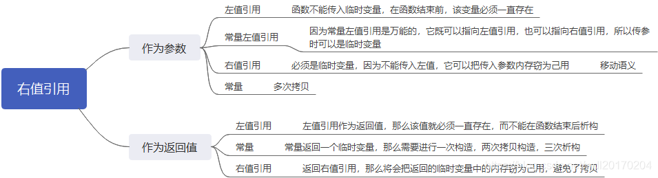

# 右值引用和移动语义    

## 右值引用    

  

- **右值包括**：    

> CRE：字面量和临时对象。    

1. 字面常量（除了C字符串）    
2. 表达式（例如x+y）  
3. 函数返回值（除非返回的是引用）    

- **右值引用声明方式**：    

`<typenmae> &&`    


## 移动语义    

> CRE：传统的**复制构造函数**涉及**临时对象**的构造和删除。所以可以用右值引用来实现移动构造函数。    
> 复制构造函数可执行深复制。而移动构造函数只调整记录，原来的数据所在地址不变。    

> C++PrimerPlus：要让移动语义发生，需要两个步骤。首先是**右值引用**，其次是编写**移动构造函数**。    
> C++PrimerPlus：机智的编译器可能自动消除额外的复制工作。但是通过使用右值引用，程序员可指出何时该使用移动语义。    


- **移动构造函数解析（以及和复制构造的区别）**：  

```CPP  
class Test
{
public:
    int n;
    char * data;
}

Test::Test(const Test & f) : n(f.n)
{
    pc = new char[n];
    for(int i = 0 ; i < n; i++)
        data[i] = f.data[i]
}
Test::Test(Test && f): n(f.n)
{
    pc = f.data;//steal数据地址。  
    f.data = nullptr; //设置为nullptr防止两个指针指向相同数据导致的多次delete。  
    f.n = 0;
}
```  


- **赋值**：    

适用于构造函数的移动语义考虑也适用于赋值运算符。    

与移动构造函数一样，移动赋值运算符也不能是const引用，因为这个方法修改了源对象。  

```CPP  
Test & Test::operator=(const Test & f); //copy assignment 复制赋值运算符
Test & Test::operator=(const Test && f);//move assignment 移动赋值运算符  
```  


- **强制移动**    

要让移动构造函数和移动赋值运算符使用左值，可以用`static_cast<&&>`转换为右值。或者使用C++11提供的`std::move()`（在头文件utility中）。    


<br />
<br />
<br />
<br />

# 参考文章    

> https://blog.csdn.net/wdl20170204/article/details/111615408    


（END）  