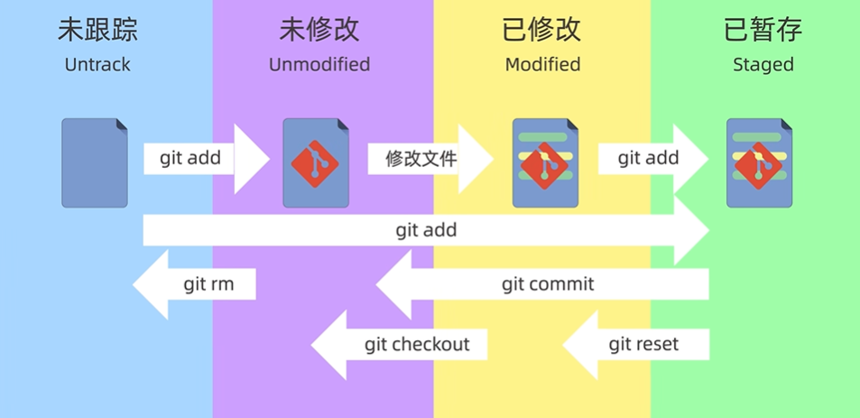

# 序章 Git简介以及安装  

 
 

## 概述    

Git是目前世界上最先进的版本控制系统。   

### 集中式版本控制系统：    

集中式版本控制系统，版本库是放在中央服务器的，需要联网。首先要先从中央服务器取得最新的版本，然后开始干活，干完活了，再把自己的活推送给中央服务器。CVS和SVN都是集中式版本控制系统。    

### 分布式版本控制系统：  

没有中央服务器的，无需联网。多人协作时，只需把各自的修改推送给对方，就可以互相看到对方的修改了。分布式的安全性要高于集中式，集中式版本控制系统的中央服务器要是出了问题，所有人都没法干活了。

### 注意：    

所有的版本控制系统，其实只能跟踪文本文件的改动，比如TXT文件，网页，所有的程序代码等等，Git也不例外。   

 
 

## Git的安装    

### 可以安装Git的操作系统：    

Linux、MacOS、Windows等。    

### 在Windows上安装Git：    

在Windows上使用Git，可以从Git官网直接下载安装程序，，然后按默认选项安装即可。安装完成后，在开始菜单里找到“Git”->“Git Bash”，蹦出一个类似命令行窗口的东西，就说明Git安装成功。    

### 相关设置：    

安装完成后，还需要最后一步设置，在命令行输入：    
`$ git config --global user.name "Your Name"`  
`$ git config --global user.email email@example.com`  
因为Git是分布式版本控制系统，所以，每个机器都必须自报家门：你的名字和Email地址。用了`--global`这个参数，表示你这台机器上所有的Git仓库都会使用这个配置，当然也可以对某个仓库指定不同的用户名和Email地址。  

 
 

## 基本原理与名词解释    

  

### 基本原理：  

文件往Git版本库里添加的时候，是分两步执行的：第一步是用git add把文件添加进去，实际上就是把文件修改添加到暂存区；第二步是用git commit一次性把暂存区的所有修改提交到当前分支（master）。每次修改，如果不git add到暂存区，那就不会被commit。    

### 工作区：    

就是你在电脑里能看到的目录。     

### 版本库：    

工作区有一个隐藏目录.git，这个不算工作区，而是Git的版本库。Git的版本库里存了很多东西，其中最重要的就是称为stage（或者叫index）的暂存区，还有Git为我们自动创建的第一个分支master，以及指向master的一个指针叫HEAD。     

### 补充：基本工作流程    

|工作区|--`git add`-->|暂存区|--`git commit`-->|本地仓库|    
|-|-|-|-|-|
|.git所在目录||.git/index||.git/objects|

 
 
 
 

# 第一章	Git基本操作    

 
 

## Git基本命令  

`$ pwd`		查看当前目录的路径。  
`$ mkdir <dirName>`	在当前目录创建文件夹。  
`$ cd <dirName>`		进入目录（change directory）。  
`$ mv <fileordir> <fileordir>`	移动或重命名文件和目录  

`$ ls`			列出所有文件（List directory contents）。($ dir实测也可以)  
`$ ls –a`		列出所有文件，包括隐藏文件。  
`$ ls –la`		列出所有文件的长格式列表（包含详细信息）。  
`$ ls –ah`		可以显示隐藏文件。  

`$ cat <file1>`						打印显示文件  
`$ cat <file1> <file2>> <target_file>`	合并文件  

`$ git checkout`	用于切换分支或恢复工作树文件。(危险：会重写工作区)

 
 

## 创建版本库`git init`    

版本库又名仓库，英文名repository。这个目录里面的所有文件都可以被Git管理起来，每个文件的修改、删除，Git都能跟踪，以便任何时刻都可以追踪历史，或者在将来某个时刻可以“还原”。    

### 创建空目录      

`$ mkdir dirName`	在当前目录创建文件夹。    

### 把这个目录变成Git可以管理的仓库：    

`$ git init`	把当前文件夹变成git仓库，会生成一个隐藏的.git文件夹。

 
 

## 添加文件`git add`    

实际上就是把文件修改添加到暂存区。      
`$ git add file1.txt`  
`$ git add file2.txt`  
`$ git add file3.txt`  
`$ git add .	`(提交全部文件)    

 
 

## 提交修改`git commit`    

实际上就是把暂存区的所有内容提交到当前分支。    
示例：
`$ git commit -m " added 3 files."`  

 
 

## 状态查看`git status`     

`$ git status`命令可以让我们时刻掌握仓库当前的状态。包括是否有文件被修改，以及修改的内容是否已经添加好准备提交了。  

`$ git diff`：比较工作区和暂存区之间差异。  
`$ git diff HEAD`：比较工作区和版本库之间差异。  
`$ git diff --cached`：比较暂存区和版本库之间差异。  
`$ git diff 1234abc 7890def`：比较两个版本之间差异。  
`$ git diff HEAD 7890def`：比较HEAD和某版本之间差异。  

（Creedon：HEAD是当前分支的最新提交。）  

`$ git log`可以查看commit提交历史。包含作者、日期、十六进制的版本号等。  

 
 

## 撤销工作区的修改`git checkout`    

`$ git checkout -- .`			撤销工作区的修改（”.”表示所有文件）。   
`$ git checkout -- fileName`	撤销工作区某文件的修改。  
（如果修改后还没有被放到暂存区，撤销修改就回到和版本库一模一样的状态。如果已经添加到暂存区后，又作了修改，撤销修改就回到添加到暂存区的状态。）  
（Creedon:可以理解为从缓存区恢复文件，缓冲区为空就从master恢复文件。）  

> 要撤销已经提交的内容，查看以下的版本回退。    

 
 

## 版本回退`git reset`    

当你觉得文件修改到一定程度的时候，就可以“保存一个快照”，这个快照在Git中被称为commit。一旦你把文件改乱了，或者误删了文件，还可以从最近的一个commit恢复。    
在Git中，用`HEAD`表示当前版本，上一个版本就是`HEAD^`，上上一个版本就是`HEAD^^`，往上99个版本`HEAD~99`。Git的版本回退速度非常快，因为Git在内部有个指向当前版本的HEAD指针，当你回退版本的时候，Git仅仅是改变HEAD的指向。    

### 三种模式    

1. `git rest --soft`（保留工作区、保留暂存区）    
2. `git rest --hard`（丢弃工作区、丢弃暂存区）    
3. `git rest --mixed`（默认）（保留工作区、丢弃暂存区）    

示例：    
`$ git reset --hard HEAD^`			回退到上一个版本  
`$ git reset --hard commit_id`		回退到具体某版本号  
要重返未来，用`git reflog`查看命令历史，以便确定要回到未来的哪个版本。  

 
 

## 删除文件`git rm`    

（在git中删除也是一种修改操作。）  

`rm XXX; git add XXX`先从工作区删除，然后再缓存删除内容。    
`git rm XXX`从工作区和暂存区同时删除。    	
（可以用$ git reset HEAD XXX恢复缓冲区，再用$ git checkout -- XXX恢复工作区）  
`git rm --cached XXX`把文件从缓存区删除，但保留在当前工作区。    
`git rm -r *`递归删除某个目录下所有子目录和文件。    

（不要忘记使用`git commit……`提交。）  

 
 
 
 

# 第二章 远程仓库    

 
   

## 概述    

GitHub提供Git仓库托管服务。  

 
 

## 创建和添加SSH    

### 第1步：创建SSH Key    

在用户主目录下，看看有没有.ssh目录，如果有，再看看这个目录下有没有id_rsa和id_rsa.pub这两个文件，如果已经有了，可直接跳到下一步。如果没有，打开Shell（Windows下打开Git Bash），创建SSH Key：    

`$ ssh-keygen -t rsa -C youremail@example.com`  

> （一路回车，使用默认值即可,无需设置密码。）    
> （id_rsa和id_rsa.pub两个文件，这两个就是SSH Key的秘钥对，id_rsa是私钥，不能泄露出去，id_rsa.pub是公钥，可以放心地告诉任何人。）    

### 第2步：GitHub添加SSH    

登陆GitHub，打开“Account settings”，“SSH Keys”页面：    
然后，点“Add SSH Key”，填上任意Title，在Key文本框里粘贴id_rsa.pub文件的内容。    
（GitHub后台可以添加多个SSH Key，但同一个SSH Key只能在添加在一个帐号上（添加时提示“Key is already in use”））    
（因为GitHub需要识别出你推送的提交确实是你推送的，而不是别人冒充的，而Git支持SSH协议，所以，GitHub只要知道了你的公钥，就可以确认只有你自己才能推送。）    
（当然，GitHub允许你添加多个Key。假定你有若干电脑，你一会儿在公司提交，一会儿在家里提交，只要把每台电脑的Key都添加到GitHub，就可以在每台电脑上往GitHub推送了。）    

 
 

## 从远程库克隆`git clone`      

（已有或者创建一个GitHub仓库。）  

### 克隆到本地    

`$ git clone git@github.com:REW-Z/TestRepository.git`（SSH方式）  
`$ git clone https://github.com/REW-Z/TestRepository.git`（HTTP方式）  
克隆到本地后可以直接$git push origin master推送到GitHub上。  

 
 

## 关联远程仓库    

添加远程分支并推送    
`$ git remote add origin git@github.com:REW-Z/TestRepository.git`（SSH方式）    
`$ git remote add origin https://github.com/REW-Z/TestRepository.git`（HTTP方式）    
（添加远程分支（remote）。建议使用SSH，比HTTPS速度快。）    

 
 

## 推送`git push`    

`git push -u origin master`	  
（把当前分支master推送到远程。）    
(由于远程库是空的，我们第一次推送master分支时，加上了-u参数，把origin这个主机设置为默认远程主机，Git不但会把本地的master分支内容推送的远程新的master分支，还会把本地的master分支和远程的master分支关联起来，在以后的推送或者拉取时就可以简化命令。)    
（其中`-u`是upstream的缩写）    

 
 

## 拉取`git pull`    

`git pull origin master`    
（拉去远程仓库的最新更改并自动合并到当前分支）    

 
 
 
 

# 第三章 分支管理    

分支管理策略：  
> master分支应该是非常稳定的，也就是仅用来发布新版本，平时不能在上面干活，干活都在dev分支上。  
> 常见分支命名:main、master、dev、test、feature。    

 
 

## 列出所有分支`git branch`      

`$ git branch`列出所有分支。  

 
 

## 创建新分支`git switch -c`    

`$ git switch -c dev`		创建并切换到分支。  
或者`$ git checkout -b dev`		创建并切换到分支。  
（`git switch`是新出的指令，用于避免`git checkout`指令的切换/恢复歧义）    
（`git checkout`命令加上`-b`参数表示创建并切换，相当于以下两条命令：`$ git branch dev`、`$ git checkout dev`）      
    
（`git checkout`指令容易和`checkout -- <file>`指令混淆，建议用`git swith`指令）      

 
 

## 合并分支`git merge`    

`git merge dev`将dev分支拉并到master分支。  
（Fast-Forword表示快进模式）  

`git merge --abort`中止合并。    

### 解决冲突    

不同分支有不同的修改，不能用快速合并。要手动修改。    

1. 尝试合并$git merge …提示错误。（会自动进入master|MERGING分支。）  
2. 手动修改文件保持一致。（HEAD<<<……>>>dev会指示哪里有冲突。）  
3. 提交$git add + $git commit。（会退出master|MERGING。）  
4. 再次尝试合并$git merge …提示成功。  

### 禁用FastForward模式        

`$ git merge --no-ff -m"merge with noff" dev`        
> 合并分支时，加上`--no-ff`参数就可以用普通模式合并，合并后的历史有分支，能看出来曾经做过合并，而fast forward合并就看不出来曾经做过合并。    

`git log`可以查看到分支合并历史。    

 
 

## 删除分支`git branch -d`      

`$ git branch -d dev`		删除被合并的dev分支。    
`$ git branch -D dev`		删除dev分支（强制）。    

 
 

## 变基`git rebase`    

`git rebase main`将当前分支变基到main分支上。    
（会把两个分叉重新变成一条直线）    
（类比为“把分枝剪下并嫁接到树干顶端”）    

 
 

## 存放工作现场`git stash`        

`$git stash`		存放工作现场。  
`$git stash pop`	取出工作现场（同时删除）。  
`$git stash apply`	取出工作现场（不会删除）。  
`$git stash list`	查看已存放的工作现场。  

> （可以存放当前分支的工作现场，然后到其他分支上操作（例如：到master上面去开个issue分支修复bug并合并到master）。回来之后可以取出暂存的工作现场继续工作。）    

 
 

## 同步修改（应用其他分支上的修改）    

`cherry-pick commitid`		把其他分支上的修改提交应用到当前分支。    
> （回来之后还要修复工作现场的bug，先读取工作现场然后提交，最后再用cherry-pick指令把其他分支某次或某几次的修改应用到当前分支，”cherry-pick”指令意为择优选择。）    

 
 
 
 

# 第四章 标签管理    

## 概述    

标签（tag）就是一个让人容易记住的有意义的名字，它跟某个commit绑在一起。  

## 创建标签    
`$ git tag v1.0`			默认标签是打在最新提交的commit上的。  
`$ git tag v0.9 f52c633`	打在历史的commit上。    
（可以通过`git log`查找历史的commit id）    
（还可以创建带有说明的标签，用`-a`指定标签名，`-m`指定说明文字：
`$ git tag -a v0.1 -m "version 0.1 released" 1094adb`）    

## 操作标签    

`$ git tag`					查看所有标签。  
`$ git show v0.9`				查看标签信息。  
`$ git tag -d v0.1`				删除标签。  
`$ git push origin v1.0`		推送某个标签到远程。  
`$ git push origin –tags`		一次性推送全部尚未推送到远程的本地标签。    
`$ git tag -d v0.9 +`  
`$ git push origin :refs/tags/v0.9`	删除远程标签(要先删本地的标签)。    

 
 
 
 

 
 

# 补充      

### 关于push产生冲突的问题：  

chatGPT: 当远程仓库包含本地没有的文件时，直接执行`git push`通常会失败。因为Git的推送要求远程仓库的状态是当前本地分支的祖先，否则会拒绝非快进的推送操作（non-fast-forward）    

⭐源代码push到GitHub时可能会出错，出现错误的主要原因是github中的README.md文件不在本地代码目录中，可以通过如下命令进行代码合并。  
`git pull origin master`  (注：等同 git fetch + git merge)    
`git pull --rebase origin master`   (注：等同 git fetch + git rebase)    

### 关于pull：    

当执行`git pull`时，如果远程文件和本地文件不一致，Git会尝试合并远程和本地的更改，具体行为取决于以下几种情况：    
1. 本地文件未修改（没有工作区修改）：Git会直接合并，本地文件更新为远程新版本。    
2. 本地文件已修改（未提交的更改）：Git会阻止pull操作，并提示错误。    
3. 本地文件已修改（已提交的更改）：如果两个更改不冲突（没有修改同一区域），Git 会自动合并。如果两个更改冲突（修改了同一区域），Git会暂停合并并提示冲突。    

### GPT：没有"文件内冲突"时：    

在远程仓库的文件和本地仓库的文件没有 文件内冲突（即远程和本地从未修改同一个文件）的情况下：
1. 可以合并，git会自动直接合并更改。    
2. 不能直接push，需要先同步（pull）。    
3. 可以pull，文件没有重叠区域，Git自动完成合并。    

# 转载自文章    

> https://www.liaoxuefeng.com/wiki/896043488029600     