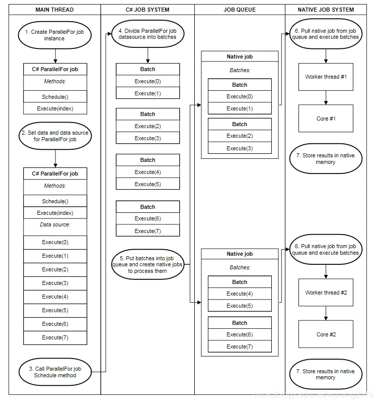

# JobSystem入门    

> Zhihu：Unity支持多线程编程，但是仅限于IO等少数几个模块。引擎主循环和游戏对象是不支持多线程控制的。      

> Zhihu：Unity没有很好支持多线程很大原因在于传统的多线程在处理游戏逻辑上有些问题，游戏逻辑代码的特点是单代码块的执行成本低，但要在16毫秒或33毫秒内执行大量的代码块。不管是为每个代码块创建一个线程还是用线程池，基中线程处理本身消耗的成本都会抵销其带来的好处。没有很好支持多线程还有个问题是多线程编程本身的复杂度问题，两个线程写冲突和依赖关系很容易引起难于调试的异常。  

> Zhihu：Job System是Unity的多线程管理API。Job System与线程相应的概念的叫Job,但Job并不是对线程的封装，个人觉得把Job当成一个函数会更容易理解。一个Job像一个函数处理单一逻辑。Job System在初始化时会创建CPU核心数减1的线程（实际比这复杂，内部会根据大小核等硬件资源做一些选择），然后把所有Job根据一定策略分配到这些线程并行执行。因为Job System只会在初始化时创建与CPU核心匹配的线程，所以不存在频繁创建线程的成本，也不会因为多个线程抢占一个CPU资源和引起上下文切换时的损耗，只要Job System能合理分配Job就能充分利用CPU资源而较少的副作用。    

## 线程安全    

- RaceCondition  

> Baidu：RaceCondition(竞争条件)是一种软件编程概念,指的是两个或多个线程或进程在竞争访问共享资源的时候,因为时序上的差异,导致程序的执行结果出现不确定性的情况。

- JobSystem安全系统  

> JianShu(作者：BacteriumFox): 为了让多线程开发变得简单，C# job system检测所有潜在的RaceCondition，并且规避可能导致的bug。比如：当在你的主线程代码中向job发送了一个数据的引用，此时无法查证当主线程在读取数据的同时，是否有job在尝试写入，此时便产生RaceCondition。  
> C# JobSystem通过发送每个job一份操作数据的拷贝，而不是主线程数据的引用，来解决RaceCondition问题。这份拷贝隔离了数据，因此得以解决RaceCondition问题。  
> Job System需要拷贝数据，意味着job只能访问blittable的数据类型，这些数据类型在本地和托管代码中不需要转换。  
> job system可以使用memcpy来拷贝blittable的数据，并且在unity的本地堆和托管堆之间转换，他在调度job的时候，使用memcpy来将数据放入本地内存，并赋予数据的管理权限。  
> JianShu：Blittable 类型是托管代码和本机代码中具有相同位级别表示形式的类型。 因此，无需将这些类型转换为其他格式即可往返本机代码进行封送，而且这样可以提高性能。    


## 创建Job    

```C#  
struct MulJob : IJob
{
    public int a;
    public int b;
    public NativeArray<int> result;
    public void Execute()
    {
        result[0] = a * b;
    }
}
```  

## 安排Job    

```C#  

void Start()
{
    NativeArray<int> result = new NativeArray<int>(1, AllocatorTempJob);
    //NativeArray<int>是DOTS引入的一部分，官方叫NativeContainer，除了NativeArray还有NativeHashMap等其它类型，NativeContainer的目的是让不同的Job能访问共享的内存。虽然Job并不代表一个线程，但不同的Job很可能在不同的线程处理。  
    var handle = new MulJob() { a = 76, b = 93, result = result }Schedule();  
    //调用Schedule扩展方法，会将Job放入Job队列以在适当的时间执行。安排Job后，您将无法中断Job。  

    handle.Complete();
    //Schedule方法并不会执行Job, 它返回一个JobHandle，调用JobHandle.Complete()才可以确保Job执行完成。然后就可以访问NativeArray中的数据了。  
    Debug.Log(result[0]);
    result.Dispose();
}


```  
## JobHandle和依赖    

Schedule()还有个重载，可以将要依赖的Job的JobHandle传入。    

- 合并依赖  

如果Job具有许多依赖关系，则可以使用JobHandle.CombineDependencies方法合并它们。   

## 在主线程中等待Job    

> JianShu：在安排（schedule）Job时，它们（Job）并不会开始执行。如果您正在主线程中等待Job，并且需要访问该Job正在使用的NativeContainer数据，则可以调用方法JobHandle.Complete。JobHandle调用Complete将返回NativeContainer类型的数据的所有权到主线程(可以理解主线程接管了NativeContainer)。也就是说您需要调用Complete才能在再次主线程中安全的访问NativeContainer。    


> JianShu：通过调用Job依赖的JobHandle的Complete ，也可以将所有权返回给主线程。例如，有两个Job ,其中JobA 依赖JobB。你可以调用JobA的Complete，或者JobB的Complete。两者都可以让你在主线程安全地访问NativeContainer【JobA的结果】。

> JianShu：如果不需要访问数据，则需要显式刷新批处理（batch）。为此，请调用静态方法JobHandle.ScheduleBatchedJobs。请注意，调用此方法可能会对性能产生负面影响。


<br>  
<br>  
<br>  
<br>  

# ParallelFor类型的Job    

## 概述    

在游戏中如果要对大量对象执行相同的操作，可以使用IJobParallelFor类型的Job。    

> JianShu：ParallelFor类型的Job使用NativeArray作为其数据源。ParallelFor类型Job跨多核（cpu的核）运行。每个核有一个Job，每个Job处理一部分工作量。IJobParallelFor行为类似于IJob，但它不是单个Execute方法，而是Execute对数据源中的每个项目调用一次该方法。该Execute方法中有一个整数参数。改参数作为索引用于访问Job实现中的数据源中的单个元素并对其进行操作。    

示例：    

```C#  
struct IncrementByDeltaTimeJob: IJobParallelFor
{
    public NativeArray<float> values;
    public float deltaTime;
 
    public void Execute (int index)
    {
        float temp = values[index];
        temp += deltaTime;
        values[index] = temp;
    }
}
```  

## 安排ParallelFor类型的Job    

> JianShu：Job System 内部对于ParallelFor 类型的Job调度更加复杂。当安排ParallelFor类型的Job时，C＃Job System工作分为几批以在内核之间分配。每个批次都包含Execute方法的子集。然后，C＃Job System在每个CPU内核的Unity本地作业系统中最多安排一个作业，并将该本地作业传递一些批次以完成。    




> Jianshu：示意图展示是有8个ParallelFor 类型的Job，在C# Job System中被分成了4个批次，每个批次中2个Job。在Job队列中这4个批次又被合并成2个本地Job，这两个本地Job在本地Job System中被分配到两个线程，分别在两个cpu内核在执行。通过下图也再次说明了Job并不是线程。    

> JianShu：要优化流程，您需要指定批次计数。批计数控制您获得多少个作业，以及线程之间的工作重新分配的粒度。

## 安排ParallelFor类型的Job    

> JianShu：ParallelForTransform类型的Job是另一种类型的ParallelFor类型的Job ，专为在Transforms上运行而设计。    


<br />  
<br />  
<br />  
<br />  


# JobSystem提示和故障排除    

> 当需要的数据准备好了后就可以调用Schedule，而Complete直到需要结果时再调用它。    

> 你安排Job时，Job实际上不会立即开始执行。我们创建了一批作业来安排需要刷新的作业。在ECS中是隐式刷新的，在ECS外部，需要通过调用static函数`JobHandle.ScheduleBatchedJobs()`来显式刷新它。（不这样做会调度会无限期延迟，直到有人等待它的结果。）        


> 调用`JobHandle.Complete`以让主线程重新获得NativeContainer的所有权。调用Complete还会清除安全系统中的状态。不这样做会导致内存泄漏。此过程也使用于：每帧依赖于前一帧作业的帧上计划新作业。    

> 您只能从主线程调用Schedule和Complete。如果一个作业依赖于另一个Job，请使用它JobHandle来管理依赖性，而不要尝试在Job中Schedule作业。    

> 默认情况下，Job拥有NativeContainer类型的读写权限。`[ReadOnly]`适当时使用属性以提高性能。    

> 在Unity Profiler窗口中，主线程上的标记`WaitForJobGroup`指示Unity正在等待工作线程上的Job完成。此标记可能意味着您在应该解决数据依赖性。    

> 在Job中分配托管内存的速度非常慢，并且该Job无法利用Unity Burst编译器来提高性能。    


### 简单总结    

- 不能干扰主线程，主线程只需在结束时拿出Job中的计算结果。    
- 不允许访问静态变量。    
- 不允许在Job里调度子Job。    
- 不能传递引用类型，只能向Job里传递值类型。    
- 并且是通过拷贝的方式从主线程将数据传输进Job，当Job运行结束数据会拷贝回主线程，我们可以在主线程的job对象访问Job的执行结果。    
- 不允许在Native容器里添加托管类型。    
- 不允许使用指针。    
- 不允许多个Job同时写入同一个地方。       
- 可以使用`[ReadOnly]`属性标记不读取的NativeContainer。    


<br />  
<br />  
<br />  
<br />  

# NativeContainer    

### NativeContainer是什么    

> NativeContainer是一个对Unity本地内存进行相对安全的封装并且接受管理的值类型。在使用Unity JobSystem时，NativeContainer允许job和主线程访问共享内存，而不是通过内存拷贝。    


### NativeContainer的分配    

> Allocator.Temp 分配速度最快，试用于生命周期在一帧以内的job，你需要在方法结束之前调用Dispose方法。    
> Allocator.TempJob 分配速度比Temp慢，但是比Persistent快，适用于生命周期在四帧以内的Job，是线程安全的，如果你没有手动调用Dispose方法，会在四帧之后输出一条警告日志，大部分小Job会采用这种类型。    
> Allocator.Persistent 分配速递最慢，但是可以存在任意长的时间，必要的话可以贯穿整个应用的生命周期。本质上是malloc的直接封装，其他更长的Job可以用这种类型，当然性能有压力的时候，还是不要使用。    


<br />  
<br />  
<br />  
<br />  


# 补充    

> CRE：NativeContainer不用互相赋值，可以用CopyFrom或者Copy方法。    
> CRE：CopyFrom方法在PC和Android可能实现不同，因为有时PC上正常执行而在Android上会报Blittable相关的错误。尝试使用Copy方法。        

<br />  
<br />  
<br />  
<br />  


# 参考资料    

> https://zhuanlan.zhihu.com/p/66336209  
> https://www.jianshu.com/p/c0e346b481f2   
> https://blog.csdn.net/zhenghongzhi6/article/details/79983573    
> https://gewu.pcwanli.com/front/article/26538.html  
> https://blog.csdn.net/m0_48781656/article/details/122601209  

(END)    