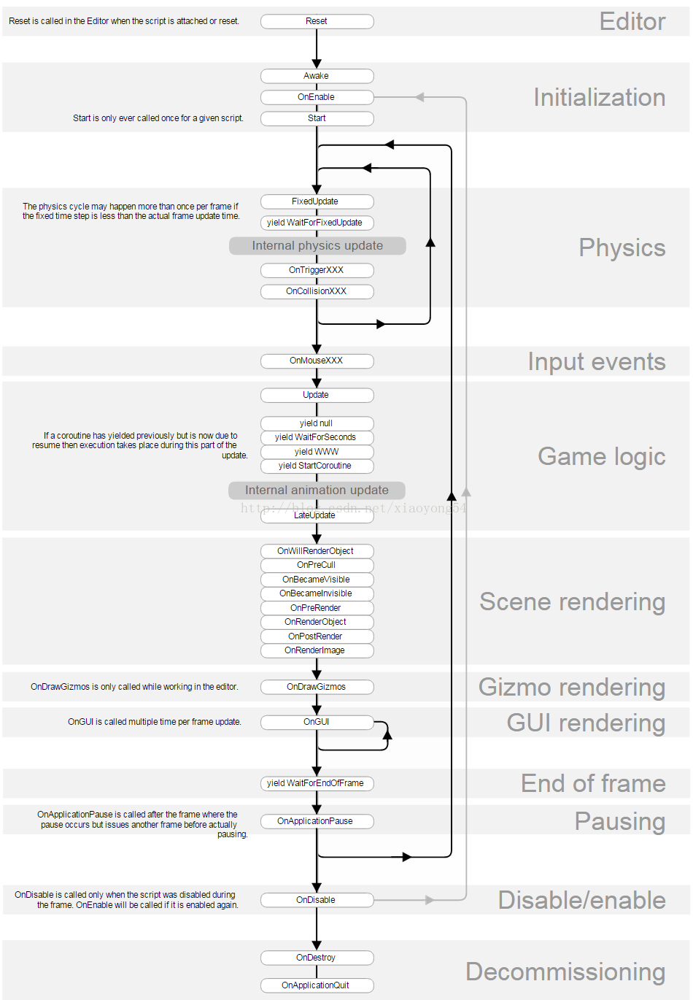

# 脚本生命周期    

# 注意事项    

避免使用构造函数或变量初始化程序。

切勿在MonoBehaviour脚本中初始化构造函数或变量初始值设定项中的任何值。为此，请使用“唤醒”或“启动”。即使在编辑模式下，Unity也会自动调用构造函数。这通常在脚本编译后直接发生，因为需要调用构造函数才能检索默认变量值。构造函数不仅会在不可预见的时间被调用，还可能在预制件或非活动的游戏对象上被调用。

当类继承自MonoBehaviour时使用构造函数，将使构造函数在不必要的时间被调用，并且在许多情况下可能会导致Unity崩溃。如果要从ScriptableObject继承，则
仅使用构造函数。

在例如 使用构造函数的单例模式可能会产生严重后果，并导致看似随机的null引用异常。

因此，如果您想实现例如。单例模式不使用构造函数，而是使用Awake。实际上，没有理由为什么从MonoBehaviour继承的类的构造函数中应该包含任何代码。

Creedon:
先构造，再Awake();
是否Instantiate()包含Awake() ???