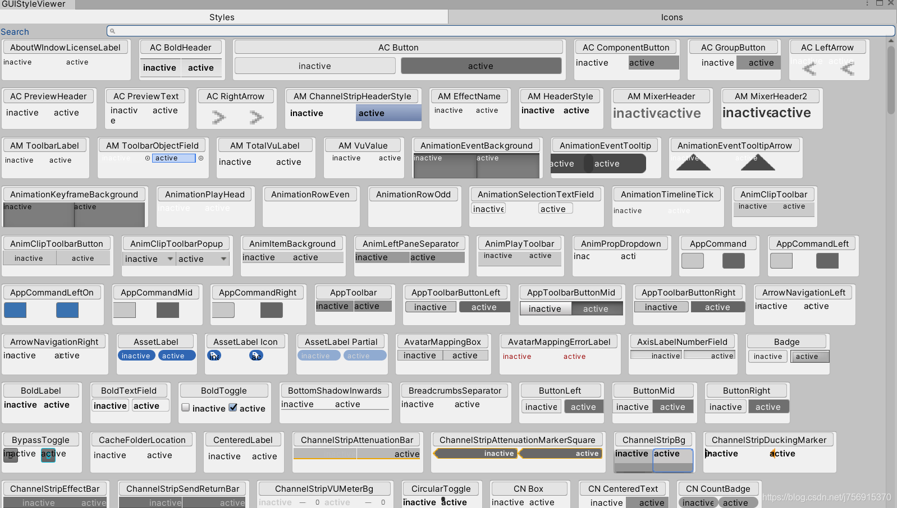



# 一、组件自定义编辑：

> AAttribute:   `[UnityEditor.CustomPropertyDrawer(typeof(TestClass))]`或者`[UnityEditor.CustomEditor(typeof(TestClass))]`    
> A继承：UnityEditor.Editor

### 需重载函数：
- 重载OnInspectorGUI();

### GUI组件：  

标签：  
`GUI.Label();`  
CheckBox：  
`GUI.Toggle();`  
按钮：  
`GUI.Button();`  
字段：
`EditorGUI.LabelField()`  
`EditorGUI.IntField()`  
`EditorGUI.ObjectField();`    
边框：  
`EditorGUI.BeginVertical("frameBox")`  

### 其他：   

缩进：
`EditorGUI.indentLevel`

 
 
 
 

# 二、GUIStyle    

> CRE：`GUILayout`的调用可以使用GUIStyle参数，或者传入字符串引用Editor自带的GUIStyle。    
> CRE：编辑器自带的GUIStyle在`GUI.skin.customStyles`中。一部分效果如图所示。    

  

 
 
 
 

# 编辑器下执行脚本ExecuteInEditMode

`[ExecuteInEditMode]`  

加在类名前面。只有在窗口变化的时候才会执行方法。    

