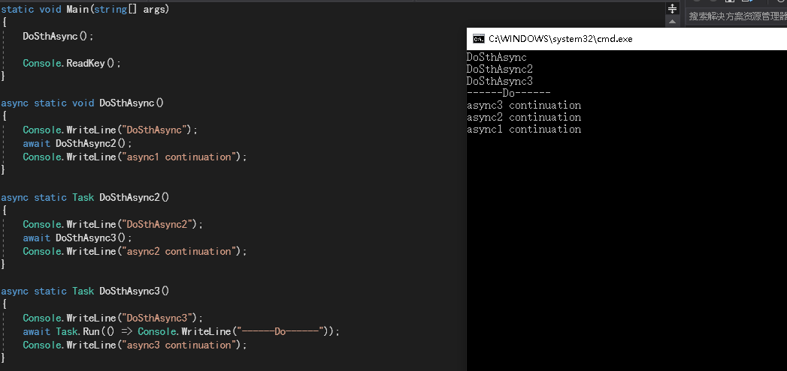

# 任务(Task)    

> 命名空间：`using System.Threading.Task`;
> Task可以在操作完成后返回一个值，而线程池不可以。    
> 长时间运行的任务或操作，可以用Long-Running Task。    

> Task的异常会抛送给task.Result或者task.Wait()方法处。    


## 创建Task并执行    


- 使用线程池的任务    

```C#  
var tf = new TaskFactory();
Task t1 = tf.StartNew(Foo, "工厂StartNew方法");
Task t2 = Task.Factory.StartNew(Foo, "工厂StartNew静态方法");
Task t3 = new Task(Foo, "使用Task构造函数");    t3.Start();//冷任务
Task t4 = Task.Run(() => Foo("使用Run方法"));//热任务  (.net 4.5)
```  


- 同步任务    

任务也可以同步运行:    
```C#  
Task t1 = new Task(Foo, "同步运行");
t1.RunSynchronously();
```  


- 使用单独线程    

如果任务的代码将长时间运行，就应该使用`TaskCreationOptions.LongRunning`告诉任务调度器创建一个新线程，而不是使用线程池中的线程。    

```C#  
var t1 = new Task(Foo, "long running", TaskCreationOptions.LongRunning);
t1.Start();
```

## 任务的结果    

当任务结束时，它可以把一些有用的状态信息写入到线程安全的共享对象。另一个选项是使用将来会返回一个结果的任务，在早期版本的*TaskParallelLibary(TPL)*的类名为`Future`，现在它是Task类的一个泛型版本（CRE:`Task<>`），可以定义任务返回的结果类型。    

```C#  
public static Tuple<int,int> Foo(int arg)
{//...
};
public static void Test()
{
    var t1 = new Task<Tuple<int,int>>(Foo, 2333);
    t1.Start();
}
```

- **`Wait()`方法**    

调用`Wait()`方法会进行阻塞直到操作完成，相当于thread的`Join()`方法。    

- **`Task.Result`**    

从Task返回一个结果值，访问Result属性时，task如果没有完成则会阻塞线程直到完成。    


## 任务的连续    

通过任务，可以指定在任务完成后，应该运行另一个特定任务。例如如果前一个任务失败了，这个任务就应该执行一些清理工作。    

- **`Task.ContinueWith**    

> 使用awaiter对象，或者使用Task.ContinueWith方法。(.NET4以上)    

```C#  
private static void First(){}
private static void Second(Task task){}

public static void Test()
{
    Task t1 = new Task(First);
    Task t2 = t1.ContinueWith(Second);
    Task t3 = t1.ContinueWith(t => Second(t));
    Task t4 = t2.ContinueWith(Second);
    t1.Start();
}
```

## 任务的层次结构    

一个任务启动一个新任务时，就启动了一个父子层次结构。创建子任务的代码与创建父任务的代码相同，唯一的区别是这个任务从另一个任务内部创建。    

如果父任务在子任务之前结束，父任务的状态就显示为`WaitingForChildrenToComplete`。所有的子任务也结束时，父任务的状态就变成`RanToCompletion`。    

取消父任务，也会取消子任务。    


<br />  
<br />  
<br />  
<br />  


# Task进阶    


## Awaiter对象    

获得Awaiter对象：  
`var awaiter = task.GetAwaiter();`  
结束/故障回调：  
`awaiter.OnComplete(delegate);`    
获得Task返回值：  
`var result = awaiter.GetResult();`    

```C#  
var awaiter =  task.GetAwaiter();  
awaiter.OnComplete(() => {
    var result = awaiter.GetResult();
    Console.WriteLine(result);  
});
```  


## CancellationTokenSource        

创建`CancellationTokenSource`实例并传入其Token到Task，即可请求任务的取消。    


## TaskCompletionSource    

> TaskCompletionSource是一种受你控制创建Task的方式。你可以使Task在任何你想要的时候完成。你也可以在任何地方给它一个异常让他失败。    

使用示例：  
```C#  
        static void Main(string[] args)
        {
            Task<int> task = Run<int>(() => { return 999; });
            task.GetAwaiter().OnCompleted(() => {
                Console.WriteLine("Result: " + task.Result);
            });
            for (int i = 0; i < 100; i++)
            {
                Console.WriteLine("main:" + i);
            }
        }

        static Task<int> Run<TResutl>(Func<int> function)
        {
            var tcs = new TaskCompletionSource<int>();
            new Thread(() => {
                Thread.Sleep(5);
                try
                {
                    tcs.SetResult(function());
                }
                catch (Exception ex)
                {
                    tcs.SetException(ex);
                }

            }).Start();
            return tcs.Task;
        }
```  


## 数据流    

Task和Parallel为数据并行提供了很多帮助，但是这些类不能直接支持数据流的处理，需要使用*TPL Data Flow*。    

- 数据块    

数据块可以是源，也可以是目标，还可以是源和目标。    

`ActionBlock`是一个目标块，所以实现了`ITargetBlock`接口。    

`BufferBlock`同时作为数据源和数据目标，它实现了`ITargetBlock`和`ISourceBlock`。    

> CRE：使用`Post()`方法向数据块发送数据。    


<br />  
<br />  
<br />  
<br />  
<br />  
<br />  


# 异步编程    

> Task非常适合异步编程，因为它们支持Continuation，这对异步非常重要。    

- **异步编程建议**    

1. I/O-Bound和ComputeBound操作建议用异步编写。  
2. 执行超过50毫秒的操作用异步编写。    
3. 粒度要适中。    


- **示例**  

  


<br />
<br />


## `await`和`async`关键字    

### **`await`**    

`await`关键字简化了附加continuation的过程：  

```C#  
var result = await expression;
//等同于
var awaiter = expression.GetAwaiter();
awaiter.OnComplete(() => {
    var result = awaiter.GetResult();
});
```  


### **`async`**    

`async`修饰符会让编译器把`await`当作关键字而不是标识符。    

> async关键字只用用于方法。该方法可以返回void、Task、Task<>。    

### **异步函数执行**    

遇到`await`表达式，执行会返回调用者，就像`yield return`。  
在返回前，运行时会附加一个continuation到await的task。（await表达式由线程池中线程来计算）。    

> async异步函数被编译成一个状态机，实现语言运行时的协程。（yield也是状态机实现）    


### **await之后在哪个线程上执行**    

在富客户端应用上，同步上下文保证后续在原线程(UI线程)上执行。否则，就会在task结束的线程上继续执行。（ContinueWith()同）    


<br />
<br />

## 注意事项    

> 对任何异步函数，可以用Task替代void作为返回类型，让它可以await，并不需要显式返回Task，编译器会自动生成一个Task。    
> 方法体返回`TResult`，那么异步方法就可以返回`Task<TResult>`。其原理就是给TaskCompletion发送的信号带有值，而不是null。    

> 编译器会对返回Task的异步函数进行扩展，使其成为当发送信号或者发生故障时使用TCS来创建Task的代码。    


（END）    


