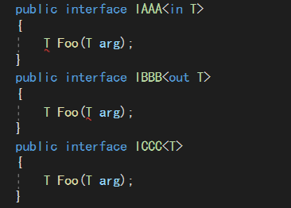

# 泛型接口    


## 协变和抗变    

> CRE：如果有一种可变性，它和子类到基类的转换方向相同，则称之为协变，反之称之为抗变。    

> 协变和抗变是指对参数和返回值类型进行转换。  

> 在.NET4之前，泛型接口是不变的。.NET4通过协变和抗变为泛型接口和泛型委托添加了一个重要的扩展。    

> 在.NET中，方法参数的类型是协变的。方法的返回值是抗变的。    


## 泛型接口的协变和逆变        

如果泛型接口用`out`关键字标注，泛型接口就是协变的。    

如果泛型接口用`in`关键字标注，泛型接口就是抗变的。    

```C#  
IEnumerable<Shape> shapes = new List<Rectangle>(); 
//转换能够成立就是因为IEnumerable<out T>是协变的。    
```

  

(END)  