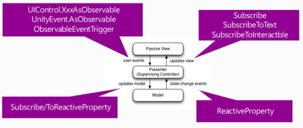

# UniRx响应式属性以及MVP模式实现            


## 响应式属性(ReactiveProperty)    

> ReactiveProperty可以替代一切变量，给变量创造了很多功能。    

要监听某个字段的改变事件，传统方法是使用属性get/set时绑定函数或者事件委托。      

```C#  
private ReactiveProperty<int> age = new ReactiveProperty<int>();
void Start()
{
    age.Subscribe(v => {
        Debug.Log("age change to:" + v);
    });
    age.Value = 5;
}
```  

> Siki：响应式属性可以实现MVC模式，Model中定义响应式属性，Controller中订阅属性，在View中改变Model。    


#### 响应式属性的序列化    

`ReactiveProperty<T>`是泛型的，默认不能序列化。UniRx⽀持了可序列化的类型，⽐如`Int/LongReactivePropety`、`Float/DoubleReactiveProperty`、`StringReactiveProperty`、`BoolReactiveProperty`等，详见InspectableReactiveProperty.cs。    

自定义：  

```C#  
public enum Fruit
{Apple, Orange }

[System.Serializable]   //CRE：Serializable属性是必须的
public class FruitReactiveProperty : ReactiveProperty<Fruit>
{//CRE：可以不声明成员
}
[UnityEditor.CustomPropertyDrawer(typeof(FruitReactiveProperty))]
public class ExtendInspectorDisplayDrawer : InspectorDisplayDrawer //InspectorDisplayDrawer extends UnityEditor.PropertyDrawer
{//CCRE：可以不声明成员
}
```  


<br />
<br />


## MVP模式实现    

  

> CRE：MVVM与MVP框架区别在于：MVVM采用双向绑定：View的变动，自动反映在ViewModel，反之亦然。    
> Siki：不使用MVVM的原因：Unity没有提供UI绑定机制，创建⼀个绑定层过于复杂并且会对性能造成影响。（使⽤反射）    


（END）  