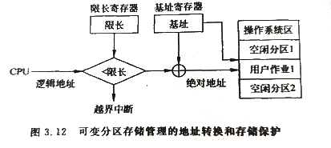

# 分区内存管理    

## 1、单一连续内存    

### 基本思想：    

单一内存管理适用于单用户单任务操作系统，是最简单的内存管理方式。    
单一连续内存管理将内存空间分为**系统区**和***用户区**，系统区存放操作系统常驻内存代码和数据，用户区全部分配给一个用户作业使用。    
在这种方式下，任一时刻主存储器最多只有一道程序，各作业只能按次序一个一个装入内存运行。    

### 内存分配和回收：    

由于用户区只能装入一个程序，所以该程序装入内存时，就从内存的用户区的基址开始连续存放。    
在运行过程中，该程序独占内存直到退出，操作系统回收内存再分配给下一程序使用。    

### 地址转换与内存保护：    
单一连续内存管理多采用静态重定向来进行地址转换。    
操作系统设置一个界限寄存器用来设置内存中系统区和用户区的地址界限，通过装入程序把目标模块装入到界限地址开始的区域。    

内存保护由装入程序来执行，转入时由装入程序检查物理地址是否超过界限地址，超过则可以装入；否则地址错误不能装入。这样用户的程序就总是被装入到合法的用户区域内。    

> Cre：可以静态重定向，也可以用动态重定向。    

- ⭕主要缺点：    
1. 内存利用率低。用户程序所需的空间一般均小于内存用户区空间，剩余的内存空间不能被其他用户使用。    
2. CPU利用率低。当运行中的程序进行I/O操作时，CPU可能空闲等待。    
3. 外设利用率低。用户控制所有资源，有些资源在运行期间可能并不使用，也不能被其他用户使用。    
4. 不能进行内存扩充。当内存容量小于某一程序所需空间，则程序无法运行。    

> Cre：大多数都是单道操作系统的缺点。。。    

## 2、固定分区内存管理    

### 基本思想：  

固定分区内存管理是与先把可分配的内存空间分割成若干个大小固定的连续区域。    
每个区域的大小可以相同，也可以不同，每个区域称为一个分区，每个分区可以装入且只能装入一个用户作业。    
这样，分区后的内存中就可以装入多道程序，从而支持多道程序并发设计。    

### 分区划分：    

- 方法一：分区大小相等    
所有分区的大小都相等，这种方式适合计算机工业控制系统。    

-方式二：分区大小不等    
把可分配空间分割成大小不等的多个分区，大的分区可以分配给大的进程，小的分配给小的进程。    
这使得内存分配更加灵活，内存浪费少。    

### 固定分区的内存分配：    

为了说明各分区的分配和使用情况，系统设置一张内存分配表。    
内存分配表指出了各分区的起始地址和分区长度，占用标志位指示是否被使用。    

### 地址转换和内存保护：    

- 静态重定位：    
装入程序再进行地址转换时检查其绝对地址是否在指定分区内，如果是则可把程序装入，否则不能装入。内存回收很简单，只需要内存分配表的占用标志位设置为0即可。    

- 动态重定位：    
计算机系统设置了一对地址寄存器--上/下限寄存器。    
当一个进程占有CPU时，操作系统就从内存分配表取出对应的地址放入该寄存器，硬件的地址转换机构根据下限寄存器中保存的基地址与逻辑地址相加就得到绝对地址。    
硬件的地址转换机构同时把绝对地址和上/下限寄存器中保存的地址进行比较，就可以实现存储保护。    

  

### 优点和缺点：    

与单一连续方式相比使系统资源利用率和吞吐量有一定的提高。    

- 主要缺点：    
1. 内存空间的利用率不高。    
2. 由于每个分区大小固定，这样就限制了可容纳程序的大小，找不到足够大的分区导致无法装入。    

 
 

## 3、可变分区内存管理    

### 基本思想：    

可变分区是指事先不确定分区大小，也不确定分区数目。当某一个用户作业申请内存时，检查内存是否有一块能满足作业的连续存储空间，若有则就把这一空间划出一块区域给该用户使用。这种方式称为*可变分区内存管理*。    

> 可变分区克服了固定分区内存利用率低的问题，更适合多道程序环境、    

### 可变分区内存的分配和回收：    

> Cre：可变分区的分配时可能有空闲空间的切分。回收时可能有空闲空间的合并。      

- 表格：    
构建对分区信息进行描述的两张表。一张表是已分配区的情况表，另一张表是未分配区的情况表。    

- 链表：    
也可用通过链表的方式管理空闲分区，将所有的空闲分区通过前向和后向指针串在一起组成双向空闲分区链。    
链表管理比表格管理复杂一点，但是优点是不占用存储单元。    

### 可变分区的内存分配算法：    

- 最先适应分配算法：每次分配时总是从头顺序查找未分配区表或链表，将第一个找的的符合要求的分配给用户作业。（缺点1：低地址段产生许多内存碎片）（缺点2：每次从头查找花费时间长）      
- 循环首次适应算法：对最先适应法的改进。不是从头查找，而是从上次为作业分配分区后的位置开始查找。（碎片问题依然存在）    
- 最优适应分配算法：从空闲区挑选一个能满足作业要求的最小分区，避免去分割一个大分区，使得大作业容易装入。（也是碎片问题）    
- 最坏适应分配算法：从空闲区挑选一个最大的区给作业使用，这样使得分割后剩下的空闲区仍然很大，减少了碎片大小和数量。采用这种算法可以把空闲区大小递减排序。（缺点是大空闲区不断减少）    
- 最快适应分配算法：把不同长度的空闲区归类，为每种长度的空闲区设立单独的空闲区链表。（优点是迅速）（缺点是回收分区困难、复杂、开销大）    

### 地址转换和内存保护：    

可变分区内存管理**采用动态重定位方式**装入作业，其地址转换由硬件机构完成。    
硬件设置了两个寄存器：基址寄存器和限长寄存器。    

  

> 当用户作业占有CPU运行时，操作系统把分配给该作业的分区的起始地址和长度送给基址寄存器和限长寄存器，启动作业运行时由硬件根据寄存器进行地址转换得到绝对地址。    
> 当逻辑地址小于限长值时，由逻辑地址加基址寄存器的值就可得到绝对地址。    
> 当逻辑地址大于限长值时，表示作业要访问的内存越界，禁止访问该地址，起到了存储保护的作用。    
> 多道程序系统中只需要一对基址/限长寄存器，因为作业出现等待时，操作系统会把寄存器(不止这对寄存器)的值随同其他作业信息保存起来。    

### 紧凑技术：    

> Cre：紧凑技术不就是内存碎片整理？    

内存多次分配后会出现许多不连续空闲空间。可以采用紧凑技术把内存中的作业改变存放区域，使分散的空闲区汇成一个更大的空间区。    

> 紧凑技术会增加系统开销，而且不是任何时候都能对一道程序进行移动的，例如外设和内存进行信息交换时。    

（END）    