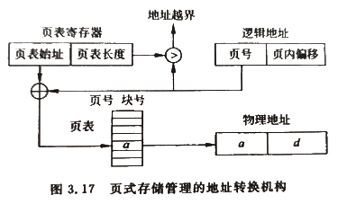
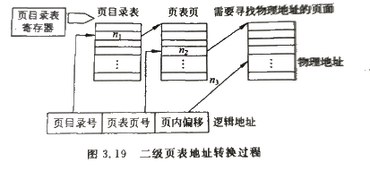
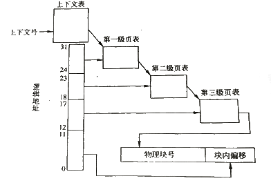

# 页式存储管理    

> 前述的各种分区式内存管理，都有一个共同特点：连续性。每道程序都要占用内存的一块连续区域。虽然有紧凑技术能够整理产生的碎片，但是紧凑技术的开销也很大。    
> 为了解决这一问题，出现了非连续的内存分配方式，也成为离散分配方式。其基本出发点是打破程序装入的整体性和存储分配的连续性，首先将用户进程的逻辑地址空间划分成多个子部分，以子部分为单位装入物理内存，这些子部分可以分布在若干非连续内存块上，实现了离散存储。    

> 内存的离散存储主要包括页式存储管理和段式存储管理。    

 
 

## 1、页式存储管理的基本原理    

### 页：    
将用户进程的逻辑地址空间划分为大小相等的区，每个区称为一页，并对各页从0开始编号。    

### 物理块：    
将物理内存也划分为与页大小相等的区，每个区域称为一个*物理块(block)*，或称“块”、“页框”。同样也对他们进行编号。    
物理块的尺寸大小通常会取2的幂次。物理块的大小由计算机硬件决定，页的大小由物理块大小决定。    

### 分配：    
内存分配的基本单位是页，当装入一个用户程序时，按页为单位，每一页装入一个物理块中。    
一个用户进程装入内到内存中时各个物理块之间不需要连续。    
进程的最后一页经常装不满一块，所以会在最后一块形成不可利用的碎片，称为“页内碎片”。    

### 逻辑地址形式：    
进程的逻辑地址可以用"页号+页内偏移值"表示。    
采用页式存储管理时，逻辑地址仍然是连续的。所以用户在编程时不用考虑如何分页，分页的工作由操作系统完成。    

 
 

## 2、页式存储管理的内存分配和回收    

页式存储管理在进行内存分配时，以物理块为单位进行分配，一个作业有多少页，在装入内存时就必须给它分配多少个物理块。  
和分区式存储管理不同，这些物理块可以是不连续的。    

在内存分配时，首先，操作系统**为进入内存的每个用户作业建立一张页表**。页表用来指出逻辑地址中的页号与内存中的物理块号的对应关系。    

|页号|块号|
|-|-|
|第0页|块1|
|第1页|块3|
|...|...|

同时，在页式存储管理系统**还存在一张作业表**，作业表中每项记录了每个作业的页表起始地址和长度。    

|作业名|页表始址|页表长度|
|-|-|-|
|A|XXX|XX|
|B|XXX|XX|

### 补充：    

页表的表项除了块号、页号以外，还有存取控制字段，用于实现对内存物理块的保护。    

页表的长度由用户进程的长度决定，每个在内存中的用户进程都会建立一张页表。    

如果进程不处于运行状态，页表的起始地址和长度存放在进程控制块PCB中。只有某一进程被调度运行时，系统才会从运行进程的PCB中将页表起始地址和长度装入页表寄存器。    

 
 

## 3、页式存储管理的地址转换    

页式存储管理中，进程逻辑地址到物理地址转换也需要硬件(地址转换机构)完成。    

    

> 由地址转换的过程可见，处理器每运行一条指令总是先根据指令的逻辑地址，通过访问内存中页表才能得到物理地址，根据物理地址再去访问内存才能得到需要的指令或数据。即处理器需要访问两次内存。    

 
 

## 4、快表    

为了提高存取速度，计算机系统通常都设置一个专用的高速缓冲存储器，用来存放页表的一部分，这种高速存储器称为*相联存储器(Associative Memory)*，存放在相联存储器的页表称为快表。    

相联存储器的访问速度比内存快，但是价格高，一般都是小容量的。由于高速缓冲存储器由半导体存储器实现，其工作周期与处理器的工作周期接近，因此速度上能够很好低匹配处理器，所以访问快表的速度远远快于访问内存中页表的速度。    

根据程序执行的局部性特点，即在一定时间内总是反复地访问某些页，若把这些页登记在快表中，无疑将极大地加快指令和数据的访问速度。快表里登记了已在相联存储器中的页及其对应的内存的块号。    

### 借助快表形成物理地址的过程：    

按逻辑地址中的页号查快表，若该页已登记在快表中，则由块号和块内偏移形成绝对地址;    
若快表中查不到页号，则只能再查内存中的页表来形成绝对地址，用时将该页登记到快表中。    
当快表填满后，又要在快表中登记新页时，则需要在快表中按一定策略淘汰一个旧的登记页，最简单的策略是先进先出。    

### 多道程序的快表：    

整个系统只有一个相联存储器，只有占用CPU的进程才能占用相联存储器。在多道程序中，当某道程序让出CPU时，应该同时让出相联存储器。    
由于快表是动态变化的，所以让出相联存储器时应该把快表保护好以便再执行时使用。    
当一道程序占用CPU时，除设置页表寄存器外还应将它的快表送入相联存储器。    

 
 

## 5、页的共享和保护    

页式存储管理有利于实现多个进程共享程序和数据。在多道程序系统中，编译程序、编辑程序、解释程序、公共子程序、公用数据等都是可以共享的，**这些共享的信息在内存中只保留一个副本**。    

### 在实现共享时必须区分数据共享和程序共享：    

实现数据共享时，可运行不同进程对共享数据页使用不同的页号，只要让各自页表中的有关表目指向共享的数据物理块即可。    
实现程序共享时，必须为不同进程在所有逻辑地址空间中指定同样的页号。（Cre：因为转移指令是地址相关的）        

### 信息保护：    

实现信息共享必须解决信息的保护问题。常用办法是在页表中增加一些标志位，用来指出该页的信息是读/写、只读、只可执行、不可访问等，在指令执行时进行核对。   
例如要想向只读块写入信息则指令停止，产生中断。    

 
 

## 6、多级页表    

### 多级页表的引入：    

随着计算机技术的发展，具备32位、64位逻辑地址空间的计算机系统已经很普遍，这样的计算机系统可以支持2^32~2^64B容量的逻辑地址空间，当采用页式存储管理时，其页表所需的存储空间也是很大的。    

> Windows2000/XP为例，其运行的Intelx86处理器具有32位地址，若规定每页大小4kB(2^12)，则4GB(2^32)的逻辑地址共有1M(2^20)页，共需要1M个页表项。若每个页表项占用4个字节，则共需要4MB的内存空间。共1K个内存物理块，这些物理块可以离散分布在内存中，查找页表时的时间开销也非常大。    

为了能快速查找**页表页**在内存中的物理块号，为这些页表页再设计一个地址索引表，即**页目录表**。页目录表的表项中包含每个页表页所在的内存物理块号和相关信息。    

> 这样，系统将页表分为两级：一级为页目录表，一级为页表页。

### 多级页表的地址转换：    

    

> 二级页表地址变换需要三次访问内存。为了节省时间，系统也可以采用快表获取内存信息。    
> 当逻辑地址的位数更多时，系统会采用三级、四级、甚至更多级的页表。    

    

> SUN公司的Solaris操作系统基于SPACE处理器，采用了三级页表。    

（END）    