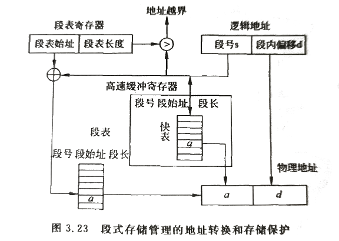
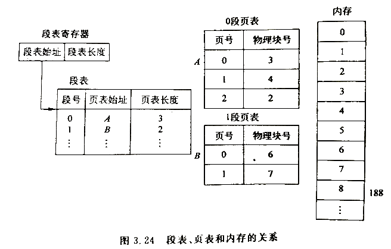
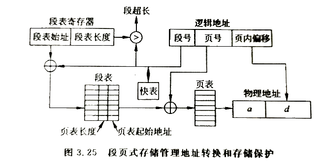

# 段式存储管理    

## 1、段式存储管理的基本原理    

### 逻辑地址空间分段：    

> 前面讨论的内存管理方法都是假设用户从0开始编址，逻辑地址空间都是一维的。    
> 事实上。一个程序往往由一个程序段，若干个子程序、数据段、工作区段所组成的，每个段都从0开始编址，段内地址连续。      
> 因此，可以按照程序的逻辑段结构，将一个程序按段为单位分配内存，一段占用一块连续的内存地址空间，段与段之间不需要连续。    

### 段地址结构：    

分段式存储管理是以段为单位进行内存分配，逻辑地址空间是一个二维空间，分为段号和段内偏移两部分。    

|段号|段内偏移|
|-|-|    

在页式存储管理中，逻辑地址如何分页用户是不可见的，连续的逻辑地址空间根据内存物理块的大小自动分页；    
而在段式存储管理中，则是由用户来决定逻辑地址如何分段。用户在编程时，每个段的最大长度受到地址结构的限制，每个程序中允许的最多段数也可能受到限制。    

段表：  
|段号|始址|段长|
|-|-|-|
|第0页|XXX|XXX|
|第1页|XXX|XXX|
|..|||

作业表：    
|作业名|段表始址|段表长度|
|-|-|-|
|A|XXX|XXX|
|B|XXX|XXX|
|..|||

分段存储管理和分页存储管理有很多相似之处。在分段存储管理中操作系统为每个作业创建一张段表，每个段在段表中占有一项。    

段表中有段号、段长、段在内存的起始地址、存取控制字段等信息。    

同时段式存储管理系统还包括一张作业表，将这些作业的段表进行登记，每个作业在作业表有一个登记项。    

在段式存储管理中，对内存的分配类似于可变分区分配方式，因此其内存分配算法可以参照可变分区内存分配算法来设计。（例如最先适应、最优适应等算法）    

 
 

## 2、段式存储管理的地址转换和内存保护    

段地址转换借助于段表完成。段表寄存器用来存放当前占用处理器的作业的段表起始地址和长度，查询段表得到每段在内存中的起始地址，将段的起始地址加上段内偏移则得到真实物理地址。    

> (1)将CPU给出的逻辑地址由地址转换机构分为段号s和段内偏移d。    
> (2)查询段表寄存器得到段表在内存的起始地址。    
> (3)将段号作为索引段表查询，得到该段在内存中的起始地址和段长。    
> (4)将段内地址与段长比较，如果大于段长就发出越界中断。否则段在内存中的始址与段内地址相加的到物理地址。    

> 同样借助于联想寄存器，在快表中保存最近使用过的段表项，可以更快地实现地址转换。    
> 段表中可增加存取控制权限字段，显示对段的读写是否允许，检查对该段内地址的访问操作是否合法。    

 
 

## 3、段的共享    

在段式存储管理中，所谓段的共享事实就是共享分区，为此计算机系统要提供多对基址/限长寄存器。这样，几个作业所共享的例行程序就可以放在一个公共分区中，让各道的共享部分都有相同的基址/限长值。    

由于段号仅仅用于段之间的互相访问，段内程序的执行和访问都使用段内地址，因此不会出现页共享时出现的问题。对数据段和代码段的共享都不要求段号相同。    

对共享区的信息必须进行保护，如规定只能读出不能写入，往该区域写入信息将遭到拒绝。    

 
 

## 4、分段和分页的比较    

段是信息的逻辑单位，由源程序的逻辑结构决定，用户可见，段长可以根据用户需要来规定，段起始地址可以从任何地址开始。在分段方式中，源程序（段号，段内偏移）经连接装配后仍保持二维结构。    

页是信息的物理单位，与源程序逻辑结构无关，用户不可见，页长由系统确定，页面只能以页大小的整数倍地址开始(Cre：即对齐)。在分页方式中，源程序经连接装配后变成了一维结构。    

 
 

## 5、段页式存储管理    

### 引入：    

> 页式存储管理基于存储器的物理结构，存储利用率高，便于管理，但难以实现存储共享、保护和动态扩充；    
> 段式存储基于应用程序结构，有利于模块化程序设计，便于段的扩充、动态链接、共享和保护，但是往往会形成段之间的碎片，浪费存储空间。    

可以把段式存储管理和页式存储管理这二者结合起来，在分段式存储管理的基础上实现分页式存储管理，这就是*段页式存储管理*，是目前应用最多的一种存储管理方式。    

### 基本原理：    

- ⭕分段：    
程序根据自身的逻辑结构分成段，这是段页式存储管理的段式特征。   

- ⭕分页：    
内存的物理地址空间划分为大小相等的物理块，这是段页式存储管理的页式特征。    

- ⭕段分页：  
将每一段的线性地址划分成与物理块大小相等的页面，于是形成了段页式存储管理。    

- ⭕逻辑地址：  

|段号s|段内页号p|页内位移d|
|-|-|-|  

- ⭕段页式存储管理的数据结构包括段表和页表：    

段表中包括段号、该段页表的起始地址、页表长度等信息。    
页表中包括页号、对应的物理块号等信息。  

    

- ⭕动态地址转换：    

段页式存储管理的动态地址转换机构由段表、页表、快表构成。    

    

> 1)操作系统把正在运行的作业的段表起始地址装入段表寄存器。    
> 2)操作系统从逻辑地址中取出段号和段内页号，用段号作为索引查询快表中的段表。    
> 3)如果从快表得到页表起始地址和页表长度，再查询快表中的页表，从而得到所在页面对应的物理块号。    
> 4)将该物理块页页内位移相加得到所需的物理地址。    

> 如果不能从从快表得到段和页的信息，则需要用段号作为索引查询内存中的段表，得到页表长度和页表起始地址。再以页号作为索引查询页表，得到该页对应的物理块号。    

（END）    