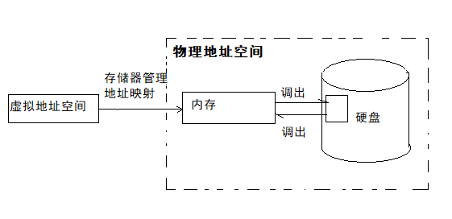

# 虚拟存储技术    

 
 

## 1、虚拟存储技术的提出    

由于受到计算机体系结构和成本限制，计算机的内存容量总是有限的。    

### 传统的存储管理：    

1. 如果一个作业要运行，必须将该作业的全部信息装入内存，并在整个作业运行结束后才能释放内存。    
2. 如果一个作业的信息大于内存容量，则无法装入内存，也无法运行。    
3. 如果系统有大量作业申请进入内存，则系统只能接纳相当有限的作业，系统的多道性和性能都难以提高。    

### 虚拟存储技术--外存作为内存的逻辑扩充：    

绝大多数作业在执行时实际上不是同时使用这些信息的，作业的某部分信息，例如异常处理，可能从来不会使用，也可能运行完一次后再也不会使用。    
既然作业的全部信息是分阶段需要的，则可以分阶段将作业信息调入内存，而不需要一次将作业的全部信息调入内存。    
于是，提出了这样的问题：能否将作业暂不执行的一部分暂时存放在外存，待到进程需要时才从外存调入内存？将外存作为内存的逻辑扩充，这就是虚拟存储技术。      

 
 

## 2、程序局部性原理：    

1968年P.Denning发现了程序的局部性原理：程序在运行时对页的访问是不均匀的，往往在某段时间内的访问仅局限于若干个页，而在另一段时间内，则又可能局限于另一些较少的页进行访问，呈现出局部性现象。    

特点总结就是：顺序性（程序大部分，除了过程调用和分支）、局限性（程序执行和过程调用）、多次性（循环指令）、独立性（程序相互独立的部分）。    

> 程序局部性原理说明：程序一次性装入内存与全部驻留内存是不必要的。    

 
 

## 3、虚拟存储技术的基本思想    

> 虚拟存储技术的思想就是外存作为内存的扩充，将暂不运行的作业信息放在外存，通过内存外存之间的对换，使系统逐步将作业信息放入内存最终达到能够运行整个作业，从逻辑上扩充内存。    
> 虚拟存储技术允许进程的逻辑地址空间比物理内存大，使得操作系统能接纳更大更多的作业，提高了系统的多道性和性能。    

- ⭕虚拟存储器：    

    

> 虚拟存储器的定义：虚拟存储器是指具有请求调入功能和置换功能，能够从逻辑上对内存空间进行扩展，允许用户的逻辑地址空间大于物理内存地址空间的存储器系统。    

- ⭕虚拟存储器的容量：    

虚拟存储器的容量由计算机的地址结构和辅助存储器的容量决定，与实际的主存储器容量无关。    
虚拟存储器的最大范围为计算机系统的可寻址范围。    

 
 

(END)    