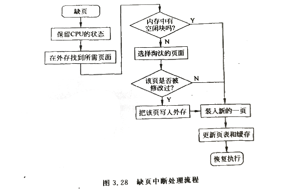
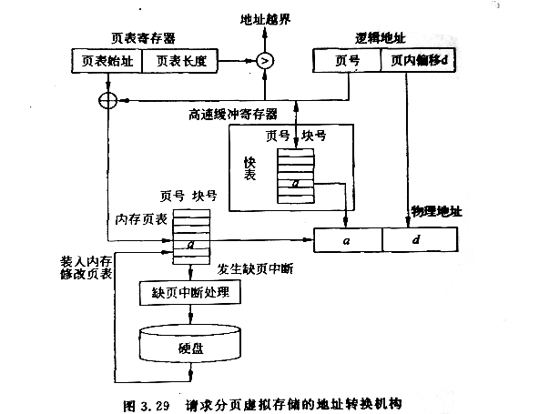

# 请求分页虚拟存储管理    

## 1、基本原理    

请求分页虚拟存储管理是在页式存储管理的基础上增加了请求调页和页面置换功能。    

- ⭕基本原理：    

1. 首先物理的内存空间被划分成等长的物理块，并对块编号。同时用户程序也进行分页。（这些与页式存储管理相同）    
2. 在用户程序执行之前，不把所有页装入内存，而是先放在外存。当程序被调度投入运行时，系统先将少数页装入内存。（对在内存中的页管理--同页式存储管理）    
3. 发现所要访问的数据或指令不在内存中，就会产生缺页中断，到外存寻找包含所需数据/指令的页，并将其装入内存的空闲块。    
4. 在装入一页的过程中，如果发现内存无空闲块或者分配给该进程的物理块用完，则需要用页面置换功能淘汰一个页释放其物理块。    
5. 被淘汰的页面如果被修改过，则还需要将其回写到外存，以保留其最新内容。    

从基本原理可以看出，请求分页虚拟存储管理与页式存储管理很多地方相似，区别是增加了请求调页和页面置换等功能，因此需要解决如下问题。    

- ⭕需要解决的问题：    

1. 需要提供一个全新的页表机制来记录任一页是在内存或在外存的位置，是否被修改过等信息。    
2. 用什么分配方式给进程分配多少物理块？    
3. 缺页中断如何处理？    
4. 页面装入内存如何进行重定位？    
5. 怎么选择要淘汰的页面？   

 
 

## 2、硬件支持    

请求分页虚拟存储管理的硬件支持包括请求分页的**页表机制**、**缺页中断机构**、**地址转换机构**。    

### 页表机制：    

虚拟存储管理中，页表除了要完成从逻辑地址到物理地址的转换外，还需要提供页面置换的相关信息。因此，页表中除了页号和物理块号以外，还增加了页的状态位、外存地址、修改位、访问字段等信息。    

|页号|物理块号|状态位|外存地址|修改位|访问字段|    
|-|-|-|-|-|-|
|...||||||  

> **状态位**：用于标志一页是否已装入内存。如果该页已经装入内存，则该页所对应的状态位置为1，否则置为0。    
> **外存地址**：页在外存的地址。当需要将某页调入内存时，需要查询页表中的外存地址项得到该页在外存的地址，在外存查找该页。    
> **修改位**：页在内存中是否被修改过的标志，决定了该页被换出内存时，是否需要再回写入外存。如果没有修改过，那么该页中的内容和在外存中的内容是一致的。    
> **访问字段**：标志页再内存时是否被访问过，用于进行页面置换时考虑是否将该页面换出内存。如果访问过，页面置换时系统会考虑该页以后会被再次访问而不换出。    

### 缺页中断机构：    

在进程运行过程中，当发现所访问的页不在内存，缺页中断机构便产生一个*缺页(Page Fault)*中断信号，操作系统接到此信号后，就运行缺页中断处理程序，将所需要的页调入内存。    
缺页中断与一般的中断类似，都需要经历保护CPU环境、分析中断原因、转入中断处理程序、中断处理后恢复CPU环境等步骤。但是也有不同。    

- ⭕与一般的中断不同点：    

1. CPU检测中断的时间不同。对一般中断CPU是在一条指令执行完后检测其是否存在，检测时间以一个指令周期为间隔。而对于缺页中断信号，CPU在一条指令执行期间，只要有中断信息就可检测，不需要等一个指令周期。（更及时）    
2. CPU可以多次处理。如果一个指令周期中多次检测到缺页中断，CPU都会及时处理。    

    

### 地址转换机构：    

请求分页虚拟存储技术是在程序执行过程中逐步将程序页面调入内存的，所以从逻辑地址到物理地址的转换是在程序运行过程完成的。（即动态重定位）    

    

> 进程被调度时，操作系统将进程PCB中的页表起始地址和长度装入页表寄存器中。    
> CPU从逻辑地址中取得页号，根据页号查询快表。    
> 如果快表中有该页的内存块号，则加上页内偏移作为该页在内存中的物理地址，同时将该页的页号和内存块号写入快表以备下次使用。    
> 如果查询页表而没有得到该页的内存块号，产生一个缺页中断，请求操作系统把该页调入内存。    
> 在调入一页的过程中，如果进程空间没有空余物理块，则系统需要调出一页后再将新页调入。同时还要修改页表。    

 
 

## 3、页面分配/调入/置换策略    

页面分配策略 --决定系统应该给一个进程分配多少物理块，进程才能运行。    
页面调入策略 --决定如何将进程所需的页面调入内存。    
页面置换策略 --决定内存中哪些页面被换出内存。    

### 页面分配策略：    

负责为多个进程分配相应的物理块，需要考虑系统的并发性、吞吐量和缺页中断等因素。有固定分配可变分配两种。    

- ⭕固定分配：    
是指为每个进程分配固定数量的物理块。由进程类型或者用户要求确定。具体分配方式包括**进程平均分配法**、**进程按比例分配法**、**进程优先权法等**。    

1. 进程平均分配法：    
将内存中所有可分配物理块平均分给系统各个进程。（最简单的分配方法）    

2. 进程按比例分配法：    
根据进程的大小，进程按照比例分配内存物理块数。    

3. 进程优先权法等：    
高优先级的、时间要求紧迫的进程，操作系统给其分配较多的内存物理块。    

- ⭕可变分配方式：    
是指分配给进程的物理块数，在该进程的运行期间可以动态变化 。用来解决事先分配给进程的物理块太少导致频繁换页。    

- ⭕进程最小物理块数：    
最小物理块是保证进程正常运行所需最小内存快数。进程需要的最小物理块数与计算机的硬件结构有关，取决于计算机的指令格式、功能、寻址方式。    
如果计算机是采用单地址指令的直接寻址方式，则只需要用于存放指令的页面和存放数据的页面，最小物理块数为2；如果计算机采用间接寻址，则至少需要3个物理块。    

对于功能强大的计算机，指令长度可能会超过多个字节，指令本省需要跨过多个页面，则物理块的最小需要数会更大。    

### 页面调入策略：    

页面调入策略有两种：**请求页(Demand Paging)**调入和**预先页(Prepaging)**调入。    

- ⭕请求页调入：    

请调是指在CPU需要访问进程某页面时，发现所在页面不再内存，CPU发出缺页中断，请求将该页调入内存。    
优点：需要时才将页面调入内存。节省了内存空间。    
缺点：开始阶段会有大量页调入内存，产生大量缺页中断。系统I/O频率高，效率减低。还会导致系统不稳定。    

- ⭕预先页调入：    

预调是指操作系统根据某种算法，预先估计进程可能访问的页面，并在处理器需要访问页面之前先将该页预先调入内存。    

优点：一次可将多个页面调入，减少了缺页中断次数和I/O频率。    
缺点：如果预先估计准确率低，会导致调入的页面不被使用的可能性大。程序员需要预先提供所需程序部分的信息，否则难以实施。    

### 页面置换策略：    

选择被置换出的页面有两种策略：**全局置换**和**局部置换**。    

- ⭕全局置换：    

操作系统从所有当前位于内存的页面选择一个页面淘汰，释放对应物理块，这种策略会影响大多数进程的运行，是一种动态方法。    

- ⭕局部置换：    

是指某进程有页面需要换入内存中时，只能从该进程目前已在内存中的页面中选择一页淘汰。    

### 页面分配和页面置换策略的关联/搭配：    

- ⭕固定分配局部置换：    

每个进程分配固定数量的物理块，在整个运行期间不再改变。缺页中断只能从该进程自己的的页面中选择一页淘汰。    

- ⭕可变分配全局置换：    

为每一个进程分配必要数量的物理块，使之可以开始运行。发生缺页中断时，系统从空闲物理块队列中选择一个空闲块分配给该进程。直到空闲物理块耗尽，才会从内存中选择任一进程的某个页面淘汰。    

- ⭕可变分配局部置换：    

产生缺页中断时，只能从自己进程的页面选择一页淘汰。不能影响其他进程。    
操作系统可以不时重新评估物理块分配情况，增加或者减少分配给进程的物理块。    

 
 

## 4、页面置换算法    

页面置换决定从内存换出哪个页面。    

衡量页面置换算法的重要指标是**缺页率**。    

- 影响缺页率因素：    
1. 进程物理块越多，缺页率越低。    
2. 划分的页面越大，缺页率越低。    
3. 程序局部性越好，缺页率越低。    
4. 置换算法越优，缺页率越低。    

以下是几种采用局部置换策略的页面置换算法。    

### A.先进先出页面置换算法：    

FIFO(First In First Out)算法的基本思想：总是选择最先进入内存的页面或者驻留最久的页面淘汰。    
该算法最早出现，易于实现、开销低、适合线性顺序特性好的程序。   

该算法没有考虑页面访问频率，很可能刚换出的页面又要访问。    

> CRE：Belady异常现象表示增加内存物理块对改善系统性能作用有限。    

### B.最佳页面置换算法：    

最佳(Optional, OPT)页面置换算法由Belady在1966年提出，基本思想是：在选择页面置换时应考虑该页面将来的使用情况，将来最长时间不用的页面被淘汰。    

在进程采用固定页面分配时，最佳页面置换算法具有最低缺页率。    

难点：很难准确预知进程在内存的页面哪些在未来最长时间不会被访问。    

> 只是一种理想化算法，难以实现。但是可以用来作为评判其他算法的准则。       

### C.最近最久未使用页面置换算法：    

最近最久未使用(Least Recently Used, LRU)页面置换算法的基本思想是：进行页面置换时，选择过去最长时间没有被使用的页面淘汰。      

该算法淘汰的页面是在最近一段时间里较久未被访问的那一页。它是根据程序的局部性来考虑的，即那些刚被使用过的页面，可能马上还要被使用，而那些较长时间里未使用的，一般来说不会马上用到。    

- 具体实现方法：  

系统维护一个淘汰队列，该队列存放当前在内存中的页号，每当访问一页就调整一次，使队尾指针总指向最近访问的页，而队头指针就是最近最少使用的页。    

- 优点：  

LRU算法能够合理地预测程序运行状态，具有良好的置换性能，被公认为一种性能好并可以实现的置换算法，但是实现较复杂。    

### D.时钟置换算法：    

详见参考资料。    

 
 

## 5、性能影响因素分析      

### 分配给进程的内存块数与缺页率的关系：    

一般来说，分给进程的物理块数越多，缺页率越小。极端情况下，某进程逻辑地址共需多少页面就分配多少物理块，请求页式管理就变成了页式管理。    

实验结果表明：对每个进程为其分配进程空间页面数约一半的物理块时，效果最好。    

### 页面大小对系统性能的影响：    

从页表大小考虑： 应该减少页数，控制页表所占空间。 -- 选择较大的页面尺寸。    
从内存利用率考虑： 进程的最后一个页面总是装不满一个物理块，会产内存碎片，为了减少内存碎片，应该选择小的页面尺寸。    
从读写页面的时间考虑：通常等待时间要大于传输时间，显然要加大页面尺寸有利于提高I/O效率。    

综上所述，现代操作系统中，页面大小大多选择512B~4KB。Intelx86就是4KB。    

### 缺页率对系统性能的影响：    

缺页率过高会发生“抖动”现象，即处理器频繁地处理页面调入调出，实际处理程度的能力极大减少。    

在实际应用中，缺页不只使得缺页的进程运行缓慢，还会影响到其他进程的运行。如果一个进程队列阻塞等待某个设备，而该设备正用于一个缺页的进程，则等待设备的进程会等待更长时间。    

可见，缺页不只使得缺页进程本身运行缓慢，还会使得整个系统的运行效率降低。    

（END）    
