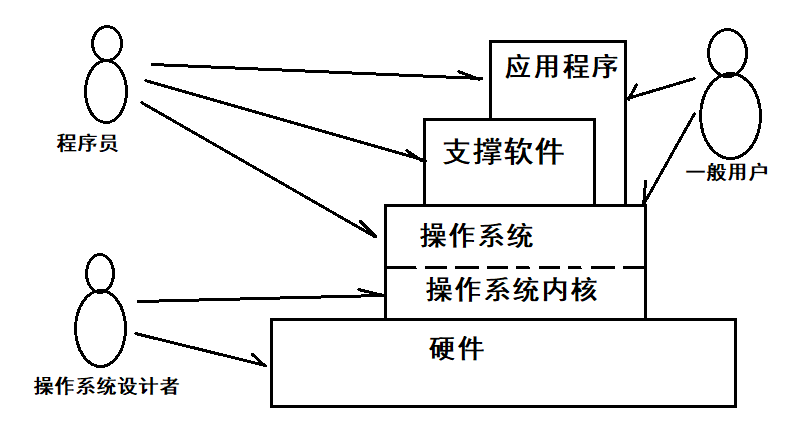
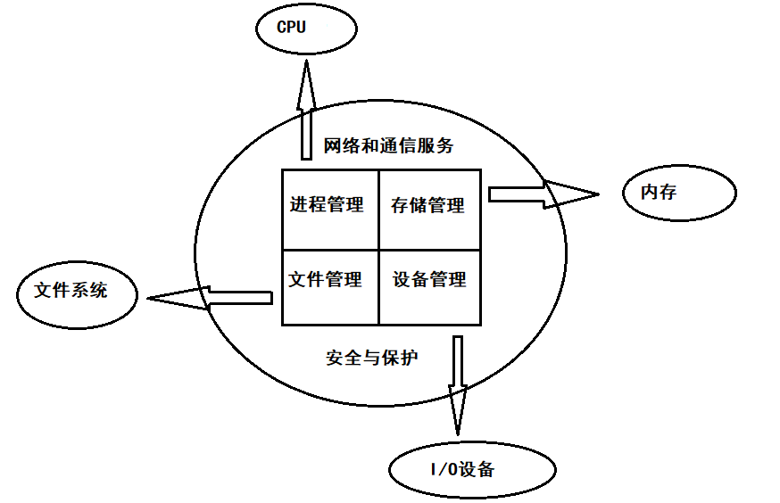

# 概述：计算机操作系统    

> 计算机系统由硬件系统和软件系统组成。*操作系统(Operating System, OS)*是配置在计算机硬件上的最底层软件。是对硬件系统功能的第一次扩充，是计算机系统中不可缺少的承上启下的系统软件。    

> 操作系统的职责是管理计算机系统的硬件和软件资源，控制计算机的整个工作流程。    

> 操作系统不仅体现了软件系统的最新发展，也体现了计算机硬件和体系结构发展的最新成果。    

 
 

# 一、操作系统的定义和功能    

 

## 1. 操作系统的定义    

### 计算机系统结构和使用关系：    

   

> 支撑软件有语言编译系统、数据库管理软件、中间件等。    

### 开发和使用操作系统的目的：    

- Ⅰ.操作系统统一控制和管理计算机系统所拥有的硬件和软件资源，使之得到更加合理的共享和尽量好的性能。    

> 操作系统作为资源管理者要1.跟踪资源状态、2.分配资源、3.回收资源、4.保护资源。    

- Ⅱ.操作系统能合理地组织计算机系统程序的运行，提高系统的处理性能。    

> 对计算机资源进行调度、分配、组织要采取相应的策略和算法，使有限的计算机资源发挥最大功能，从而计算机能够安全、可靠、高效地运行。    

- Ⅲ.操作系统为应用程序和用户提供方便地使用计算机的接口。    

> 操作系统是计算机硬件与用户之间的接口，最总用户是在使用计算机，所以它必须为用户提供一个良好的用户界面。    
> 操作系统也是计算机硬件与上层应用程序之间的接口，通过该接口，程序员开发应用程序时方便使用计算机操作系统提供的各项功能调用，使应用程序执行更加高效。    

### 操作系统的定义总结：    

> 操作系统是一组计算机程序的集合，主要用于控制和管理计算机硬件和软件资源，合理地组织计算机的工作流程，为用户提供方便、快捷、友好的应用程序使用接口。    

> 在操作系统设计者看来，操作系统是基于计算机硬件系统开发的第一层软件，是硬件资源的软件抽象，为程序员和普通用户提供使用计算机的接口。    

> 在程序员来看来，操作系统为程序提供系统调用或经进一步包装后的库函数、类库、API等，以方便程序员使用操作系统功能。    

> 在普通用户看来，操作系统对自己是透明的，只有应用程序才能体现自己使用计算机的价值，操作系统是支持应用程序开发和运行的基础平台。    

 
 

## 2. 操作系统功能    

> 操作系统管理计算机系统资源的基本功能可以分为几个方面：进程管理、存储管理、设备管理、文件管理。    

> 随着计算机网络的普及和安全问题的不断重视，现在的操作系统也都具备了基本的网络通信与服务功能和相应的安全保护机制。    

  

### 进程管理：    

*进程管理*主要围绕进程如何使用处理器(CPU)展开讨论。进程管理的任务是保证CPU正确地同时运行多个程序，CPU被多个程序分时共享，势必引起对CPU的竞争。    

为了描述程序运行，引入一个概念-*进程(process)*。**进程是指在系统中独立地描述运行程序的基本单位，向系统请求资源分配的单位**。    

宏观上允许多个进程同时在CPU上运行，但是在微观上一个时刻CPU只能为一个进程服务(CRE：即分时共享)。这就涉及如何建立、控制进程，进程间如何通信、协同工作以及如何正确地共享系统资源等一系列问题，它们都是进程管理需要解决的问题。**进程管理使一个物理CPU虚拟成多个同时运行的CPU，即进程**。    

**用户作业**是交给计算机执行的一个独立任务实体，它由**程序**、**数据作业说明书**组成。作业一般由多个作业步构成，每个作业步可由独立运行的程序完成，作业说明书包含了操作系统如何运行用户作业的信息。    

### 存储管理：    

存储管理的主要任务是管理内存资源。由于多个程序同时共享内存，存储管理将根据各用户程序的不同要求按照一定的策略为每一个程序分配内存。    

存储还要保护用户的程序和数据不被破坏，这也要求存储管理需要相应的管理策略和隔离保护措施。    

当一个程序要求的内存超过实际内存余量时，存储管理必须具有内存扩充能力，也就是系统应该实现虚拟存储器。这样一来用户所看到的逻辑空间容量就比实际物理内存大得多。    

### 设备管理：    

设备管理的基本任务是管理输入输出(I/O)设备，使多个用户能够共享设备和方便地使用设备。    

设备管理器按照外部设备的类型和一定的策略把外部设备分配给某作业（包括分配相应的通道和设备控制器）。按照用户的要求启动设备、控制设备工作，实现真正的输入输出操作并负责回收设备，同时对控制器或通道发出的中断请求作出及时的响应处理。    

为了解决高速CPU和低速外设之间的矛盾，设备管理器还需要按照一定的策略管理输入输出的缓冲区。    

为了像打印机那样的独享设备实现多用户、多进程之间共享，操作系统提供了虚拟设备。    

即插即用(PnP)、节能也是设备管理器要解决的问题。    

### 文件管理：    

文件系统管理着计算机系统中的各种信息资源，包括程序和数据等。这些信息存储在外部存储设备上。    

**文件是计算机永久存储信息的基本单位**，在现代计算机系统中，为了便于管理，各种信息资源都组织成文件，多个文件构成文件夹(目录)，目录也可以包含目录，目录本身也是文件，它包含其中每个文件特征信息的描述（即文件目录）。    

文件管理的任务就是对文件进行组织、管理，向文件用户提供对文件按名进行存取、检索、查询、保护的接口。    

在UNIX、Linux中，设备也被抽象为一种特殊的文件。    

### ※ 衍生功能：网络通信与服务：    

局域网通过路由器（或网关）与其他局域网和通信子网构成庞大的互联网。    

操作系统包含主要的标准局域网的物理层与数据链路层网络接口，其中包括以太网、Token网和无线网。支持网络进程通信、网络文件服务等分布计算的基本功能。    

### ※ 衍生功能：安全和保护：    

现在的操作系统在传统基本功能的基础之上，还提供了必要的安全和保护机制。    

本地与网络用户身份的认证与鉴别、合法用户的使用权限控制、文件系统的访问控制等等都是操作系统所应必备的安全与保护机制。    

 
 

## 3. 操作系统的特征    

### 并发性：    

在单处理器多道程序的环境下，在一段时间内有多道程序同时处于活跃状态，每一时刻仅能执行一道程序，在微观上这些程序是在交替执行，是串行的。在宏观上这些程序都在运行，是并发的。    

多处理器系统可以实现真正的并行性。并行性是指两个或者多个程序在同一时刻执行。    

### 共享性：    

内存中并发执行的多个程序可以共享计算机的硬件和软件资源。    

系统所配备的资源是很有限的，当并发执行的多个程序所需要的资源总数超过某种资源的数目时，为了避免混乱，需要操作系统提供一定的管理手段协调资源共享。    

- 互斥共享方式。在任意具体时刻只能有一个用户或者程序在真正使用，其他用户必须等待，当该用户访问完毕并释放资源后，才允许另一个用户或者程序对该资源访问。（例如打印机这类资源）    

- 交替共享方式。允许一段时间内多个用户或者程序“同时”对资源进行访问。是宏观上的同时，在微观上这些用户或者程序可能是交替对该资源进行访问。（例如磁盘设备的访问）    

### 虚拟性：    

虚拟性是指将一个物理实体映射为一个或者多个逻辑对象。    

例如宏观一个CPU能同时运行多道程序，给用户的感觉就是每道程序都有一个CPU为他服务。此时的虚拟性就是把一个物理CPU虚拟为多个逻辑的CPU。    

CPU、内存、外部设备都采用了虚拟技术，从逻辑层面上扩充了物理设备的数量。即在资源使用上更加灵活自由不受物理设备的数量限制。    

### 随机性：    

随机性也叫异步性，指的是每道程序在何时执行、各个程序执行的顺序以及每道程序所需要的时间都是不可预知的。    

在多道程序环境下，允许多个程序并发，但只有程序获得所需资源后才能执行。由于资源等因素限制，使程序的执行通常不是“一气呵成”的，而是“走走停停”的。很多东西是不可预知的。    

存在随机性并不是说操作系统不能很好地控制资源使用和程序运行，而是强调了操作系统的设计与实现要充分考虑各种可能性，以便稳定、可靠、安全、高效地达到程序并发和资源共享的目的。    

（END）

