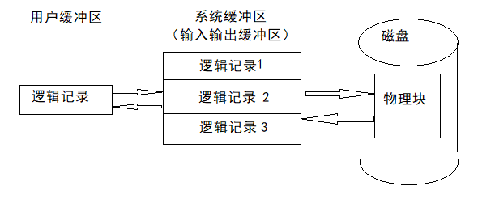

# 文件的组织    

> 存储介质是用来存储文件信息的载体，例如磁带、磁盘、光盘等。存储介质不同，提供的存取方式也不一样。      

文件的内容和相关信息都是以块的方式存放在外存上的，也就是说外存物理空间的分配是以块为单位的。    

文件组织是指文件中信息的配置和构造方式，同一个文件应该从两个侧面来观察它的文件组织方式：逻辑结构组织和物理结构组织。    
1. 文件的逻辑结构是指从用户的观点出发观察到的文件组织形式，用户可以直接处理，独立于文件的物理特性。    
2. 文件的物理结构是指逻辑文件在物理存储空间的存放方式和组织关系，又称文件的的存储结构。    

用户在处理文件信息时，只需关心所执行额文件操作以及文件的逻辑结构，而不必涉及存储结构，但对文件系统本身来说必须采用特定的数据结构和有效算法，实现文件的逻辑结构到物理结构的映射。同时为了实现对文件存储空间的管理，还要提供多种存取方法。    

 
 

## 1、文件的逻辑结构    

文件的逻辑结构的设计要求方便用户的使用，如方便用户查找和修改等。    

在本质上，文件的逻辑结构分为两种形式：**流式文件**和**记录式文件**。    

> 文本文件、源程序文件、可执行文件等二进制文件或者ASCII文件都属于流式文件，而大量的信息管理系统和数据库系统中都以记录式文件为主。    

### 流式文件：    

流式文件是指文件内的数据不组成记录，而是依次的一串信息集合，如字节流或字符流，它也可以看成是无结构的或只有一个记录的记录式文件，一所以也称为无结构文件。    

在系统中存在很多流式文件，如源程序文件、可执行文件、库函数文件等。这些类型的文件并不需要分记录，如用户作业的源程序就是一个顺序字节流，硬要分割源程序文件成若干记录只会带来操作复杂、开销增大的缺点。    

虽然字节流没有结构，但并非意味着该类型的文件不能有结构。实际上流式文件本身可以没有结构，但是处理该文件的软件可以按照用户定义的结构来操作文件，这种把文件的结构交给处理该文件的软件来完成的方式实际上更加灵活，大大简化了文件系统管理。因此目前大多数现代操作系统对用户仅仅提供流式文件（目录文件除外）。记录式文件往往由高级语言或者数据库管理等系统提供。    

### 记录式文件：    

记录式文件是一种有结构的文件，它是指文件中的数据由若干条定长或不定长的记录构成，每条记录又由若干条定长或者不定长的记录构成，每条记录又由若干数据项构成。    
记录是记录式文件进行存取的基本单位，顺序访问时文件读写指针每次步进一条记录长度。    

记录式文件中的所有记录长度一般都相等，当然也可以不等。定长记录的文件更便于检索修改。造成变长记录的原因可能是因为一条记录中所包含的数据项目数量不同，也可能是数据项本身的长度不定。无论是哪一种，在处理前，每个记录的长度都是可知的。对变长记录的检索速度慢，也不便于对文件进行处理和修改，在实际处理时，可以通过建立索引等方式来提高检索速度。    

记录式文件中记录之间组织方式非常重要，设计时综合考虑很多因素，例如如何提高检索速度、如何便于记录增删改等。按照组织方式的不同，记录式文件分为顺序文件、索引文件。  

- ⭕顺序文件：    

顺序文件是一种最基本最常见的文件形式。它是指记录之间按照某种顺序排列组织所形成的文件。    

顺序文件分为定长记录文件和不定长记录文件。    

顺序文件可以顺序存取和随机存取。（不定长记录文件的随机存取效率极低）    

优点：    
1. 适合进行批量存取。    
2. 只有顺序文件才能存储在磁带上。    

缺点：  
1. 不适合按要求查找或修改单个记录。    
2. 增删记录比较难，因为要重新组织记录的顺序和关键字。    

- ⭕索引文件：    

> 定长记录的顺序文件只要给出记录的位置，通过简单的计算很容易实现随机存取，按关键字检索也方便。但是变长记录的顺序文件都要从第一个记录查起，一直查找到索要查找的记录，所需时间较长。为此，可以为变长记录的顺序文件再建立一张索引表，对主文件中的每个记录在索引表中都有对应表项，用户记录记录长度和指向记录的指针。    

索引文件都是按关键字建立索引表，故只能按给出的关键字进行检索。    

索引文件可以有多个索引。可以为每一个可能称为索引条件的属性或关键字都配置一张索引表。    

优点：    
1. 通过建立索引极大地提高了查找速度。    
2. 增删很方便。    
缺点：  
1. 存储开销较大，除了主文件还有索引表。    
2. 增删记录时需要修改索引表。    

- ⭕索引顺序文件：  

> 索引文件查找效率提高了，但是索引表本身增加了存储开销，特别是记录有很多时。索引顺序文件是顺序文件和索引文件结合的产物，它将顺序文件中的多个记录组合成一组，并为每一组记录建立一个索引，通过索引指针指向该记录组的第一条记录。    

文件记录较多时采用索引顺序文件很适合。    

优点：  
1. 索引表占用空间小。    
2. 查找效率比顺序文件高。    

 
 

## 2、记录的成组和分解    

文件的内容以及相关信息都是以物理块为单位存放在外存中的。而记录式文件中的记录描述的是文件的逻辑结构，也成为逻辑记录。一个逻辑记录被存放到存储介质上时，可能占用一块或多块，也可以一个物理块包含多个逻辑记录。    

若干个逻辑记录合并成一组，写入一个块称记录**成组**。这时每块中的逻辑记录的个数称*块因子*。成组操作一般现在输出缓冲区内进行，凑满一块后才将缓冲区内的信息写到存储介质上。    
反之，当存储介质上的一个物理记录读入输入缓冲区时，把逻辑记录从块中分离出来的操作称为记录的**分解**。    

文件被打开后，在主存分配相应的输入输出缓冲区，用于成组和分解。由于容量有限，操作系统限定同时打开的文件个数，以防止文件缓冲区太多而挤占内存空间。    

- 优点:    
记录成组和分解不仅节省了存储空间，还能减少输入输出操作次数，提高系统效率。    

- 缺点：  
主要缺点是需要软件进行成组和分解的额外操作，需要能容纳最大块长的输入输出缓冲区。    

 
 

## 3、文件的物理结构    

文件的物理结构不仅取决于存储介质的存储特性，还与采用的外村分配方式有关。考察文件的物理结构时应该把文件看作相关物理块的集合，如何给文件分配所需物理块是研究的主要内容。    

按照物理块分配方式的不同，文件的物理结构主要分为连续文件、*链接文件*、*索引文件*、*直接文件*。    

### 连续文件：    

连续文件是基于磁带设备的最简单的物理结构，也适合其他各种外村设备。    

连续文件采用连续的外村分配方式，即要求所分配的物理块必须是连续的。    

- 优点：    

顺序存取时速度较快，非常便于顺序访问。所以顺序文件通常用于存放系统文件，因为这类文件往往被从头到尾依次存取。    

- 缺点：    

1. 要求建立文件时就确定它的长度，以此来分配相应的存储空间，这往往很难实现。    
2. 不便于文件的动态扩充。实际计算时，作为输出结果的文件往往随执行过程不断增加新内容。（所在位置的空间不够的话需要整块移动）    
3. 可能出现外部碎片。就是存储介质上不连续的小空闲块。    
4. 不能灵活地删除和插入记录。    

### 链接文件：    

为了克服连续文件的弱点，可以把一个逻辑上连续的文件分散地存放到不同的物理块中，这些物理块不要求连续也不必按规则排列。    

链接分配方式能适应文件的动态增长，消除了磁盘的外部碎片，添加删除和修改记录也更方便。实现链接组织有两种方式-*隐式链接*和*显式链接*。    

- ⭕隐式链接：    

隐式链接是指每个物理块自身存放下一个物理块的链接指针。    

隐式链接的主要缺点：  
1. 只适合顺序访问，不适合随机访问。  
2. 每个物理块增加了一个链接信息，为信息管理增加了一些访问。  
3. 可靠性差，一个指针出问题整个文件信息就丢失或出错。  

- ⭕显式链接：    

显式链接是指把用于链接文件的各个物理块指针显式地放在一张表格中。表格的序号是物理块号，每个表项存放链接指针，即下一个块号。整个磁盘只要设置一张这样的表格，表项数量为整个磁盘的的块总数。    

由于该表格专门负责指示各文件的物理块分配信息，所以也称为*文件分配表(FAT)*。这是MS-DOS和Windows早中期采用的文件系统技术。      

主要缺点：  
1. 不支持高效的直接存取，对一个较大文件存取时，须在FAT表中顺序地查找许多盘块号。    
2. FAT表本身占用很大的内存空间。   

### 索引文件：    

> FAT记录了每个文件的物理块占用情况，不管系统打开多少文件，必须把整个FAT表调入内存。事实上，可以将每个文件对应的块号集中放在一起，访问到这个文件时再将它对应的块号信息一起调入内存。索引结构就是基于这种思想。    

索引结构即系统为每个文件建立一个索引表，集中记录该文件占用的块号，索引表可以直接放在文件控制块中，但是大文件的索引表往往很大，所以大多数文件系统把索引表置于单独的物理块且可以驻留在磁盘任意位置。文件控制块的“物理地址”字段保存该索引表所在的块号。    

索引表可以分为**无键索引表**和**有键索引表**。分别适用于流式文件和记录式文件。    

优点：  
1. 方便地进行直接存取。    

缺点：  
1. 索引表增加了空间开销。（对于中小型文件空间浪费很严重）  
2. 索引表的查找增加了时间开销。存取文件时要首先取出索引表查表，增加了一次访盘操作，加重了I/O负担。    

### 多级索引文件：    

> 对于索引文件结构，如果文件很大，大到物理块号已经装满一个盘块时，系统就必须为该文件再分配一个盘块用于存放后继的索引信息，以此类推。    
> 如果索引表占用很多块，则需要交换很多次才能找到所需记录的物理地址，很费时间。为了提高大文件的查找速度，可以为这些一级索引再建立一个索引，称为二级索引。如果文件再大，还可以建立更多级索引。    

> 在UNIX系统中，为了能兼顾大中小文件，采取了混合索引结构。它在文件控制块的地址部分设置13个地址项，混合了四种寻址方式：直接寻址、一级索引寻址、二级索引寻址、三级索引寻址。    

### 直接文件：    

利用哈希函数直接建立逻辑记录的关键字与其物理地址的对应关系的文件组织称为直接文件。    
直接文件只能在直接存取的存储设备(例如硬盘)上实现，并且主要用于记录式文件。    

- 优点：  

1. 记录在介质上不需要按序存放，因为它能根据关键字直接计算出物理地址，所以最适合直接存取。  
2. 相对索引文件，它不需要索引，节省了索引存储空间和索引查找时间。    

- 缺点：  

直接文件的主要缺点是需要解决冲突问题，解决冲突碰撞会增加相当多的额外代价。    

 
 

## 5、文件的存取方法    

> 存取方法是指如何存储和检索文件数据的方法，它是操作系统为用户进程提供的使用文件的技术和手段。存取方法和文件逻辑结构、物理结构以及存储介质有密切关系。    
> 许多操作系统提供多种存取方法，而在一些文件处理密集的系统软件中，如数据库管理系统，文件存取的方法就更加丰富。    

### 顺序存取：    

按照记录的排列顺序或字符先后顺序逐个存取的方法称为顺序存取，一般要设置存取文件的读写指针。    
这种方式最简单，在磁带设备上存取效率最高。顺序组织的文件，即逻辑结构上的顺序文件或物理结构上的连续文件，都适合顺序存取，特别对于文件的批量存取，效率最高。    

### 直接存取（随机存取）：    

根据需要任意存取文件中的记录或物理块的方法称为直接存取或随机存取。    

定长记录的顺序文件比较适合直接存取。直接存取通常用于磁盘文件模式，在磁盘文件中，用户可以按照块号直接请求存取某个物理块。    

### 按键存取：    

按键存取可以看做直接存取的一种特例，它是指按给定的键值存取相应的记录。由于文件中的记录不按它在文件中的位置，而按它的记录键来编址，所以用户提供给操作系统记录键后就可以查找所需记录。    
索引组织的文件最适合该方法，因为索引文件都会按照关键字建立索引表，指定关键字来存取非常方便。    

 
 

## 5、文件存储空间管理    

文件管理的主要功能之一就是如何在外部存储介质上为创建或扩充文件而分配空间，为删除文件而回收空间以及对空闲空间的管理。  
磁盘可以随机存取的特性非常适合文件系统的实现，因此硬盘是最常见的文件外部外部存储介质。    

### 磁盘空间的分配：    

文件的物理结构和磁盘空间的分配方法密切相关。    

- ◉ 连续分配：  

文件被存放在外存空间的连续物理块。在建立文件时，用户必须给出文件大小，然后查找能满足的连续存储区供使用。    

优点是顺序访问时无需移动磁头，文件查找速度快，管理较简单。    
缺点是不适于文件频繁动态增长和收缩的情况，用户事先不知道文件长度也无法进行分配。    

- ◉ 非连续分配：  

非连续分配是指以物理块(扇区)为单位，按文件动态要求分配物理块，这些物理块不一定要连续，属于同一文件的块按文件记录的逻辑次序用链接指针链接或用索引表指示，即链接分配和索引分配。    
非连续分配还可以以**簇**为单位，簇是由若干个连续扇区组成的分配单位，实质上是连续分配和非连续分配的结合。    

优点是外存空间管理效率高，便于文件的动态增长和收缩，访问文件执行速度快，特别是簇为单位的分配方法已经被广泛使用。      

- ◉ 补充：  

> 外存管理中由于连续分配具有较高的分配速度，可减少磁盘I/O频率，故它在诸多分配方式上仍然占有一席之地。例如，在对换方式中，对于对换空间，一般都采用连续分配方式。对于文件系统，文件较小时，仍采用连续分配方式；当文件较大时，便采用离散分配方式。    

### 磁盘空闲空间管理：    

> 要合理组织磁盘空间的分配和回收，就要求文件系统随时掌握磁盘空间的分配情况，以便随时分配给新的文件或目录。为了记录空闲磁盘空间，也就是那些未分配快，需要采用一定的数据结构来实现。    

- ◉ 空闲区表法：  

为外存上所有空闲块建立一张空闲区表，每个表项记录了一个空闲区，主要包括该空闲区的第一个空闲块号，该区的空闲块数和状态等信息，再将所有的空闲区按其起始块号递增的次序排列，如下所示。        

|首块号|空闲块数|表目状态|
|-|-|-|
|...|...|...|

> 适合连续组织的文件，因为在建立文件时按尺寸申请一组连续的内存块，撤销文件时归还这组连续的空闲区。     

- ◉ 空闲块链表法：  

将所有空闲块连接在一起，组成一个空闲块链表。系统保持一个指针指向第一个空闲块，每一空闲块空间中保存指向下一空闲块的指针。    

> 这种方法效率低，需要多次读盘取得指针，但是便于文件动态增长和收缩。    
> DOS操作系统使用这种方法的变种。    

- ◉ 位示图法：  

空闲空间还可由位图或位矢量的方法来实现。每个磁盘块由1位表示。如果该磁盘块是空闲的，这个位就是0，否则就置1.    

优点是简单，寻找空闲块或寻找n个连续空闲块很有效。很多处理器支持一些位操作指令，就可以实现物理块的高速分配和回收。    
缺点是要把整个位图都装入内存，对于大容量磁盘来说，很耗费内存。    

（END）  
