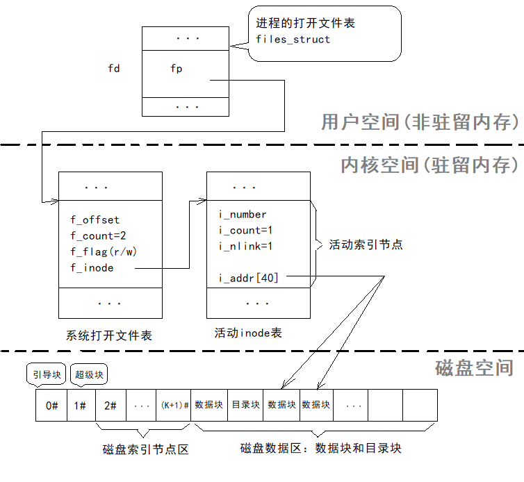

# 文件系统调用实现（UNIX/Linux为例）    

## 1、实现系统调用的相关数据结构    

> 文件系统在为用户进程服务时，经常需要沿路径查找目录以获得有关该文件的各种信息，这往往要多次访问外存，使得访问速度大大减慢。若把所有文件目录都复制到内存，能提升访问速度，但是增加了内存开销。一种行之有效的办法就是把常用和正在使用的那些文件目录复制进内存，既不需要增加太多内存开销又可以明显缩短查找时间。    

> 实现时，系统为每个用户进程建立一张打开文件表，并在系统中再维护一张记录系统中所有正在使用文件信息的系统打开文件表，正在使用文件的索引节点也会从外存索引节点区复制到内存索引节点表（即活动索引节点表）中。用户使用文件之前先通过“打开”操作，把此文件的文件目录信息（包括索引节点信息）复制到指定的内存区域，当不再使用这个文件时，使用“关闭”操作撤销该文件存放在内存的使用信息。这样可以大大减少访盘次数，提高文件系统效率。    


- ▤ 用户打开文件表：    

进程PCB结构中保留一个`files_struct`，称为用户打开文件表或文件描述符。表项的序号是文件描述符`fd`，此登记项内登记系统打开文件表的一个入口指针`fp`，通过此系统打开文件表项连接到打开文件的活动inode。    

- ▤ 系统打开文件表：  

这是为解决多用户进程共享文件、父子进程共享文件而设置的系统数据结构`file_struct`。主存专门开辟最多登记256项的系统打开文件表区，当打开一个文件时，通过此表项把用户打开文件表的表项与文件活动inode连接起来，以实现数据的访问和信息共享。    

- ▤ 活动索引节点表：  

由于文件的索引节点中保存的信息非常重要，当系统需要对文件进行各种操作，都离不开文件系统的索引节点表中指出的文件属性信息。因此，在实现中也将被访问文件在磁盘中的索引节点复制到内存中，构成了活动索引节点表，从而使对文件的访问更加方便。    


  


> 系统打开文件表中每个表项主要保存了读写位移指针`f_offset`、进程族中共享该系统打开文件表项的进程计数`f_count`、读写标志`f_flag`和指向对应文件的活动索引节点指针`f_inode`等。    
> 活动索引节点的每个表项除了保存了对应磁盘索引节点保存的文件属性信息以外，还增加了反映文件使用动态特性的信息，如内存索引节点号`i_number`、通过不同系统打开文件表项共享该活动索引节点的进程数`i_count`等，`i_addr[40]`数组保存了该文件在磁盘上的物理地址。    


<br />
<br />


## 2、创建和删除文件    

> 当文件尚未存在时，需要对其创建，创建和打开是完全不同的概念。文件打开是指当前文件已经存在，需要使用时先执行打开操作，以便建立应用进程和文件之间的联系。相应地，不需要创建文件时可以从外存上删除文件。    

### 创建文件：    

文件系统中创建一个新文件的系统调用`create`，其格式为：  

```CPP
fd = create(pathname, mode);
//其中mode是以二进制的位值位该文件设置的存取控制权限  
```  

- 实现过程(以`fd = create("/home/abc/file1.c", 0775);`为例)：  


1. 为新文件`file1.c`分配磁盘inode和活动inode，并把inode号与文件分量名`file1.c`组成新的目录项。记录到该文件目录路径`/home/abc`的目录文件中。显然在这一过程需要执行目录检索程序。    
2. 为新文件所对应的活动inode中置初值，包括把存取控制权限`i_mode`设置为`0775`,链接计数`i_count`置为`1`等。  
3. 为新文件分配用户打开文件表项和系统打开文件表项，置系统打开文件表项的初值，包括在`f_flag`中置“写”标志，读写位移`f_offset`清零等等；把用户打开文件表项、系统打开文件表项以及`file1.c`所对应的活动inode用指针连接起来，最后把文件描述符`fd`返回给调用者。    

> 上述步骤中兼有文件“打开”功能，在此后的操作中，无须执行“打开”操作即可读写。    


### 文件的链接、删除链接、删除：    

删除的任务是把指定文件从所在目录文件中去除，删除时如果没有链接用户（即`i_nlink`为`1`）,还要把文件占用的存储空间释放。    

删除系统调用形式：  
```CPP
unlink(pathname);
```  
> 在执行删除时，必须要求用户对该文件具有“写”操作权。    


- 示例：    

例如在`/home/l`目录下创建一个`/home/abc/file1.c`的共享文件，文件名为`file2.c`，则可以执行以下系统调用：  

```CPP
link("/home/abc/file1.c", "/home/l/file2.c");
```  

此时，这两个文件所在目录项实际上指向了同一个索引节点，索引节点中的`i_nlink`为2，即`/home/l/file2.c`文件共享了文件`/home/abc/file1.c`。    
当执行`unlink("/home/l/file2.c")`时，因为还有其他链接文件，所以并不把该文件从物理外存删除，只是把`file2.c`的目录项从`/home/l`目录文件中删除，并把`i_nlink`减一。   
接着执行`unlink("/home/abc/file1.c")`，由于此时该文件已经没有其他链接文件，即`i_nlink`为1，所以除了把`file1.c`的目录项从`/home/abc`目录文件中删除，还要删除该文件的外存索引节点，并把文件的内容从物理外存上删除。    


<br />
<br />


## 3、打开和关闭文件    

> 文件在使用之前必须“打开”，以建立进程与文件之间的联系，而文件描述符唯一地标识了这样一种连接，其任务是把文件的磁盘索引节点复制到主存的活动索引节点中，同时建立一个独立的读写文件数据结构，即系统打开文件表的一个表项。另一方面，活动索引节点表的大小受到容量的限制，这就要求用户一旦不再对文件进行操作时，应立即释放相应的活动索引节点，以便让其他进程使用，这就是“关闭”文件的主要功能。      

### 打开文件：    

打开文件的调用形式：   
```CPP
fd = open(pathname, flags);
//fd为文件描述符
//flags表示本地打开后的操作要求，例如读(0)、写(1)、读写(2)等
```

- 实现过程：    

1. 检查是否有其他进程已经打开该文件，如果有，则活动inode表中已有此文件的inode，只要把对应的活动inode中的`i_count`加一。    
2. 如果是第一次打开文件，则检索目录，要求打开的文件应该是已经创建的文件，它应登记在文件目录中，否则会出错。在检索到指定文件后，就把它的磁盘索引节点复制到活动索引节点表中。    
3. 根据参数`flags`所给的打开方式与活动索引节点在创建文件时记录的文件访问权限比较，如果非法，则打开失败。    
4. 当打开合法时，为文件分配用户打开文件表项和系统打开文件表项，并为表项设置初值。通过指针建立这些表项与活动索引节点间的联系。并把文件描述符`fd`(即用户打开文件表中相应文件表项的序号)返回给调用者。    


### 关闭文件：    

调用形式：  
```CPP
close(fd);
```  

- 执行过程：    

1. 根据`fd`找到用户打开文件表项，再找到系统打开文件表项。释放用户打开文件表项。    
2. 把对应系统打开文件表项中的`f_count`减一，如果非零，说明进程族（例如父子进程）中还有进程共享这一个表项，不用释放此表项直接返回；否则释放表项，并找到与之连接的活动索引节点。    
3. 把活动索引节点中的`i_count`减一，若非零，表明还有其他用户进程正在使用该文件，不用释放而直接返回；否则把该活动索引节点中的内容复制回磁盘上的相应索引节点中后，释放该活动索引节点。    

> `f_count`表示不同进程通过同一个系统打开文件表项共享一个文件的情况。    
> `i_count`表示不同进程通过不同的系统打开文件表项共享一个文件的情况。    


<br />
<br />

## 4、文件的读写和随机存取    

文件的读写时文件最基本操作，读是指文件的内容读入用户数据区，写是指用户数据区的内容写入文件。读写的位置由读写位移指针`f_offset`决定。    

### 读文件：    

系统调用形式：  
```CPP
nr = read(fd, buf, count);
//buf是读入的用户数据区首地址
//count为字节数
//nr是此系统调用执行后返回的实际读入字节数（可能小于count）
```

- 实现过程：  

1. 首先根据`f_flag`中的信息，检查读操作合法性。    
2. 如果合法，按活动索引节点中`i_addr`指出的文件物理块存放地址，从文件的当前位移量`f_offset`处开始，读出所要求的字节数到块设备缓冲区中，然后再送到buf指向的用户主存区。    

### 写文件：    

系统调用形式：  
```CPP
nr = write(fd, buf, count);
```

### 随机存取：    

> 文件初次打开时，文件的`f_offset`清空为零，以后的文件读写总是根据offset的当前值来顺序地读写文件。为了支持文件随机访问，文件系统还提供了系统调用`lseek`，它允许用户在读写文件之前，事先改变`f_offset`的指向。

系统调用形式：  
```CPP
lseek(fd, offset, whence);
//whence为0时，则f_offset被置为参数offset的值；当whenece的值为1时，则f_offset被置为文件当前位置加上offset的值。    
```


（END）    


