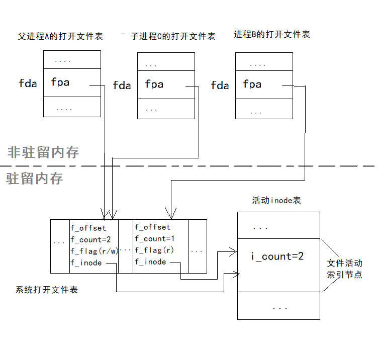

# 文件共享    

> 文件共享是指不同用户(进程)共享一个文件，这样，在系统中只需保留该共享文件的一个副本。    
> 文件共享不仅为不同用户完成共同任务提供了基础，而且还可以节省大量的外存空间，减少由于文件复制增加的访问外存次数。    
> 文件共享可以有多种形式。在UNIX/Linux系统中，允许多个用户静态共享或动态共享同一个文件。当一个文件被多个用户进程动态共享使用时，每个进程可以各用自己的读写指针，或者共用读写指针。    

 
 

## 1、静态共享    

文件或者目录的共享关系不管是用户是否正在使用系统都存在的共享方式称为*静态共享*。    
例如允许一个文件或目录有多个父目录，实际仅有一处物理存储。    
这种文件在物理上一处存储，从多个目录可到达该文件的多对一关系称为*文件链接(FileLink)*。    

静态共享主要有两种方式实现链接：一种是基于索引节点的方式，一般不适合目录共享；另一种是符号链接共享的方式，适合文件也适合目录。      

### 基于索引节点的链接分享：    

这种静态共享方式是通过索引节点实现链接的。多个目录共享一个文件，只要把共享文件的目录指向同一个索引节点，即存放相同的索引节点号，被共享的文件可以同名，也可以不同名。    

用户删除一个共享文件时，只将`i_nlink`减一。当最后一个共享文件(`i_nlink=1`)被删除时才执行真正的删除操作。    

这种链接在UNIX也成为*硬链接*，缺点是只能用于单个文件系统但不能跨文件系统，可用于文件共享但不能用于目录共享。优点是实现简单、访问速度快。    

### 符号链接共享：    

另一种链接称为*符号链接(SymbolicLink)*，又称为*软链接*，可以克服上述缺点。    
符号链接实现共享时，只有原文件的目录项才拥有指向其索引节点的指针，而共享该文件的其他链接文件只有该文件的路径名，并不拥有指向其索引节点的指针。这个保存的路径名也称为符号，所以叫符号链接。    

符号链接的优点是能用于链接计算机网络中不同机器中的文件，此时仅需提供文件所在机器地址和该机器中文件路径。缺点是扫描包含文件的路径开销大，需要额外空间存储路径。    

 
 

## 2、动态共享    

文件的动态共享，就是系统中不同用户的进程或同一用户的不同进程并发地访问同一个文件。    
这种共享关系只有当用户进程存在时才可能出现，一旦用户进程消亡，其共享关系也就自动消失。    

在UNIX/Linux系统中，*用户打开文件表*、*系统打开文件表*、*内存活动索引节点表*是实现文件共享的重要数据结构。    
由于UNIX/Linux系统中的文件采用无结构字符流序列，因此文件每次读写都由一个位移指针指出所要读写的位置。这个位移指针是存放在系统打开文件表中的。    

根据是否共享读写指针，动态分享分为：共享位移指针的动态共享、不共享位移指针的动态共享方式。        

    

### 共享位移指针：    

共享位移指针方式主要适合父子进程之间。因为同一用户的父子进程往往要协同完成同一任务，若使用同一读写位移指针，那么一个进程改变它时，另一进程就能感觉到它的变化。这样就使父子进程更容易同步地对文件进行操作。    

### 不共享位移指针：    

若一个文件为两个以上的用户共享，必然是每个用户都希望独立地读写这个文件，彼此不干扰，必须为每个用户进程分别设置一个读写位移指针。    
所以就不能采用共享系统打开文件表项了，而应该为打开同一个文件的多个用户进程各自在系统打开文件表设置一个系统打开文件表项，他们各自拥有不同的读写位移指针`f_offset`，`f_inode`都指向同一个活动索引节点。      

(END)  
