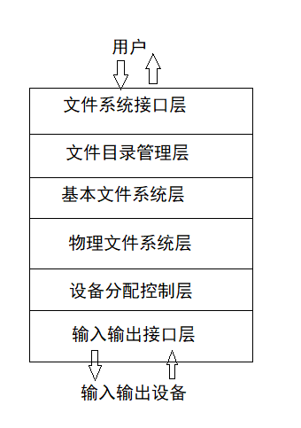
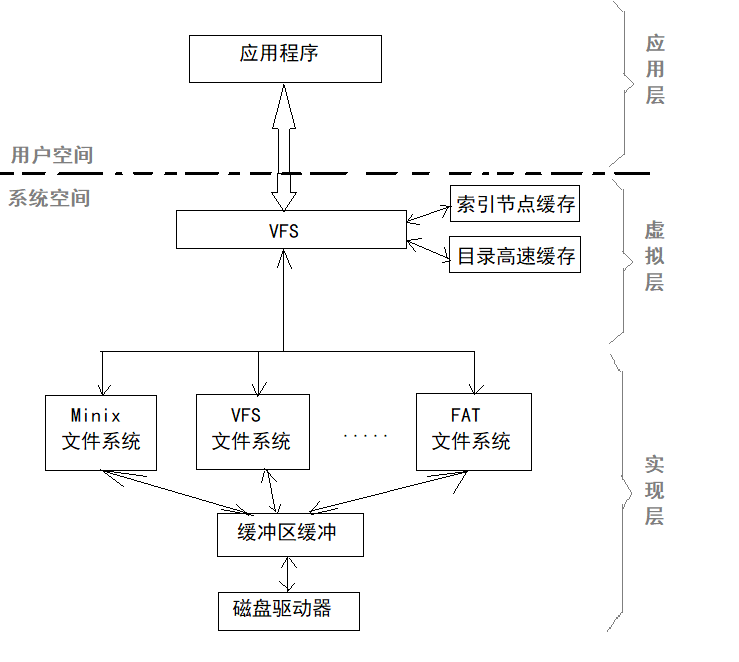

# 文件系统体系结构    

文件系统的体系结构通常采用分层结构，总体由*文件管理*、*目录管理*、*磁盘主存映射管理*三部分组成。    

- 文件管理层实现文件的逻辑结构；为用户提供各种文件系统调用，及完成文件访问权限的设置等工作。    

- 目录管理负责查找文件描述符，进而找到需要访问的文件，并进行访问权限检查等工作。    

- 磁盘主存映射管理将文件的逻辑地址转换成磁盘的物理地址。即由逻辑块号找到柱面号、磁道号和扇区号，具体的传输操作由设备管理器实现。    

 
 

## 1、文件系统的层次结构模型    

文件系统的传统模型为层次模型。每一层都在下层的基础上，向上层提供更多的功能，由下向上逐层扩展，从而形成一个功能完备层次清晰的文件系统。    

### 六层文件模型：    

最常见的是六层文件系统模型。    

  

- 文件系统接口层：  

主要用于接受用户对文件的操作命令或者系统调用，根据用户对文件的存取要求将其转换为统一格式的文件系统内部调用。  

- 文件目录管理层：  

根据文件名或文件路径名建立或搜索文件目录，获得文件内部标志和目录中的文件属性。从目录中的文件属性确定访问文件的用户身份，验证存取权限，判定操作合法性，实现文件的存取、共享、保护。    

- 基本文件系统层：  

根据文件内部标志将文件说明信息调入内存，即打开文件，为访问文件做准备。该层根据文件的逻辑结构和存取方法等信息，把指定的逻辑记录地址变换为物理块地址。    

- 物理文件系统层：  

根据文件在内存中的物理结构信息，将对应块号和块内地址变换成文件存储器的物理块号和块内地址。    

- 设备分配控制层：  

负责文件存储空间的分配，动态地为文件的写操作申请物理块，实现文件缓冲区的管理。该层根据申请的物理块号生成I/O控制系统的地址格式。    

- 输入输出接口：  

执行I/O操作，为文件分配磁盘等物理介质空间，实现文件信息的存取，与设备管理功能相联系。    

 
 

## 2、文件操作的执行过程    

以写一个文件为例简要说明文件写操作发出时，各层是如何工作和衔接的：    

1. 当用户写一个文件时，应用程序首先调用文件系统提供的接口，将写文件的请求转换为统一格式的文件系统内部调用。    
2. 文件系统管理根据写文件的文件名和文件路径读内存中相应的目录，修改并更新文件目录。    
3. 基本文件系统根据文件内部标志将文件说明信息放入内存，写入内存中的打开文件表，打开文件，为访问文件做准备。    
4. 物理文件系统根据写文件的结构和存取方法等逻辑结构信息，把指定的逻辑记录地址变换为相应的物理块地址。对于流式文件，只要把用户指定的逻辑地址按块长计算出相应块号；对于记录式文件，先把记录号变换成逻辑地址，再把逻辑地址按块长计算出相对块号。    
5. 物理文件系统将相对块号和块内地址变换为文件存储器的物理块号和块内地址。    
6. 设备分配控制为文件的写操作申请物理块，实现文件缓冲区的管理。系统根据申请的物理块号生成I/O控制系统的地址格式。    
7. 输入输出接口执行I/O操作，为文件分配磁盘等物理介质空间，并对磁盘的请求信息传递给磁盘管理。    

 
 

## 3、虚拟文件系统    

> 文件系统层次模型对支持单个文件系统比较适合，对于同时支持多个文件系统则有所欠缺。    
> 为了同时支持多种文件系统，不同的操作系统采用不同的技术方案提供了虚拟文件系统。    

- 虚拟文件系统的目标：  

1. 把多种文件系统纳入统一框架，不同的磁盘分区可以包含不同的文件系统，对它们的使用和传统的单一文件系统并不区别；    
2. 用户可通过一组系统调用对不同的文件系统及文件进行操作，系统调用可以跨物理介质和跨文件系统执行；    
3. 对网络文件提供完全的支持，访问远程节点上的文件应与访问本地节点的文件一致；    
4. 提供对特殊文件的支持。    

*虚拟文件系统(Virtual File System, VFS)*也称为虚拟文件系统开关，它是内核的一个子系统，提供一个通用文件系统模型，开阔所能见到的文件系统的常用功能和行为，处理一切与底层设备相关细节，为应用程序提供标准接口。    

具体设计时在原有的具体文件系统层次结构上增加应用层、虚拟层、实现层。    

- 应用层：  

VFS模型源于UNIX文件系统，使用户可以可以直接使用标准UNIX文件系统调用来操作文件，无需考虑具体文件系统的特性和物理存储介质，通过VFS访问文件系统，才使不同文件系统之间的协作性和通用性称为可能。  

- 虚拟层：  

在对具体文件系统的共同特性进行抽象的基础上，形成与具体文件系统实现无关的虚拟层，并在其上定义与用户的一致性接口。    

- 实现层：  

使用类似与开关表的技术进行具体文件系统的转接，实现各种文件系统的细节。    

### Linux中文件系统Ext2引入的虚拟文件系统框架结构：  

  

> VFS只是一种存在于内存的文件系统，拥有关于各种特殊文件系统的公共接口，如超级快、inode、文件操作函数入口等，特殊的文件系统的细节统一由VFS的公共接口来转换，当然对于系统内核和用户进程是透明的。    

> VFS在操作系统自举时建立，在系统关闭时消亡。  

> 当某个进程发出了一个文件系统调用时，内核将调用VFS中相应的函数，这个函数处理一些与物理结构无关的操作，并且把它重定向为真实文件系统中的相应函数调用，再来处理那些物理结构有关的操作。    

 
 

(END)  