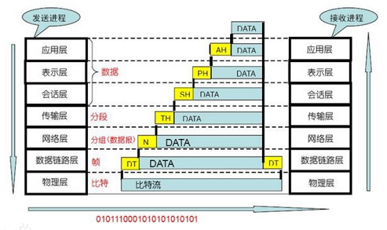
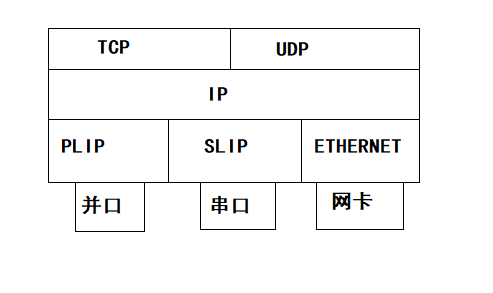

# 网络操作系统    

> *网络操作系统(NOS)*就是利用局域网底层提供的数据传输功能，为高层网络用户提供资源共享等网络服务的系统软件。换句话说就是管理网络资源，为网络用户提供服务的操作系统。    

> WindowsNT、Windows2000、Linux等都是网络操作系统。    

> NOS是网络用户和计算机网络之间的接口，它既具有单机操作系统的功能，也具有提供多种网络服务的功能。    

 
 

## 1、网络通信协议    

> 为了使网络中不同节点之间同层的对等实体能正常进行通信，通信双方就必须有一套彼此能互相了解和共同遵守的规则和约定，即一套关于信息传输的顺序、信息格式和信息内容等的规则或约定，用于规定有关部件通信过程中的操作，同时为各个软件开发者提供统一的标准，这就构成了网络通信协议。    

### 网络通信协议三要素：    

1. 语义。语义规定双方“讲什么”，如需要发送何种信息，以及完成的动作与做出的响应。它说明字或报文的每一部分的含义，例如哪些是控制信息那些是通信信息。    
2. 语法。规定通信双方“如何讲”，用于决定用户数据与控制信息的结构与形式，关系到字的排列，并与报文形式有关。    
3. 时序。对事件实现顺序的详细说明，例如同步还是异步传输。    

### 网络通信协议的基本功能：    

1. 分割和重组。（较小的数据块利于错误控制，并且通信网络通常只接受一定大小的数据块。由于这些原因，常将较大数据块划分成小的数据块，在接收端再重新组合。）    
2. 传输服务。（一个协议通常将定义一个特定系统的几项传输服务。）    
3. 寻址。（对于两个互相通信的设备来说，它们双方必须能互相识别。例如在一个交换网络中，网络必须了解目的站的身份，以便适当地选定数据路由或建立联系。）    
4. 信息流控制。（是一种通常由接受设备执行的功能，用以限制发送端发送数据的数量或速率。协议将规定在给定环境中采用的信息流控制方法。）    
5. 多路传输。（是在一条传输线路上传输许多信号的过程。协议将确定在某一给定环境下要采用哪一种类型的多路传输，以便确保多路传输信息包的合适译码和接受。）    
6. 排序和同步。（排序是按照适当的顺序来发送和接受报文的方法。同步是使两台设备对各种数据传输单元保持一致的一种方法。）    
7. 错误控制与连接控制。（错误控制是用来检测或纠正传输错误的过程。连接控制是指在通信实体之间建立和终止链路的过程。）    
8. 封装。（在数据包开始端或末端加上控制信息）    

### 网络体系结构：    

由于网络是一个复杂大型系统，需要有许多网络协议，以解决不同计算机之间的通信和相互合作问题。为了简化处理，可以为网络设置多个层级，在每个层级设置一个或多个协议，分别用于实现不同功能，上层功能的实现依赖于下层提供的功能。    

网络体系结构，实质上就是计算机网络的层级及其协议的结合。比较著名的网络体系结构是**OSI网络体系结构**和**TCP/IP网络体系结构**。前者是一个参考模型，后者已成为事实上的网络互联协议的标准。    

 
 

## 2、ISO的OSI网络体系结构模型    

*开放系统互联参考模型(Open System Interconnection Reference Model, OSI)*是由国际标准组织ISO制定的网络体系结构，该模型把网络分为七层模型。    

  

> 建立七层模型的目的是解决网络互连时的兼容性问题。    
> 它的最大优点是将服务、接口、协议三个概念明确区分开来：服务说明某一层为上一层提供什么功能，接口说明上一层如何使用下一层的服务，而协议涉及如何实现本层的服务。    

### 物理层：  

> 物理层是OSI最底层，建立在通信介质基础上，实现系统和通信介质的接口功能。    

> 物理层定义了与传输线及硬件接口的机械、电气、功能和过程有关的各种特性，以便建立、维持、拆除物理连接，并实现数据发送和接收。    

### 数据链路层：  

> 数据链路层主要功能是在相邻两系统的网络实体之间建立、维持、释放数据链路连接，在两个相邻系统的网络实体之间实现透明可靠的信息传输服务。    

> 数据链路层数据传输的基本单位是*帧*。    

### 网络层：  

> 网络层主要涉及通信子网及主机的接口。网络层提供建立、维持、释放网络连接的手段，以实现两个端系统中传输实体间的通信。    

> 传输的基本单位是分组。    

### 传输层：  

> 传输层为不同系统内的会话实体建立端到端(end 2 end)的透明、可靠的数据传输，执行端到端差错控制及顺序和流量控制，管理多路复用等等。    

> 数据传输的基本单位是报文。    

### 会话层：  

> 会话层为不同系统应用进程之间建立会话连接，它的主要作用是对基本的传输连接服务进行“增值”，以提供一个能满足多方面要求的绘画连接服务。  
> 会话层的“增值”基于各种应用的要求，如提供半双工通信、更有效的差错纠正机制、允许暂停发送消息等。    

### 表示层：  

> 表示层的主要用途是应用进程提供信息表示方式，对不同系统的表示方法进行转换，使在采用不同表示方式的应用实体之间能进行通信，并提供标准的应用接口和公用通信服务，如数据加密压缩等。    

### 应用层：  

> 应用层为应用进程访问OSI环境提供了手段，并直接为应用进程服务。其他各层也通过应用层向应用进程提供服务。    

 
 

## 3、TCP/IP网络体系结构    

除了OSI之外，另一个最广为人知的网络体系结构就是TCP/IP协议。此协议并非国际标准，但是它简洁实用，已经成为事实上的工业标准。    

TCP/IP是一个协议族，其中最著名的就是传输控制协议TCP和网际协议IP，除此之外还包含很多协议，构成了TCP/IP网络体系结构。    

### 网络接口层：  

主要提供TCP/IP与各种物理网络的接口，包括以太网、X.25、ATM网、分组交换网、TokenRind等，实现点到点的数据通信。    

### 网络互联层：  

该层是TCP/IP模型中最重要的层次，其中的IP协议主要用于异构网络之间的相互连接和路由选择。IP提供是面向无连接的、不可靠的传输服务，它可使由源主机发送的IP数据报，穿越由各种WAN和不同的LAN互连形成的互联网络，到达目的主机。    

### 传输层：  

传输层中主要协议是传输控制协议TCP，它所提供的是面向连接的、可靠的端到端通信机制。    

TCP是建立在网络层的基础上的，在指定TCP的时候，已考虑到所依赖的通信子网不一定是可靠的这一因素，所以在TCP协议中采取了增强可靠的措施，以确保传输层能正确无误地运行。    
传输的另一个协议是数据报协议UDP，他提供无连接的、高效的数据报传输服务，对一些可靠性要求不高但速度要求高的信息传送场合比较合适。    

### 应用层：  

应用层提供了许多用于支持各种应用程序的网络服务。    

常用的应用层协议有*简单邮件传输协议SMTP*、*文件传输协议FTP*、*远程登录协议Telnet*、*超文本传输协议HTTP*，以及用于实现网络管理的*简单网络管理协议SNMP*等。    

 
 

## 4、网络操作系统的功能和构成    

### NOS功能：  

不同的网络操作系统有不同的特点，但是它们提供的网络服务功能却有相同点，网络操作系统一般都具有以下功能。  

- **⭕较强的系统服务**：  

随着网络技术发展，只有早期操作系统的文件服务和打印服务已经远远不能满足网络多元化需求，还应该提供数据库服务、通信服务等。    

- **⭕丰富的应用程序**：  

通常这些软件包括数据库、电子邮件系统、系统备份软件等。现在还有一项重要的就是Internet相关软件或系统服务，例如Web Server、FTP Server等。  

- **⭕网络管理服务**：  

网络操作系统必须提供功能强大，又有良好用户界面的安全保密系统。    

另外NOS必须提供系统的容错能力，这对于一般单机用户来说不那么重要，但是对于NOS绝对是必要的。网络上的服务器故障直接影响网上所有工作站，因此NOS应提供一定程度的容错能力，当有异常发生时，可以自行解决，以保证稳定的工作状态。    

此外，还应该提供网络性能分析、状态监控等管理功能。    

- **⭕对客户端的支持**：  

NOS的服务对象是网络上的各种用户，他们可能有各种操作系统或者环境，所以一个好的NOS，必须要尽可能支持各种各样的用户环境。    

- **⭕分布式服务**：  

NOS为支持分布式服务功能，提出了一种新的网络资源管理机制，即*分布式目录服务*。分布式目录服务将分布在网络中不同地理位置的资源组织在一个全局的、可复制的分布数据库中，网中多个服务器都有该数据库的副本。    

用户在一个工作站上注册，便可与多个服务器连接。对于用户来说，网络系统中分布在不同位置的资源都是透明的，这样就可以用简单方法去访问一个大型互联局域网系统。    

### NOS构成：  

大多数局域网上配置的网络操作系统的工作模式是客户/服务模式，把网络操作系统的核心配置在网络服务器上，但在每个工作站也必须配置工作站网络软件。这样网络操作系统就有以下4部分组成。    

- **⭕工作站网络软件**：  

要想实现客户和服务器的交互，使工作站上用户能访问文件服务器上的文件系统和共享资源，就需要在工作站上配置网络软件。为此，在工作站上配置了重定向程度Redirector和网络基本输入输出系统NETBIOS。    

- **⭕网络环境软件**：  

在服务器上配置网络环境软件包括**多任务软件**、**传输协议软件**以及**多用户文件系统**。  

多任务软件可以使多任务高度并行，为它们提供良好的环境。  
传输协议软件可以对工作站与服务器之间的报文传输进行管理，用得最大得是TCP/IP协议软件。   
多用户文件系统采用增加高速缓冲区、电梯调度算法等各种方法来提高访问文件得速度和保证文件的安全性。    

- **⭕网站服务软件**：  

随着NOS的日益完善，它所提供的网络服务也更加丰富。例如**名字服务**、当某一用户要访问某一对象时，只需给出该对象的名字而不需要知道它的物理位置。这一点对于大型局域网非常重要。    
大多数NOS都提供了名字服务。另外还有**多用户文件服务**、**打印服务**、**电子邮件服务**等。其中多用户文件服务允许多个用户共享文件和目录，而且为了保证数据安全性还采取了有效的“存取控制”方式。  

- **⭕网络管理软件**：  

网络管理软件主要包括安全性管理、容错、备份、性能检测。    

 
 

## 5、Linux网络操作系统的实现  

Linux是一种网络操作系统，它具备了上面所讲的NOS所有功能。例如Linux支持世界范围内最成功的网络机制TCP/IP协议的全部实现。另外Linux也同样装有WWW服务器软件以及Email软件等。    

Linux的网络部分的层次结构：  
  

> 其中PLIP、SLIP、ETHERNET是硬件协议。    

（END）  

