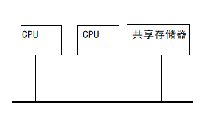
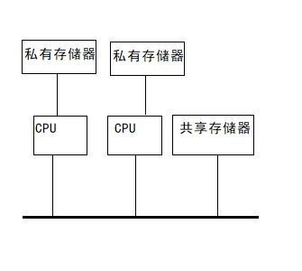
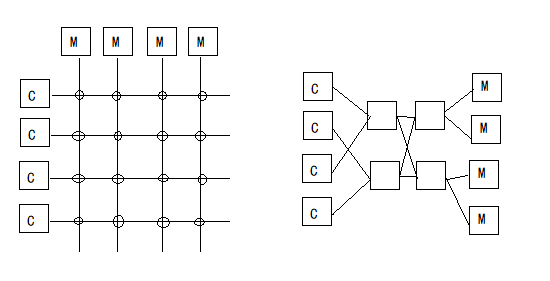

# 多处理器操作系统    

## 1、多处理器系统结构    

> 多处理器的系统结构，主要是指处理器、存储器、设备三者之间的连接。    

### 处理器和存储器之间的连接：  

- ◉ **基于单总线的结构**    

基于总线的多处理器系统，所有CPU连接到一个公共的总线上，并且共享一个存储器。每个处理器可以访问不同存储器模块中的单元，以及与其他处理器进行通信。    

  

> 意味着系统只需要运行操作系统的一个备份，因此，为单处理器编写的应用程序，可以直接移植到这个系统中运行。    
> 典型的总线有32根或64根地址线，还有约32根或更多的控制线，它们都是并行操作的。  

为了读取存储器的一个字，CPU首先检查总线的忙闲状态。如果总线忙，CPU必须等待。如果空闲，则CPU将要访问的存储器地址放到总线的地址线上，然后用控制线发送一个适当的信号来表明它想要进行读操作。存储器进行响应，把改地址的内容送到数据线上以使CPU可以对它进行读取。写操作类似。    

这种结构的缺点在于可伸缩性有限。系统中所有CPU对存储器的访问，都需要通过总线进行。多个CPU可能同时需要对总线进行访问，形成了对总线的竞争。随着CPU数目的增加，总线资源会成为整个系统的瓶颈。（使用高速缓存可以缓解对共享存储器的竞争）    

- ◉ **使用多层总线的结构**    

  

这种结构中，系统中所有CPU不仅共享一个存储器，还有一个本地私有的存储器，各个CPU与本地私有存储器和I/O设备通过本地总线连接，系统再使用系统总线将不同CPU的本地总线进行连接，并将系统中的共享存储器连接在总线上。    

为了减少各CPU通过系统总线对共享存储器的访问，对于每个CPU而言，应尽可能把所运行程序的正文、字符串、常量和其他只读数据存放在私有存储器上，仅将共享变量存放在共享存储器中。这种结构可以在很大程度上减少各CPU对系统总线的占用，使得可以支持更多CPU。    

但是这种方式提高了对程序编译器的要求，为了尽可能减少使用系统总线的频率，就需要对程序中的数据进行仔细的安排，也增加了编程难度。    

- ◉ **交换型结构**    

要建立一个更多处理器的多处理器系统，就需要采用一种不同的方法将这些CPU和存储器连接起来。一种方法就是把存储器分为许多存储模块，用交叉开关把它们和CPU相连。    

  

> 每个CPU和每个存储器模块都有一个外部接口同这个交叉开关相连。    
> 在每个交叉点上都有一个微小的能够用硬件打开或关闭的电子交叉开关。    
> 当CPU想要访问一个特定的存储器模块时，连接它们的交叉点就暂时闭合，允许访问。    
> 当两个CPU想要同时访问同一个存储器模块，其中的一个必须等待另一个访问结束后才能够进行。    

当有n个CPU和n个存储器时就需要n^2个交叉开关，为了避免这个数字太大，可以使用多级交叉开关网络，他只需较少的开关。    

### 处理器和I/O设备的连接：    

处理器和I/O设备之间的连接方式有多种：  

- ◉ 多端口I/O设备    

类似多端口存储器，该连接中设备的每个端口同一个处理器的总线相连，设备可用此端口进行数据传输和中断处理。    

- ◉ 由交叉开关连接CPU和设备    

设备开关的硬件逻辑更复杂些，因为一个设备与一个CPU保持联系的时间在一个读盘或写盘的过程中可能很长，因此用软件来控制开关比用硬件实现更方便。    

- ◉ 只与一个CPU相连而不能被其他CPU访问的设备    

一个CPU只能访问与之相连的设备。如果需要访问别的设备，需要软件参与协调，例如向其他CPU发送一个请求使本地CPU能在别的设备上操作。    

- ◉ 只与一个CPU相连但可被其他CPU访问的设备。这种方式中，尽管CPU能访问任一设备，但从设备发出的数据和中断信号只能由与之相连的CPU处理。    

 
 

## 2、多处理器操作系统的功能与类型    

### 功能：  

1. 多处理器操作系统应该有新的进程同步和互斥算法。（因为多处理器并行执行比单处理器复杂）    
2. 多处理器调度必须考虑多CPU的负载平衡。（了解不同CPU的能力以便把合适的任务分配给它，还要确切了解哪些任务必须顺序执行，哪些任务可以并行）    
3. 地址变换。多处理器下，存储器空间有局部又有全局，其地址变换机构比单机环境复杂。    
4. 冲突解决。当多个进程竞争访问某存储块时，必须要仲裁哪个处理器先访问，哪些进程应该等待。    
5. 数据一致性。当共享主存中的数据在多个局部存储器出现时，操作系统要保证这些数据的一致性。    
6. 多处理器环境下对文件的保护。    
7. 重构能力。及时通过备份等方式处理资源故障。    

### 多处理器系统的3种类型：  

- **主从式**    

主从式操作系统由一台主处理器记录、控制其他从处理器的状态，并分配任务给从处理器。    

- **独立监督式**    

每个处理器都有各自的管理程序。    

- **浮动监督式**    

每次只有一台处理器作为执行全面管理功能的“主处理器”，但根据需要，“主处理器”是可浮动的，即从一台切换到另一台。    

 
 

## 3、多处理器操作系统的进程调度管理    

多处理器操作系统中，“任务”是指进程或进程集合。多处理器调度是将任务分配给指定的处理器，并要求在指定的时间内完成。    
调度算法的目标是：使用最少的处理器，在最短时间完成任务。    

一般多处理器系统采用两级调度：*长期负载调度*和*短期进程调度*。    

多处理器的调度方式有两种：*确定性调度*和*不确定性调度*。        

(END)    