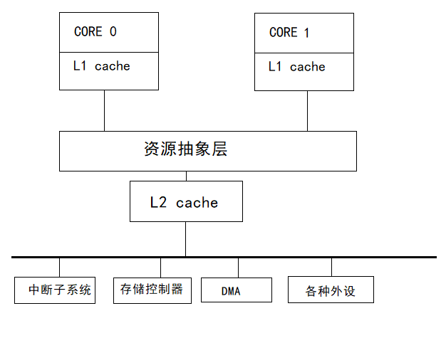

# 单处理器多核操作系统    

> 与传统单核CPU相比，多核CPU带来了更强的并行处理能力和更高的计算密度以及更低的时钟频率，并大大减少了功耗和散热。    

  

> 一般情况下，多核CPU的内核拥有独立的L1缓存。  
> 共享L2缓存、内存子系统、中断子系统、外设。    
> 多核系统和多处理器系统有很大区别，不能把多处理器系统上的软件移植到多核系统。    

### 多核系统和多处理器系统的区别：    

多处理器系统中，CPU之间的界限清晰，多个CPU通过总线连接起来，即便是共享存储器，这些CPU基本是独立运行的。    
多核系统中无论什么架构，被共享的东西很多，如中断控制器和外设等。    

### 多核系统面临的难点和挑战：    

多核的出现让操作系统设计变得更加复杂。  

例如多核芯片共享了存储器和外设等资源，如何管理这些共享资源是多核系统的重大挑战。例如运行在不同内核上的应用为了互相访问、互相协作，需要进行一些独特的设计，如高效的*进程间通信(Interprocess Communication,IPC)*机制、共享内存的数据结构和*同步原语(Synchronization Primitives)*等。    

此外，*程序代码迁移(Code Migration)*也是一个问题，即如何把单核系统的程序代码迁移到多核系统中，来使其代码最大化地利用多核资源。    

### 操作系统管理内核的基本方式：  

- **①对称多处理(Symmetric MultiProcessing,SMP)**    

一个操作系统就可以同时管理多个CPU内核，且某个应用并不绑定某个内核。只要有一个内核空闲可用，操作系统就在线程等待队列中分配下一个线程给这个空闲内核。    

- **②非对称多处理Asymmetic MultiProcessing,AMP)**    

每个CPU内核独立运行一个独立的操作系统或同一操作系统的独立实例。    

- **③混合多处理(Bound MultiProcessing,BMP)**    

每个操作系统的实例可以同时管理所有CPU内核，但每个应用被锁定于某个指定的核心。    

> 这三种模式都有优缺点。每一个模式适合解决某方面的特定问题，而且对操作系统的要求也各不相同。    
> SMP因为应用程序运行在单一操作系统之上，因而有许多优势，特别是容易管理和开发，也可以较好地在多个内核之间实现负载平衡，使得内核使用效率达到最高。        
> AMP也有许多优势，首先AMP使得运行在每个内核上的线程效率更高，因为这种方式较少地需要在内核之间进行沟通和同步，其次AMP具有很好的故障隔离能力，一个内核崩溃不会影响其他内核。。而且AMP扩展性也比SMP好，能支持更大量的内核。    

（END）  
