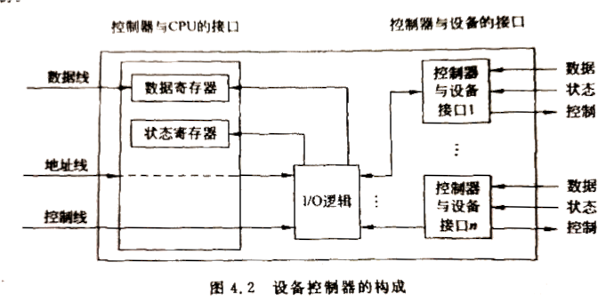

# 设备管理概述    

> 现代计算机系统中配置了大量外部设备。例如打印机、显示器、扫描仪、U盘等。    

> 各种各样的计算机外设给人们的工作和生活带来便利的同时，也要求操作系统对这些输入输出(I/O)设备进行有效的管理，提高外设的并行度和利用率。    

- 外部设备和设备管理：    

*外部设备*，简称设备，通常情况下是指除了CPU和内存外的其他所有硬件资源。设备管理主要指除CPU和内存之外的设备的分配、控制、管理、回收。    

## 1、设备分类    

> 随着计算机应用的不断深入和功能的不断增强。越来越多的外部设备被添加到计算机系统中，设备管理也越来越复杂。为了便于理解可将它们进行分类。    

### 按照服务功能分类：    

- ⭕存储类设备：    

这类设备通常以存储大量信息和快速检索为目标，**也称为外存、后备存储器、辅助存储器**，是计算机系统用于存储信息的主要设备。    
例如磁带机、磁盘机、U盘、光盘等。    

- ⭕输入输出设备：    

这类设备主要完成把外界信息输入计算机，或者把运算结果从计算机输出的功能。    
例如显示器、打印机、键盘、音响、摄像头等。    

- ⭕通信类设备：    

这类设备主要完成计算机和外界的通信过程，往往既可以输入也可以输出。    
例如网卡、蓝牙设备等。    

### 按每次信息交换的单位分类：    

- ⭕字符设备：    

以单个字符为单位来传送信息的设备。    
例如显示终端、键盘、打印机、异步通信接口等。    

- ⭕块设备：    

以数据块为单位来组织和传送数据的设备，属于有结构设备。    
例如磁盘、摄像头等。（磁盘以扇区为基本单位、摄像头以一帧为单位）    

### 按使用特征分类：    

- ⭕独占设备：    

这类设备在用户作业整个运行期间必须为用户独占，才能保证传送信息的连贯性。独占性是设备本身的属性。    
大多数低速I/O设备，如用户终端、打印机等均属于这类设备。    

> 一旦设备分配给某一用户或进程，那么只有等它运行结束释放后才能让其他用户或进程使用。    
> 这类设备往往在进程运行前就分配好，而不是动态申请。    

- ⭕共享设备：    

这类设备通常指磁盘磁带一类的存取设备。共享是指多个用户进程运行期间可以交替使用它们，对它们进行读写。    
这类设备具有较高的利用率，随时需要随时申请分配。    

- ⭕虚拟设备：    

为了将慢速的独占设备改造成多个用户可以共享的设备，以提高设备利用率和系统并行度，可以借助**假脱机技术(Simultaneously Peripheral Operation On Line, SPOOLing)**。    

SPOOLing技术的基本思想是：当某作业或进程请求分配某独占设备时，系统就分配给它共享设备，**例如用磁盘中的某一文件代替打印机**。程序要打印输出的信息先写入磁盘相应的文件中，再由系统从文件中取出该信息交给打印机输出。这样，用户或进程是直接和磁盘文件打交道，而间接使用打印机。由于磁盘是可共享的，所以对用户来说似乎有了一台高速可共享的打印机。模拟独占设备的那部分共享设备的空间称为虚拟设备。    

> CRE：引用操作系统概述第一章：“CPU、内存、外部设备都采用了虚拟技术，从逻辑层面上扩充了物理设备的数量。即在资源使用上更加灵活自由不受物理设备的数量限制。”        
> CRE：CPU的分时机制使得每个进程在逻辑上都拥有了自己的一个CPU。      

 
 

## 2、设备管理的目标、功能和结构    

### 设备管理的目标：    

- ⭕提高利用效率：    

尽管计算机外设本身的工作速度在逐步提高，但与CPU相比仍然太慢。为了减少两者之间过大的速度差异带来的使用效率问题，通常需要采取一定的措施对设备合理地分配和使用。    
另外，还要尽量提高CPU和外设之间以及外设与外设之间的并行度。均衡系统中各设备的负载，最大限度地发挥所有设备的潜力，以使操作系统获得最佳效率。    

> 中断技术、DMA技术、通道技术、缓冲技术极大地提高CPU与了I/O设备之间的并行度，从而更充分地利用外部设备，提高计算机系统的性能。    

- ⭕提供便捷的接口：    

所谓便捷一方面是指用户能独立于具体设备的复杂物理特性而方便地使用设备。      
另一方面是指对多种不同设备尽量能有统一的操作方式。把用户程序和设备的硬件特性分开，使得用户在编写应用程序时不再使用物理设备名而使用逻辑设备名。（CRE：抽象、低耦合的思想）      

> 具体的转换操作由操作系统通过相应的**逻辑设备表**实现，而由系统进行合理的分配，有些操作系统把所有设备抽象成文件或者I/O流，呈现给用户的是一种抽象的、操作简便的设备。    
> CRE：UNIX系统把设备都抽象成文件，提供类似`open`/`close`的操作，对信息提供类似`read`/`write`的操作，它是一种更高层的设备抽象。    

### 设备管理的功能：    

- ⭕设备的分配回收：    

多道程序环境下，多个用户或进程往往同时要求使用同一类或者同一台设备。要实现对设备的有效管理和利用，系统必须了解设备的状态及相关信息，通常由设备管理软件实现设备的登记和状态跟踪，应按照一定的算法把某I/O设备及相应的设备控制器和通道分配给某一个用户或进程。对请求而未获得设备的进程，应把它们排成一个等待队列，使这些进程将来能按一定的次序使用设备。    

操作系统一方面根据进程的请求分配设备，另一方面在进程使用设备结束后回收设备。    

- ⭕缓冲区管理：    

在计算机系统中，CPU的处理速度往往比外部设备的I/O速度高出很多倍。    
为了实现低速的I/O设备与高速处理器之间的协调工作，一般都在内存中开辟一块存储器作为缓冲区，使CPU和设备通过缓冲区传送数据，从而使设备与设备之间、设备CPU之间的工作协调起来。    
缓冲区的建立、分配、释放需要设备管理软件实施。    

- ⭕设备控制和中断处理：    

在未设置通道的系统中，用户提出的I/O请求，由设备管理软件对设备I/O请求做必要的处理，如设备分配、缓冲区分配，并直接对设备控制器接口编程，转换为每个设备能够识别的I/O指令，然后驱动指定设备进行I/O操作。    
在设置通道的系统中，其I/O操作一般通道执行通道程序来完成。此时，操作系统的设备管理软件组织相应的通道程序并提交给通道，然后用专门的通道指令启动通道对指定的设备进行I/O操作，并能相应通道的中断请求。I/O中断处理是对设备输入输出结束的处理。    

- ⭕实现虚拟设备：    

为了实现多进程并发对独占设备的需求，设备管理实现了虚拟设备功能，将一个独占的物理设备变成多个逻辑设备，从而能够接受多个进程对设备的请求。所以，实现虚拟设备的目的是进一步提高设备使用效率。      

- ⭕补充：    

在现代操作系统中，设备的即插即用、节能、调度优化等特性变得越来越突出，也渐渐称为设备管理的必备功能。    

### 设备管理的结构：    

设备管理的结构描述了设备、设备控制器、设备驱动程序、应用程序之间的逻辑关系。    

- ⭕设备管理的结构：    

    

> 设备一般包括其机械部件和电子部件。为了设计和制造的模块性和通用性，一般设备将这两部分分开。    
> 电子部分称为**设备控制器**或**适配器**，机械部件则为物理设备。    

- ⭕设备控制器结构：    

    

> 设备控制器起着承上启下的作用，是物理硬件和逻辑软件之间的桥梁，主要由三个部分构成。    
> 一是与CPU的接口：主要用于通过数据线、地址线、控制线实现设备控制器与CPU之间的通信。  
> 二是与设备的接口：在一个控制器中有一个或多个设备接口，一个接口连接一个设备，在每个接口中都有数据、控制、状态三种类型信号。    
> 三是I/O逻辑：主要用于对I/O控制。当要启动一个设备时，CPU将启动命令和地址送给设备控制器，然后由控制器的I/O逻辑对收到的地址进行译码，控制器再根据译出的命令对所选设备进行控制。    

- ⭕驱动程序：    

每种设备有自己的**驱动程序**，它有两个主要功能：一是为应用程序**实现一个抽象API**，二是**提供设备相关的操作**，发出适当的命令，实现在应用程序接口中定义的功能。    

（END）    

