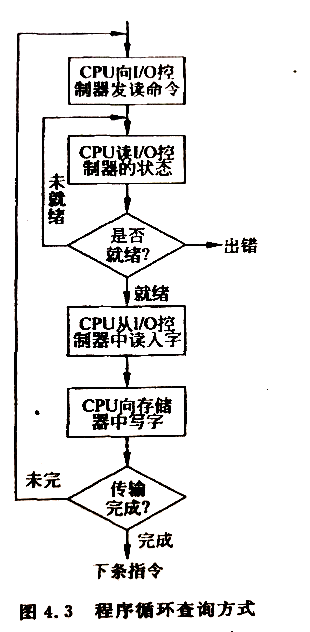
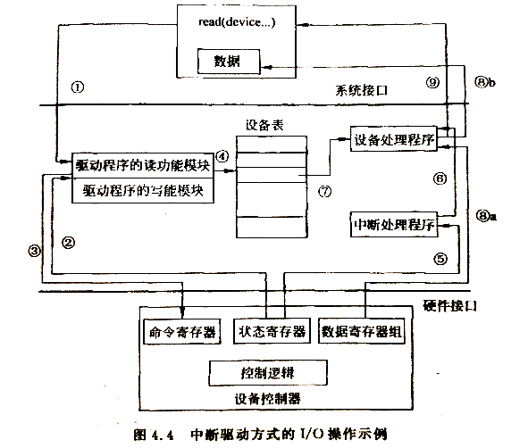
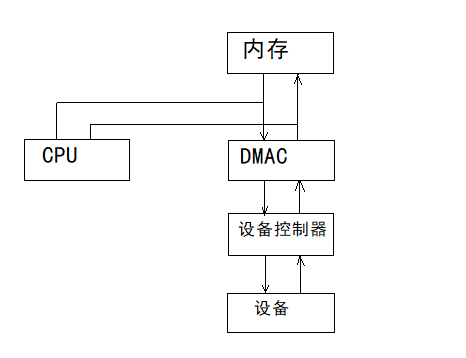
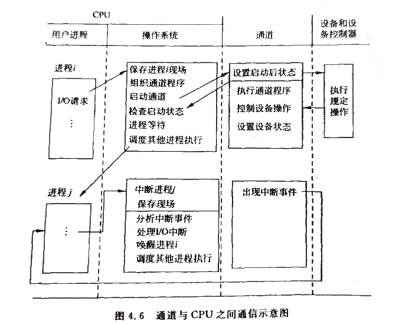

# 设备控制方法    

> 按照I/O控制器与CPU之间联系方式的不同，可以把I/O设备的控制方式分为4类：**查询方式**、**中断方式**、**DMA方式**、**通道方式**，它们的主要区别在于CPU和外设并行工作的方式和程度不同。CPU和外设并行工作有重要意义，它能大幅提高计算机效率和系统资源利用率。    

 
 

## 1、程序循环查询方式    

> Cre：轮询？    

在简单的微型计算机中经常使用这种程序循环查询I/O方式。CPU要不断地发送I/O测试指令用于测试设备控制器的(busy/free)标志位，如果设备不忙，则主存与外部设备交换一个字符；如果设备忙，则I/O测试指令不断对它进行测试，直到设备空闲为止。    

由于CPU的速度远大于I/O设备的速度，使CPU大部分时间都处于等待I/O完成的循环测试中。对于CPU是极大的浪费，但是它控制简单，在CPU速度慢、要求不高的场合下常被采用。    

  

 
 

## 2、中断驱动方式    

在查询方式中，CPU之所以不断测试I/O设备的状态，就是因为在CPU中没有中断机构，使I/O设备无法直接向CPU报告他已完成了一个字符的输入操作。    
引入中断机构是为了消除驱动程序不断地轮询控制器状态寄存器的开销，当I/O操作结束后，由设备控制器自动地通知设备驱动程序。    

- 使用中断机制的系统中，由硬盘读入到内存的请求执行步骤如下：    

  

> ①应用程序请求读操作。    
> ②设备驱动程序查询设备状态寄存器，确定设备是否空闲，如果设备，则驱动程序等待直到它空闲。    
> ③驱动程序向设备控制器命令寄存器输入命令，启动设备。    
> ④当驱动程序完成上述工作，根据操作情况保存相应信息，这些信息一开始是保存在设备表中，系统中每台设备在表中都有对应的表项，如最初调用的返回地址，以及I/O操作的一些参数。然后CPU就可以分配给其他进程使用了，为此，设备管理调用进程管理的调度程序，原进程的执行就被挂起了。    
> ⑤设备完成了I/O操作，中断CPU，引起中断处理程序的运行。    
> ⑥中断处理程序确定是哪个设备引起的中断，然后转移到该设备对应的设备处理程序执行。    
> ⑦设备处理程序重新从设备表中找到等待I/O操作的状态信息。    
> ⑧设备处理程序复制控制器数据寄存器的内容到用户进程的内存区。    
> ⑨设备处理程序返回控制权给应用进程，从而继续运行。    

- 总结：    

> 由上述示例可以看出，在采用终端驱动进行传输数据的过程中，由于无需CPU干预，仅当输完数据时，才需CPU花费极短的时间去做一些中断处理，因而可以使CPU与I/O设备在一定程度上并行工作，提高系统效率。    
> 例如从键盘输入一个字符的时间约为200ms，而将字符送入键盘缓冲区的时间小于0.2ms。如果采用程序I/O方式，CPU约有199.8ms的时间因为查询忙而处于等待中。如果采用中断方式，CPU可以利用这199.8ms的时间去做其他事情，而仅用0.2ms的时间处理控制器发来的中断请求，大大提升CPU利用率。    

 
 

## 3、直接内存访问方式    

> 中断处理方式提高了主机利用率，但是每次中断都要保存现场信息、恢复现场等，仍然占用大量CPU时间。在传输数据量大、速度高的情况下，频繁中断就不适应了。    

> 目前个人计算机块设备传输系统中，普遍采用了*直接内存访问(Direct Memory Access, DMA)*方式，这是一种直接内存访问存取方式，通过DMA控制权(DMAC)控制从内存向设备输入输出。    

    

DMAC内有控制器、状态寄存器、传送字数计数器、内存地址寄存器以及可能有的数据缓冲寄存器。    
它通常采用偷窃总线控制权的方法，由DMAC送出内存地址和发出内存读设备写或者设备读内存写的控制信号来完成内存和设备之间的直接数据传送，而不用CPU干预。    

当进程要求输入时，CPU首先作为DMA设置输入的字节数、输入到内存的地址，开放中断，启动DMA，然后CPU和DMA并行工作。DMA每传送一个数据并不产生中断、只是字数计数器减一，内存地址加一，转送字数计数器减至0的时候，也就是本次DMA传送的数据全部传送完毕时，产生中断，请求CPU进行结束处理。    

- DMA方式的三个特点：    

1. 数据传输的基本单位是数据块，即每次传送至少一个数据块。    
2. 所传送的数据是从设备直接送入内存，或者直接读出内存的。    
3. 传输时CPU参与更少，仅在传送一个或者多个数据块的开始和结束时才需要CPU干预，整块数据的传送是在控制器的控制下完成的。    

DMA仅复杂在高速外围设备与内存之间批量数据的传输工作，由于不对数据做再加工，进一步提高了CPU与I/O设备的并行操作程度。    

 
 

## 4、通道方式    

> I/O通道方式是DMA方式的发展，它可进一步减少CPU的干预（即把对一个数据块的读/写为单位的干预减少为对一组数据块读/写及相关的控制和管理为单位的干预）。    
> 可以把通道看成一个比DMA功能更强的接口设备。他有专门用于I/O的处理单元。在进行I/O操作时，接受CPU的委托，独立地执行自己的通道程序来实现内存与外设之间的数据传输。    
> 当主机委托的I/O任务完成后，通道发出中断，请求CPU进行结束处理。这使CPU从对I/O设备繁忙的直接控制中解脱出来，极大提高了CPU与外设并行工作的程度，从而更有效地提高整个系统的资源利用率。    

### 通道分类：    

- ⭕字节多路通道：    

字节多路通道(Byte Multiplexor Channel)适用于连接打印机、终端等低速或中速的I/O设备。每个通道可以连接8、16、32个甚至更多的子通道。子通道所连接的I/O设备以字节为单位经通道与内存交换数据。在要给子通道传送一个字节后，立即让位于另一个子通道传送下一个字节。    

- ⭕选择通道：    

字节多路通道不适于连接高速设备，这推动了按成组方式进行数据传送的选择通道的形成。    
选择通道(Select Channel)适用于连接高速I/O设备，例如磁带、磁盘。选择通道每次传送一批数据，传送速率很高。    
由于选择通道只有一个分配型子通道。虽然这个子通道可以连接多台设备，但每次只能把子通道分配给一台设备使用 ，一旦分配给某台设备，子通道就被它独占，即使暂时出现空闲，也不允许其他设备利用该子通道。直到它被释放，再选择另一台设备为其服务。所以这种通道的利用率并不高。    

- ⭕成组多路通道：    

*成组多路通道(Burst Multiplexor Channel)*综合了字节多路通道分时工作和选择通道传输速率高的特点。    
它具有多个非分配型子通道，每个子通道连接一台中、高速I/O设备，因而通道所连接的几个设备可以并行工作，而且每台设备的数据传送都是按成组方式进行的。因此，这种通道既具有很高的传送速率，也能获得令人满意的通道利用率。        

> 利用成组多路通道传输数据时，先让某台设备执行一条通道指令，传送一批数据，然后再选择另一台设备执行另一条通道指令，即几台设备的通道程序都在同时进行中。但是任何时刻通道只能为一台设备的数据传输提供服务。因此成组多路通道技术相当于通道程序的多道程序设计技术。    

### 通道的工作方式：    

通道本身比DMA方式强得多。通道I/O操作由两种命令实现控制：CPU的I/O指令和通道本身提供的通道程序。CPU的I/O指令的功能一般包括清除、停止、启动、查询等功能，除了操作码之外，I/O指令中还有通道地址和设备地址域。I/O指令属特权指令，只能由操作系统使用。通道程序一般有读、写、查询、控制、转移等功能。    

> 用户再程序中通过库函数请求I/O。由I/O库函数调用I/O系统调用进入操作系统处理。    
> 操作系统保存进程现场，在成功地分配所需设备后，CPU按I/O要求组织通道程序，然后，启动相应通道，检查设备和通道启动状况。    
> 正常情况下，操作系统使请求进程等待，调度其他进程执行。    
> 同时通道执行通道程序，控制设备操作。    
> 一旦I/O操作完成，通道发出中断信号，致使当前执行的进程进入中断处理。    
> 中断处理分许中断事件，做出相应额处理，唤醒等待I/O的进程，重新调度进程运行或者继续执行中断的进程。    

在通道I/O工作过程中，CPU对通道的通信是向通道发出启动、查询、停止通道指令，而通道向CPU的通信则采用中断方式向CPU汇报。      

(END)    

