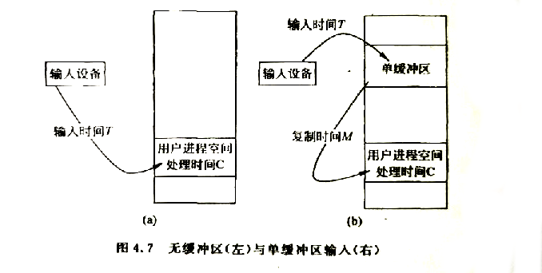
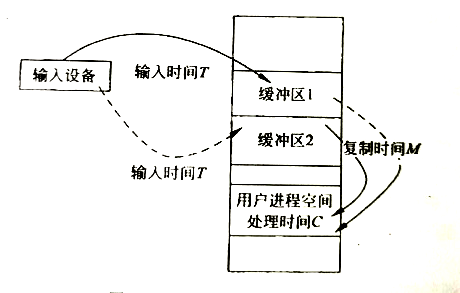
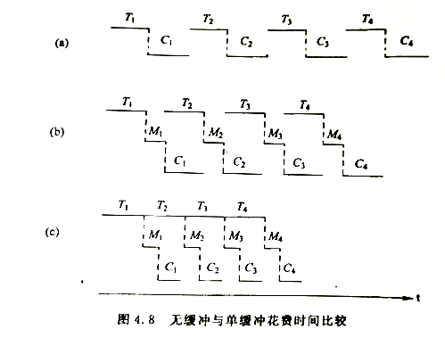
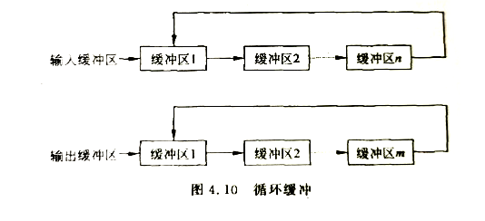
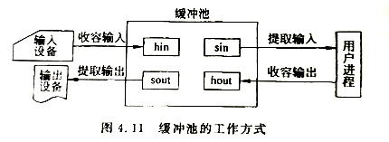

# 缓冲技术    

缓冲技术作为一种缓和机制，主要用来解决速度不匹配的问题，在现实世界中应用很广，例如公共汽车站、公交站台等就是为了缓和乘客的速度与汽车速度的差异性而引入的。在计算机系统中，缓冲技术主要有以下作用。      

- 它能改善CPU与外设之间速度不匹配的矛盾，提高CPU和I/O设备的并行度。    

例如一个程序，它时而进行长时间的计算而无输出，时而又产生阵发性的输出到打印机。由于慢速打印机跟不上这个请求，CPU不得不停下来等待。    
如果设置了缓冲区，程序输出的数据先到缓冲区暂存，然后由打印机慢慢输出。于是CPU不必等待，而可继续执行程序，使CPU和打印机得以并行工作。    

- 它能减少I/O对CPU的中断次数和放宽对CPU中断响应时间的要求。    

如果I/O设备每传送一个字节就产生一个中断，那么设置了n个字节的缓冲区后，则可以等待缓冲区慢才产生中断。这样，中断次数大大减少，中断响应时间也可相对放宽。    

- 缓冲技术还能协调逻辑记录大小与物理记录大小不一致的问题。    

用户程序输出一个逻辑记录时，不是直接向设备输出，而是申请一个等于磁盘扇区的缓冲区，首先向缓冲区输出，多个逻辑记录拼接成等于或接近磁盘块长，然后向磁盘输出。    
同样用户程序从磁盘读入一个逻辑记录时，首先把逻辑记录所在扇区读入一个缓冲区，然后根据需要从缓冲区读出相应的逻辑记录。    

缓冲有硬件缓冲和软件缓冲之分。硬件缓冲是以专用的寄存器作为缓冲。由于经济上的考虑，除了在必要的地方采用一定量硬件缓冲外，大都采用软件技术实现缓冲。即在操作系统的管理下，在内存中划分若干个单元作为缓冲区。软件缓冲的好处是易于改变缓冲区大小和数量，缺点是占据一部分内存空间。    
根据缓冲区个数的多少和结构，缓冲可分为单缓冲、双缓冲、多缓冲、循环缓冲、缓冲池。    

 
 

## 1、单缓冲    

单缓冲是指当一个进程发出I/O请求时，操作系统便在内存中为之分配一个缓冲区，用来临时存放输入输出数据。它是操作系统提供的一种简单的缓冲形式。    

    

单缓冲信息的输入输出实际上是串行工作的。要实现输入输出的并行问题，必须引入双缓冲。    

 
 

## 2、双缓冲    

双缓冲指在操作系统中为某一设备设置两个缓冲区，当一个缓冲区中的数据尚未被处理时可使用另一个缓冲区存放从设备读入或读出的数据，以此来进一步提高CPU和外设的并行程度。    

> 双缓冲技术又称为缓冲交换(Buffer-Swapping)。    

> Cre：很多领域采用了双缓冲的思想，例如计算机图形学的帧渲染中。        

    

    

> 当C < T的时候，由于M远小于T，所以在将磁盘上的一块数据传送到一个缓冲区期间，计算机已完成了将另一个缓冲区的数据传送到用户区并对这块数据进行计算的工作，所以一块数据的传输和处理时间为T。这种情况下输入设备连续交替使用两个缓冲区进行数据的输入工作。    
> 当C > T的时候，每当上一块数据计算完毕后，仍需要把一个缓冲区中的数据传送到用户区然后再对这块数据进行计算。所以一块数据的传输和处理时间为C+M。双缓冲效果已经弱化到类似单缓冲了。    

 
 

## 3、多缓冲    

> 采用双缓冲技术虽然提高了I/O设备的并行工作程度，减少了进程调度开销，但是在I/O设备和处理进程速度不匹配的情况下仍不十分理想。为了改善上述情形，获得较高的并行度，常常采用多缓存组组成的*循环缓存(CircularBuffer)*或者*缓冲池(BufferPool)*技术。    

### A.循环缓冲：    

    

> 根据用途分为输入缓冲区组和输出缓冲区组。    
> 每个缓冲区有一个链接指向下一个缓冲区，最后一个缓冲区指向第一个，组成循环缓冲。    
> 每个缓冲区的大小可以等于物理记录的大小。    
> 这种循环式的多缓存区是系统公共资源，并由系统统一分配和管理，可供各个进程共享。    
> 为了管理各缓冲区，进行统一调度和管理，操作系统中通常要设置专门机构来管理它们。    

### B.缓冲池：    

缓冲池由内存中的一组缓冲区构成，各缓冲区之间不一定采用循环链表方式进行链接，而是操作系统与用户进程将轮流地使用各个缓冲区，以改善系统性能。      
缓冲池中多个缓冲区可供多个进程使用，既可以用于输出又可以用于输入，是一种现代操作系统经常采用的一种公共缓冲技术。    

缓冲池中的缓冲区一般按照内容被组成成3个队列：空闲缓冲区队列emq、输入缓冲区队列inq、输出缓冲区队列outq。每个缓冲区根据其当前的工作性质不同，分为4种状态：收容状态、提取输入、收容输出、提取输出。      
对缓冲区的管理，有两个基本操作：`Getbuf`过程和`Putbuf`过程。`Getbuf(type)`用于从type所指定的队列的队首摘下一个缓冲区，`Putbuf(type， number)`用于将参数number所指示的缓冲区挂在type队列上。    

    

> 当某缓冲区处于收容输入工作状态时，该缓冲区被称为hin缓冲区。在输入进程需要输入数据时，调用`Getbuf(emq)`过程，从空缓冲区队列emq的队首摘下一个空缓冲区，把它作为收容输入工作缓冲区。然后把数据输入其中，装满后再调用`Putbuf(inq,hin)`过程，将该缓冲区挂在输入队列inq的队尾。    
> 当某缓冲区处于提取输入工作状态时，该缓冲区被称为sin缓冲区。此时计算进程需要提取输入数据，首先调用`Getbuf(inq)`过程，从输入队列取得一个缓冲区作为提取输入工作缓冲区，计算进程从中提取数据。计算进程用完该数据后，再调用`Putbuf(emq, sin)`过程将该缓冲区挂到空缓冲队列emq上。    
> 当某缓冲区处于收容输出工作状态时，该缓冲区称为hout缓冲区。计算进程此时需要调用`Getbuf(emq)`过程从空缓冲区队列emq的队首取得一个空缓冲，作为收容输出工作缓冲区hout。当其中装满数据后，又调用`Putbuf(outq, hout)`过程，将该缓冲区挂在输出队列outq的队尾。    
> 当某缓冲区处于提取输出工作状态时，该缓冲区称为sout缓冲区。首先由输出进程调用`Getbuf(outq)`过程，从输出队列的队首取出一个装满输出数据的缓冲区，作为提取输出工作缓冲区sout，在数据提取完后，再调用`Putbuf(emq, sout)`过程将它挂到空缓冲队列emq队尾。    

（END）    