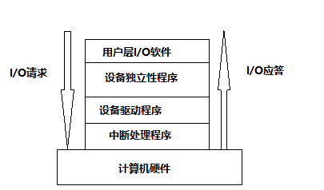
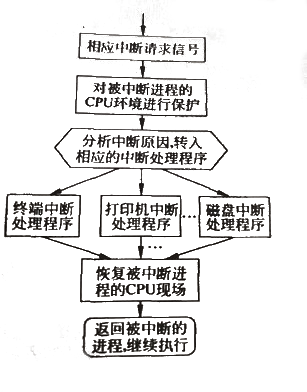

# 输入输出软件    

输入输出软件是实现输入输出管理的软件部分，其目标是改善输入输出设备的效率，实现统一标准的输入输出设备管理方式。    
为了实现目标，这些软件通常被组织成一种层次结构，自底向上分别为中断处理程序、设备驱动程序、设备独立性程序、用户层程序。处于底层的软件用于频闭输入输出硬件的细节，从而实现上层设备无关性，高层软件则为用户提供一个统一、规范、方便的接口。    

  

 
 

## 1、中断处理程序    

凡是涉及输入输出设备开始、结束、异常时，一般都会发生中断信号。当一个中断信号发生时，若能及时得到响应，则正在运行的进程将被挂起，直到I/O操作结束并发出一个中断请求，CPU响应后便转入中断处理程序，然后解除相应进程的阻塞状态。    

  

> 如果有来自于中断源的中断请求，并且CPU允许中断，则CPU响应中断的条件满足，同时它立即关中断，使其不能再次响应其他中断，否则中断处理无法进行。    
> 保护被中断进程的CPU环境。为了在中断处理结束后能使进程正确地返回到断电，系统必须当前处理的状态字PSW和程序计数器PC等的内容保存在中断保留栈中，对被中断进程的CPU现场要进行保护，包含所有CPU寄存器，因为在中断处理时可能会用到这些寄存器。    
> 分析中断原因，转入相应的设备中断处理程序。由处理器对各个中断源进行测试，识别中断类型（磁盘中断还是时钟中断）和中断的设备号（如哪个磁盘引起的中断），处理优先级最高的中断源发出的中断请求，并发送一个应答信号给发中断请求信号的进程，使之消除该中断信号，然后将该中断处理程序的入口地址装入程序计数器，使处理机转向中断处理程序。    
> 执行中断处理程序。对不同的设备有不同的中断处理程序。中断处理程序首先从设备控制器中读出设备状态看是否正常。如果正常完成，则驱动程序便可做结束处理；如果还有数据要传送，则继续进行传送；如果是异常结束，则根据发生异常的原因进行相应处理。    
> 恢复被中断进程的CPU现场。当中断处理完成后，便可将保存在中断栈中的被中断进程的现场信息取出，并装入到对应的寄存器中。    
> 返回被中断进程，继续执行。当某程序是指令在N位置被中断的，退出中断后，处理机再执行本程序时，便从N+1开始，于是便返回了被中断的程序。    

 
 

## 2、设备驱动程序    

所谓设备驱动程序是指驱动物理设备和DMA控制器或I/O控制器等直接进行I/O操作的程序集合。    
不同类型的设备应有不同的设备驱动程序，设备驱动程序主要负责启动指定设备，指定操作的类型和数据流向。    

### 设备驱动程序的处理过程：    

1. 接受由I/O进程发来的命令和参数，并将命令中的抽象要求转换为具体要求，例如将磁盘块号转换为磁盘的盘面、磁道号及扇区。    
2. 检查用户I/O请求的合法性，了解I/O设备的状态，传递相关参数，设置设备的工作方式。    
3. 发出I/O命令，如果设备空闲，便立即启动I/O设备去完成指定的I/O操作；如果设备处于忙碌状态，则将请求者的请求块挂在设备队列上等待。    
4. 及时响应由控制器或通道发来的中断请求，并根据其中断类型调用相应的中断处理程序进行处理。对于设置有通道的计算机系统，驱动程序还应能够根据用户的I/O请求自动地构成通道程序。    
5. I/O完成后，由通道或设备产生中断信号。CPU接到中断请求后，如果条件符合，则响应中断，然后转去执行相应的中断处理程序，唤醒因等待I/O完成而睡眠的进程，调度用户进程继续执行。    

### 设备驱动程序的特点：    

1. 驱动程序指在请求I/O的进程与设备控制器之间的一个通信和转换程序。它的主要任务是接受上层软件发来的抽象要求并将设备控制器发来的信号送给上层。    
2. 驱动程序与设备控制器和I/O设备的硬件特性紧密相关，因而对不同类型的设备应该配置不同的驱动程序。    
3. 驱动程序与I/O设备所采用的I/O控制方式紧密相关。    

 
 

## 3、设备独立性程序    

> CRE：计算机科学领域的任何问题都可以通过增加一个间接的中间层来解决。    

如果用户程序中直接使用真实的物理设备，那么会出现这样的问题：当某系统中有多个同样的设备的话，如果用户直接指定的物理设备因故障不能使用，或者该设备正忙于为其他进程服务时，即使有其他空闲的设备，也不能直接使用，只有等待或者修改程序，然后重新制定其他设备。显然这是不合理的。为了解决这个问题，人们提出了**设备独立性**的处理方式。    

### 设备独立性：    

设备独立性，也称为设备无关性，是指在用户程序中不直接使用物理设备名或者设备的物理地址，而是只使用逻辑设备名。逻辑设备是实际物理设备属性的抽象，它不限于某类具体设备。    

逻辑设备究竟和哪一个具体的物理设备对应，还要系统根据当时的设备忙闲情况决定或者由系统管理员决定。在应用程序中使用逻辑设备名来请求使用某类设备，而系统在实际执行时，使用物理设备名。    

系统必须根据如图所示对应关系将逻辑设备名转换为物理设备名，进一步找到物理设备的驱动程序地址：    
|逻辑设备名|物理设备名|驱动程序入口地址|
|-|-|-|
|/dev/tty|3|1024|
|/dev/printer|7|2046|
|...|...|...|

|逻辑设备名|系统设备表指针|
|-|-|
|/dev/tty|3|
|/dev/printer|5|
|...|...|  

- 引入设备独立性这一概念的优点：    

Ⅰ、使得设备分配更加灵活，提高了设备的利用率。当多用户多进程请求分配设备时，系统根据设备当时的忙闲情况，合理地调整逻辑设备名与物理设备名之间的对应关系，以保证设备的充分利用。    

Ⅱ、可以实行I/O重定向。所谓I/O重定向指的是可以更换I/O操作的设备而不必改变应用程序。    

### 实现设备独立性的软件：    

设备驱动程序是一个与硬件紧密相关的软件，为了实现设备独立性，就必须在驱动程序之上设置一层与设备无关的软件。其主要功能如下。    

1. 向用户层软件提供统一接口。无论哪种设备，它们向用户提供的接口相同。（例如各种设备的读写都用`write`和`read`）    
2. 设备无关程序负责将设备名映射到相应的设备驱动程序。    
3. 设备保护。操作系统应向各个用户赋予不同的设备访问权限，以实现对设备的保护。    
4. 协调不同设备数据块的差异。设备无关软件屏蔽了不同设备使用的数据块大小可能不同的特点，向用户软件提供了统一的逻辑块大小，即缓冲。    
5. 差错控制。由于在I/O操作中绝大多数错误都与设备无关，所以主要由设备驱动程序来处理，而设备无关软件只处理那些设备驱动程序无法处理的错误。    

 
 

## 4、用户层软件    

任何设备的设计开发都是为了应用，用户层的I/O软件实际上就是面向设备具体应用的软件，它是I/O系统软件的最上层软件。    

用户层软件负责与用户和设备无关的I/O软件通信，即它面向程序员，当接受到用户的I/O指令后，把具体的的请求发送到设备无关的I/O软件，进行进一步处理。    

针对I/O设备的用户层软件主要包含用户I/O操作的库函数和前文提到的SPOOLing假脱机系统。例如用户级的库函数`write()`是写文件的系统调用，对软盘和磁盘的读写操作都是`write()`，这两个设备的具体参数完全不同，读写速度也后很大差异，但用户层的输入输出软件完全屏蔽了具体的硬件细节，向用户提供了统一的接口。SPOOLing系统是在多道程序设计中将一台独占设备改造为共享设备的一种行之有效的技术，在下文设备分配中详细讲解。          

（END）    