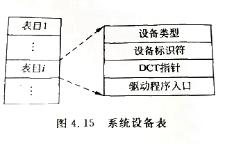

# 设备分配与回收    

> 设备分配与回收的任务是按照一定的算法将设备有关资源分配给申请进程，在进程使用完毕后还要负责收回相关的设备资源。    

 
 

## 1、设备信息描述    

操作系统为了能够对系统设备统一管理和统一分配，需要掌握设备的所有相关信息，具体包括**设备系统表(SystemDeviceTable,SDT)**、**设备控制表(DeviceControlTable,DCT)**、**控制器控制表(ControllerControlTable,COCT)**、**通道控制表(ChannelControlTable,CHCT)**。    

### ▤ 系统设备表：    

系统设备表记录系统中所有设备资源的状态。在整个系统中设置唯一的系统设备表是系统范围的数据结构，记录了系统中全部设备情况，并为每一个设备设置了一个表项。    
 
  

> SDT的每个表项主要包括：设备类型、设备标识符、指向DCT的指针、驱动程序入口。   

### ▤ 设备控制表：    

对系统范围内任何一台设备，操作系统都配置了一张设备控制表，用来记录设备的特性、设备和I/O控制器的连接情况、设备的分配和使用情况。    

DCT在系统生成时或在该设备和系统连接时创建，但表中的内容则可根据系统执行情况动态修改。    

  

  

> DCT主要包括：设备类型、设备标识符、设备状态、控制器表指针、重复执行次数或时间、设备队列的首指针。  
> 重复执行次数或时间是标志该设备在传输数据时，数据出错后重复传送的次数或时间，一般系统中会规定最多的重复次数或最大的时间。如果达到最多重复次数或最大时间仍然不能成功传送数据，则认为传送失败放弃传送。    
> 设备队列的首指针指向请求而没有得到设备的相关进程构成的进程控制块队列的首部。    

### ▤ 控制器控制表：    

系统为每个控制器都设置了一个COCT，用它来反映I/O控制器的使用情况以及所连接的通道情况。    

  

> 主要包括：控制器标识符、控制器状态、控制器相连接的通道表指针、控制器队列的队首指针、控制器队列的队尾指针。    

### ▤ 通道控制表：    

在设置有通道的系统中，操作系统为每个通道都配有一张通道控制表，它与COCT类似。    

 
 

## 2、设备分配策略    

按照设备本身使用属性，设备分为独占设备、共享设备、虚拟设备3类，相应的设备分配策略就成为独占方式、共享方式、虚拟方式。    

- **独占方式**：    

就是把一台设备固定地分配给一个用户或者进程，直到它运行结束。这种方式对用户来说是方便的，管理起来也简单，但往往造成资源浪费。因为用户程序或进程运行过程中不会自始至终都使用像打印机这类设备。    1

- **共享方式**：    

是指设备可以被多个用户或进程“交替”使用。即一个进程需要时，便申请它，获得后使用它，用完后释放它。其他进程也是如此。磁盘、磁带就是可以用共享方式分配、使用的设备。    

- **虚拟方式**：    

大多数低速设备都属于独占设备，如果一个用户进程申请到一台独占设备，也许一直到进程撤销才释放该设备。其他进程如果需要这样的设备只能等待。    
为了提高独占设备的利用率，提高进程并发度，引入了虚拟设备技术。虚拟设备技术就是利用快速、共享设备把慢速、独占设备模拟成同类物理设备。    

> 例如一个用户需要一台打印机，这时系统分配给它的不是一台物理打印机，而是一个磁盘文件，用户进程输出，向该磁盘文件输出，用户进程结束，系统把该磁盘文件传输给打印机进程，依次排队打印输出。    
> 从用户看，每个用户都感到系统为自己提供了一台物理打印机。计算机的屏幕也是独占设备，图形界面的窗口是虚拟屏幕，使用窗口可以使不同的应用程序共享屏幕。    

 
 

## 3、SPOOLing技术    

> 早期，人们为了缓和CPU的高速性和I/O设备的低速性之间的矛盾而引入了脱机输入输出技术，该技术是利用专门的外围控制机，实现低速I/O设备与高速磁盘的数据传输。    
> 当系统引入多道程序技术后，可以利用其中的一道程序，来模拟脱机输入输出的外围控制机功能，把低速I/O设备上的数据传送到高速磁盘上，或者把数据从磁盘传送到低速输出设备上。    
> 这样，便可以在主机的直接控制下，实现脱机输入输出功能。此时的外围操作与CPU对数据的处理同时进行，这种在联机情况下实现的同时外围操作称为**SPOOLing**，或者**假脱机系统**。    

### SPOOLing系统组成：    

    

> 输入井模拟假脱机输入，用于收容输入的数据。输出井模拟脱机输出，用于收容用户程序的输出数据。    

> 预输入程序模拟脱机输入时的外围控制机，将输入设备的输入信息送到输入井，当相关进程需要输入数据时，直接从输入井读入到内存的用户程序区。    

> 缓输出程序模拟脱机输出时的外围控制机，把用户要求输出的信息从用户程序区送到输出井，待输出设备空闲时，将输出井中的信息送到输出设备上。    

> 井管理程序负责管理输入井和输出井的协调工作。    

> 在进程指向过程中，如果请求启动某台设备的输入或输出工作，

> 操作系统得到该请求并调出井管理程序，控制从相应输入井读取信息或将信息送到输出井内。      

### 共享打印机：    

共享打印机技术已被广泛用于多用户系统和局域网络中。为了实现打印机的虚拟共享，应该创建一个特殊的**守护进程(daemon)**以及一个特殊的目录--**SPOOLing目录**。    

当用户进程请求打印输出时，SPOOLing系统同意为它打印输出，但不真正立即把打印机分配给该用户进程，而只为它做两件事：    

①由输出进程在输出井中为之申请一个空闲磁盘块区，并将要打印的数据送入其中。    
②输出进程再为用户进程申请一张空白的用户请求打印表，并将用户的打印要求填入其中，再将该表挂到请求打印队列上。    

> 实际上，当进程把该文件放到SPOOLing系统中之后就可以认为打印过程已经完成，虽然打印机还没有进行该文件的打印，因此SPOOLing也称为打印的假脱机过程，而整个的打印作业由该守护进程进行处理，只有该守护进程能够真正使用打印机设备文件。通过禁止用户直接使用打印机设备文件就解决了打印机独占问题。    

> SPOOLing除了用于打印机外，还可以用于其他场合。例如在网络上进行文件传输、发送Email等也可以使用SPOOLing技术，在一定程度上减少了操作系统负担。    

### SPOOLing技术的特点：    

1. 提高了I/O速度，缓和了高速处理器与低速输入输出设备之间的矛盾。    
2. 将独占设备改造为共享设备，提高了设备利用率。    
3. 实现了虚拟设备功能，将物理的单个设备变换为多个对应的逻辑设备。    

 
 

## 4、设备分配算法    

在进行设备分配时，首先需要将请求设备的进程组织成请求设备队列。对请求设备队列，操作系统按照一定的算法将设备分配给进程。对设备的分配算法与进程的调度算法有一些相似之处，但它比较简单，一般多采用以下几种算法。    

- 先来先服务算法：    

> 系统允许多个进程请求同一个设备，也允许一个进程请求多个设备。当有多个进程对同一设备提出I/O请求时，或者在同一设备上进行多次I/O操作时，系统按照提出请求的先后顺序将对应的进程组织成一个设备请求队列，当设备空闲时，设备分配程序总是把设备首先分配给队首进程。    

- 高优先级算法：    

> 首先对有I/O的进程按照其优先级的高低进行排列，高优先级进程排在设备队列前面，低优先级排在后面。当有一个新进程要加入设备请求队列中时，根据进程优先级插在适当的位置。    

 
 

## 5、设备分配与回收过程    

### 设备分配：    

当系统中已经有具备了分配的数据结构，而且在设备分配总原则下确定了一定分配算法后，若某进程提出I/O请求，设备分配程序便可以进行分配。    

主要步骤：    
1. 进程向操作系统提出I/O设备分配请求。    
2. 系统根据请求中提出的逻辑设备名，到系统设备表中查找设备标志，看是否有该类设备。若系统设备表没有该类设备，则拒绝请求并发出通知。如果有该类设备，则查找相应的设备控制表。    
3. 查找设备控制表，如果没有空闲设备，则把该进程阻塞，进入等待队列，若有空闲的设备，则根据相应的算法进行分配。    
4. 分配设备时，按照一定的算法计算分配是否安全。若分配后出现死锁，则此次分配不成功，把该进程阻塞，进入等待队列。如果分配是安全的，则查找相应的设备控制器的信息。    
5. 查找设备控制器表，获得相应的设备的控制器信息。若设备控制器繁忙，则阻塞该进程进入等待队列。若空闲则继续查找通道情况。    
6. 查找相应通道控制表，获知通道情况。若通道繁忙，则阻塞进程，进入等待队列。若有通道空闲，则分配该通道。    
7. 启动I/O设备，执行I/O操作。    

    

> 设备分配过程是逐步从抽象信息表格到具体物理设备的过程，首先使用了管理逻辑设备信息的系统设备表，继而查找设备控制表，然后通过设备控制器利用通道启动设备，传输信息。    

### 设备回收    

当某一作业或进程使用完后，则需“释放设备”，设备回收过程是分配过程的逆过程。    
回收时，要请求操作系统一次修与设备相关的通信控制表、设备控制器控制表、设备控制表、系统设备表，主要是修改其中的状态信息，以使设备能够及时被下一个进程使用。        

(END)    