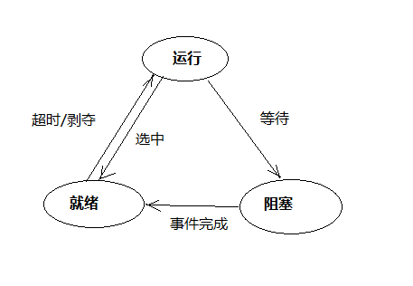
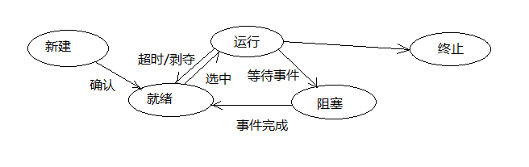
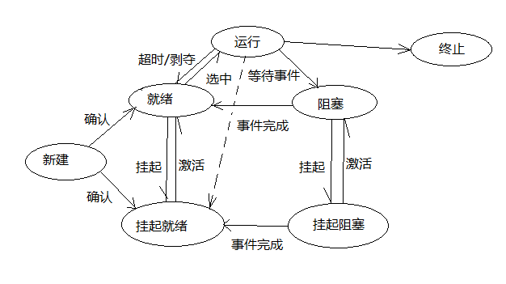
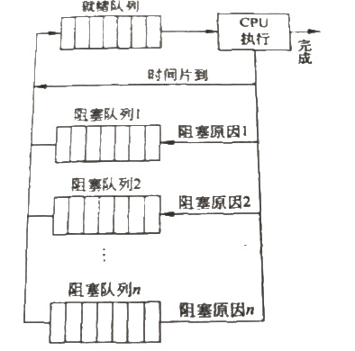
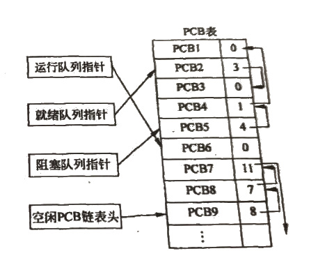
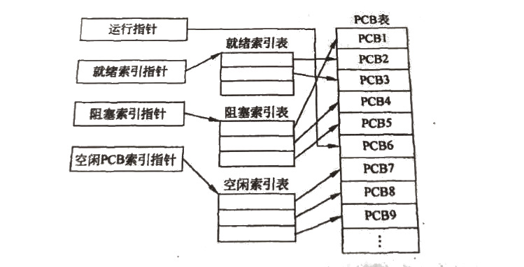

# 进程的特征和控制    

### 进程的特征回顾：    

- 结构性：    

> 进程包含程序及其相关的数据结构。进程的实体包含进程控制块(PCB)、程序块、数据块和堆栈，又称为*进程映像(Process Image)*。    

- 动态性：    

> 进程是程序在数据集合上的一次执行过程，具有生命周期，由创建而产生，由调度而运行，由结束而消亡，是一个动态推进和不断变化的过程。（而程序则只是静态的文件）    

- 独立性：    

> 进程是操作系统资源分配、保护、调度的基本单位。每个进程都有其自己的运行数据集，以各自独立的、不可预知的进度异步运行。    
> 进程的运行环境不是封闭的，进程之间可以通过操作系统进行数据共享、通信。    

- 并发性：    

> 在同一时段内，若干个进程可以共享一个CPU。进程的并发性能够改进系统的资源利用率，提高计算机的效率。    
> 进程在单CPU系统中并发执行，在多CPU系统中并行执行。    
> 进程的并发执行意味着进程的执行可以被打断，可能会带来一些意想不到的问题，因此必须对并发执行的进程进行协调。    


### 用户进程和系统进程：    

进程通常分为*系统进程*和*用户进程*。     

- 两种进程的区别：     

> 系统进程是操作系统用来管理系统资源并行活动的并发软件。用户进程是可以独立执行的用户程序段，是操作系统提供服务的对象，是系统资源的实际使用者。    

> 系统进程之间的关系由操作系统自己负责，这样有利于增加系统的并行性，提高资源利用率；用户进程之间的关系由主要由用户自己负责，为了便于用户管理自己的任务，操作系统提供一套简便的任务调用命令作为协调手段，并在用户区根据用户作业的性质(多任务还是单任务)装入相应的任务调度程序。    

> 系统进程直接管理有关的软硬件资源活动。用户进程只能间接地使用系统资源，必须向系统提出请求，由系统分配调度。    

> 进程调度中，系统进程的优先级高于用户进程。  

### 进程上下文：    

进程生命周期中，进程实体和支持进程运行的环境称为*进程上下文(Process Context)*。    

<div style="border-style: solid; border-width: 1px; padding: 10px; color:#888888">  

- 用户级上下文：    

*用户级上下文(User-Level Context)*由进程的代码区、数据区、用户栈区、共享内存区组成，在编译目标文件时生成，占据进程的虚拟地址空间。  
进程的代码区是只读的程序指令，数据区存放程序运行时所需要的数据，用户栈区用来完成处理器运行时的过程调用和返回、传参等。共享内存区是与其他进程共享的部分。    

- 系统级上下文：    

*系统级上下文(System-Level Context)*，由进程控制块、内存管理信息、进程环境块和系统栈组成。    

- 寄存器上下文：    

*寄存器上下文(Register Context)*，由程序状态寄存器、各类控制寄存器、地址寄存器、通用寄存器、用户栈指针等组成。    

</div>    

当一个进程被系统调度而占有CPU时，会发生CPU在新老进程间的切换，切换的内容是进程上下文，进程运行是在进程的上下文中执行的。    

<div style="border-style: solid; border-width: 1px; padding: 10px; color:#888888">  
切换上下文过程示例：    

```
context_switch()
{
    Push registers onto stack;
    Save ptrs to code and data;
    Save stack pointer;
    Pick next process to execute;
    Restore stack ptr of that process;
    Restore ptrs to code and data;
    Pop registers;
    Return;
}
```
</div>

<br />
<br />

## 1、进程状态及转换    

进程的特性决定了进程在其生命周期中会处于不同的状态。进程的三种基本状态为**就绪状态**、**运行状态**、**阻塞状态**，即三态模型。    

    

### 三态模型的三种状态：    

- 就绪状态(Ready)：    

进程在内存中已经具备执行的条件，等待分配CPU。一旦被分配CPU，进程立刻执行。一个进程在创建后处于就绪状态，这些处于就绪状态的进程以队列方式进行组织，称为就绪队列。    

- 运行状态(Running)：    

进程占用CPU并正在执行。在单CPU的系统中，任一个时刻只有一个进程处于运行状态。    

- 阻塞(Blocked)：    

也成为等待状态(Waiting)，当正在运行的进程由于发生某事件（例如请求并等待输入输出的完成、等待进程通信之间的进程到来或进程同步之间的进程到来等）而受到阻塞不能继续执行时，便需要放弃CPU，从运行状态切换到阻塞状态。    
多个进程处于阻塞状态时，这些进程组织成阻塞队列。    

### 状态转换的几种情况：    

1. 就绪->运行。（当CPU空闲时，从就绪队列选中一个并分配CPU，此刻该进程从就绪状态转换到运行状态）    
2. 运行->阻塞。（当正在运行的进程需要等待某些事件的发生时，其状态将从运行状态转伪阻塞状态）    
3. 阻塞->就绪。（处于阻塞的进程，由于等待的事件到来而不需要再等待时吗、，进程状态将从阻塞状态转换为就绪状态，不会立刻运行）    
4. 运行->就绪。（正在运行的进程被操作系统中断执行(例如分配的时间片用完或者优先级更高的进程进入就绪队列)，该进程将从运行状态转换为就绪状态，等待再次调度。）    

### 五态模型：    

    

> 为了更加详细地描述进程状态，需要考虑增加进程的新建和终止两个状态。    

- 新建状态(New)：    

进程被创建时所处的状态。进程新建成功后即转入就绪状态，进入就绪队列。    
操作系统创建进程需要为其分配资源。因此操作系统将根据系统的性能和内存容量确认是否创建新进程。    

- 终止状态(Terminated)：    

进程正常结束或者严重错误时，会被操作系统终止或被其他有终止权的进程终止。    
进入终止状态的进程不再被执行，等待操作系统完成进程终止处理。当操作系统完成进程终止处理后，收回所占用的资源。    

### 具有挂起功能的进程状态模型：    

至此，进程都被假设已进入内存。事实上，操作系统中可能出现进程过多的情况，内存已经不能满足所有进程的运行要求，此时可将一些进程**挂起(Suspended)**--将其从内存交换到磁盘上，暂时释放其所占用的资源。    

此外，在系统故障、用户调试程序、父进程对子进程实施控制、修改和检查、以及某些定期执行的进程在时间未到而等待时，都需要暂时挂起进程，之后再恢复运行。    

> 挂起的进程实际就是交换除了内存的进程，不参与低级调度，在解除挂起之前不能立即执行。    
> 挂起条件独立于等待事件，只能由操作系统或者父进程解除挂起。    



> 注意事项：    
> 进程在运行态也可以被挂起，转换为挂起就绪状态。    
> 如果挂起阻塞状态的进程的阻塞事件或I/O请求完成，则进程转台转换为挂起就绪状态 -- 依然是挂起状态。    
> 创建进程时，如果内存足够，则新建进程进入就绪状态；如果内存不足，则转入挂起就绪状态。    

- 挂起就绪(Ready Suspended)：    

进程具备运行条件，但目前不在内存中，需要被系统调入内存才能运行。    

- 挂起阻塞(Blocked Suspended)：    

进程在等待某一事件或条件，并且该进程目前不在内存中。    


<br />
<br />

# 2、进程控制块PCB      

### PCB：    

为了描述和控制进程的运行，系统为每个进程定义了一个数据结构--*进程控制块(Process Control Block, PCB)*，或者称为*进程描述符(Process Description)*。    

它是进程实体的一部分，是操作系统中最重要的数据结构之一。PCB中记录了描述进程的当前状态以及控制进程运行的信息。    

- ⭕进程标识信息：    

每个进程都有两种标识符：**内部标识符**和**外部标识符**。内部标识符是操作系统为进程设置的唯一整数，操作系统管理进程时使用进程的内部标识符。外部标识符由字母和数字组成，即进程创建者提供的进程名。用户访问进程时使用外部标识符。    

- ⭕现场信息：    

现场信息是指进程运行时CPU的即时状态--寄存器中的数值，包括各通用寄存器、控制寄存器、栈指针等。    

> Cre：用于恢复运行的时候重现之前的进程状态？    

- ⭕控制信息：    

操作系统控制进程所需的信息，包括程序和数据地址、进程同步和通信机制信息、进程的资源清单和链接指针、进程状态、进程优先级、进程等待时间、进程执行时间、与进程状态变化相关的事件等内容。    

### 补充：    

> 操作系统是根据PCB来对进程进行控制和管理的。例如当操作系统要调度某进程执行时，要从该进程的PCB中查出其现行状态及优先级。在调度运行该进程后，要根据其PCB中保存的CPU状态信息，设置该进程恢复运行的现场，并根据其PCB中的程序和数据的内存地址，找到指令和数据。    
> 进程执行过程中，当需要其他相关进程实现同步、通信或者访问文件时，也都需要访问PCB。当进程由于某个原因暂停执行时，必须将其断点的CPU环境保存在PCB中。    
> 可见，在进程的整个生命周期中，系统总是通过PCB进行控制的。PCB是进程存在的唯一标志。    


### PCB的组织：    

当系统创建一个新进程的时候，就为它建立了一个PCB，进程结束时又收回PCB，进程于是也随之消亡。PCB可以被操作系统中的多个功能模块读取或修改，如调度程序、资源分配程序、中断处理程序以及监督和分析程序等。    

因为PCB经常被系统访问，尤其是被运行频率很高的进程及分派程序访问，所以PCB应该常驻内存。将所有进程的PCB集中在系统特定位置，构成PCB表，其大小决定了系统中并发度。再进一步将处于 相同状态的进程的PCB组织进一个队列，形成运行队列、就绪队列、阻塞队列。这些进程队列可以用线性方式、链接方式、索引方式实现。    

  
  
  


> Linux中用`task_struct`数据结构描述每个进程的PCB。Windows使用一个执行体进程块(EPROCESS)结构来表示进程对象。    


<br />
<br />


## 3、进程控制    

### 概念-内核态和用户态：    

内核态和用户态，也成为管态和目态。在x86上，可以理解为Ring0和Ring3。    

操作系统内核代码、设备驱动需要运行于内核态，以获取无限制的指令执行特权，自由访问内存空间的任何有效地址，直接进行设备端口操作。    

一般用户进程代码则要受到CPU保护模式的诸多安全限制，运行于用户态，只能执行部分普通指令，只能访问页表映射的虚拟地址空间，只能访问系统许可的映射端口。    

- ▷内核态和用户态切换：    

> 这对术语实际是指CPU的运行模式，CPU模式切换不同于进程切换，也不一定引起进程切换或者进程状态切换。    
> 一般来说，当发生中断或者系统调用时，用户进程暂停，CPU模式从用户态切换到内核态，执行系统服务例程，此时进程仍在原上下文中运行，仅模式发生变化，系统内核在该进程上下文中进行中断响应和服务。当中断响应和系统服务完成后，通过逆向模式切换来恢复被中断进程的运行。    

### 进程控制概述：    

进程控制的职能是对系统中所有进程实行有效的管理对一个进程进行创建、销毁或终止，以及在某些进程状态间的转换控制。    

通常允许一个进程创建和控制另一个进程，前者称为*父进程*，后者成为*子进程*。各级子进程形成一个树结构，使得进程控制更为灵活方便。    

### 概念-原语：    

进程控制通常是由**原语(Primitive)**完成。原语是指由若干条指令所组成的用于实现某个特定功能，在执行中不可被中断的程序段。原语是一个不可分割、不可并发的执行单位。  

在操作系统中，一些操作一旦开始执行，就不能被中断，否则就会出现操作错误造成系统混乱，这些操作应该用原语来实现。例如队列操作、信号量操作等。    

原语是操作系统核心的一个组成成分，并且常驻内存，通常在核心态/管态下执行。    

### A.创建进程：    

创建一个新进程的主要任务是建立一个进程控制块PCB，将调用者提供的有关信息填入该PCB中，并把该进程控制块插入到就绪队列中。    

> Lin：如果查找PCB列表时有同名进程则非正常终止。      
> Cre：如何允许多个同名进程？    

- 创建进程具体步骤：    

1. 命名进程。为新进程设置进程标识符。    
2. 从PCB集合中为新进程申请一个空PCB。    
3. 确定新进程的优先级。    
4. 为新进程的程序段、数据段、用户栈分配内存空间。如果进程中需要共享某个已在内存的程序段，则必须建立共享程序段的链接指针。    
5. 为新进程分配除内存外的其他资源。    
6. 初始化PCB，写入新进程的初始化信息。（进程名、信号量、状态位等）    
7. 插入就绪队列。（如果就绪队列能接纳的话）    
8. 通知操作系统其他管理模块，例如记账程序、性能监控程序等。    

- 能够导致创建新进程的事件：    

1. 用户登录。（系统内核直接调用原语创建）    
2. 作业调度。（系统内核直接调用原语创建）    
3. 提供服务。（系统内核直接调用原语创建）    
4. 应用请求。（用户调用操作系统提供的系统调用完成创建）      


### B.撤销与终止进程：    

进程完成之后，应当退出系统而消亡。系统及时收回它占有的全部资源以便其他进程使用，这是通过撤消原语完成的。    

撤消原语的实现过程是：根据提供的要被撤销进程的标识，再PCB链中查找对应的PCB，若找不到要撤销的进程的标识或者该进程尚未停止，则转入异常处理程序。从PCB链中撤销该进程及其所有子孙进程（部分操作系统父进程结束后子进程交给系统进程管理）。检查此进程是否有等待读取的消息，有则释放所有缓冲区，最后释放该进程的工作空间和PCB空间以及其他资源。      

> 撤销原语撤销的是进程控制块，而不是进程的程序段。因为一个程序段可能是今个进程的一部分，即可能多个进程共享该程序段。    

### C.阻塞与唤醒进程：    

进程阻塞是进程的一种自主行为，是进程为了等待某事件的发生或者等待I/O操作完成，而自己调用系统原语使得自己放弃CPU，进入阻塞队列中等待。（其实现过程是：首先停止进程运行，将CPU的现行状态存放到CPU状态保护区中。然后该进程置阻塞状态，并把它插入阻塞队列。最后系统执行调度程序，将CPU分配给另一个就绪的进程。）    

当该进程所需的事件发生或者资源可用时，由释放资源或者触发事件的进程调用唤醒原语，唤醒在该资源/事件上等待的进程。唤醒原语的基本功能是：把除了CPU之外的所需资源都得到满足的进程置就绪状态。首先要找到被唤醒进程的标识，让该进程脱离阻塞队列，转为就绪状态，然后插入就绪队列等待调度执行。    

> 进程的阻塞和唤醒虽然是一对相反操作，但是进行这两个操作的主体和客体却有区别--阻塞是进程的自我行为，唤醒是被动行为，阻塞状态的进程必须被其他进程唤醒。      


### D.挂起与激活进程：    

处于阻塞状态、就绪状态的进程都可以被挂起，系统使用挂起原语将进程挂起。被挂起进程的非常驻内存部分将交换到磁盘上。    

如果进程挂起时间到或者内存资源充足，系统或相关进程的原语操作会激活被挂起的进程，将其之前被交换到磁盘的内容调入内存并修改进程状态。    

> 需要注意，挂起原语既可以由进程自己调用，也可以由其他进程或者系统调用，但激活原语只能由其他进程或系统调用。    


（END）    
