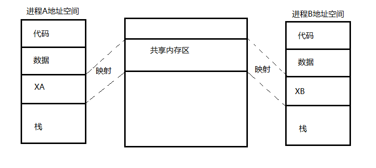

# 进程通信      

进程同步和互斥，实现了进程间的信息交换。但由于交换的信息量少，可以看作是**低级通信**。    

当进程之间需要交换的数据量较大时，为了提高效率，系统需要采用一些相应的通信机制来完成进程间通信。      

**进程通信(InterProcess Communication, IPC)**是进程间数据的互相交换和信息的互相传递，是一种**高级通信**机制。    

- 主要的通信机制：    

1. 消息传递(Message Passing)通信。    
2. 共享内存(Shared Memory)通信。    
3. 管道(Pipeline)通信。    

<br />
<br />

## 1、消息传递通信    

> 消息传递通信也可以用于同步和互斥。    

消息传递通信机制是一种灵活的进程间通信形式。进程将通信数据封装在消息中，消息通过消息缓冲区在进程之间互相传递。    
消息隐藏了通信实现的细节，利用消息的进程通信简化了程序设计，因而得到了广泛应用。    

所谓消息是指进程之间以不连续的成组方式发送的信息，而消息缓冲区应包含消息发送进程标识、消息接收进程标识、指向下一个消息缓冲区的指针、消息长度、消息正文等。    
这个缓冲区构成了进程通信的一个基本单位。当进程需要发送消息时，需形成这样一个缓冲区，并发送给指定的接收进程。每个进程都有一个消息队列，其队列头由接收进程的PCB中的**消息队列指针**指向。    

当来自其他的一些进程的消息传递给它时，就将这些消息链入消息队列。通常，进程按先来先服务的原则处理这一队列。当处理完一个消息后，抽到消息的进程在同一缓冲区中向发送进程回送一个“回答”信号。队列中的消息数量可由PCB中设置的信号量sm登记。      

- Windows中的消息结构定义：    

```cpp
typedef struct tagMsg
{
    HWND hWnd;
    UINT message;
    WPARM wParam;
    LPARM lParam;
    DWORD time;
    POINT pt;
}MSG
```

### 同步问题：    

为了在两组彼此独立的进程之间进行通信，要求它们在一次传送数据的过程中互相同步，每当发送进程发来一个消息，并将它挂在接受进程的消息队列上时，便在sm上执行V操作；而当接收进程需要从消息队列中读取一个消息时，先对sm执行P操作，再从队列中移出已读消息。    

> Cre：应该不止一个信号量，除了sm应该还有一个mutex信号量。      


### 直接通信：    

发送进程和接受进程可以直接发送和接受消息，也可以借助邮箱发送接受消息。所以说存在直接通信和间接通信两种类型。    

在直接通信方式下，发送进程将发送的数据封装到消息正文后，发送进程必须给出接收进程的标志，然后用发送原语将消息发送给接收进程。    

- ▷ 发送原语：    

`send(接收进程标识, 消息队列首指针);`    

其工作原理是，首先查找接收进程的PCB，如果接收进程存在，申请一个存放消息的缓冲区；    

如果接收此消息的进程曾因等待此消息而阻塞，则唤醒此进程，并把消息的内容、调用发送原语的进程名等，复制到预先申请的存放消息的缓冲区，然后将存放消息的缓冲区连接到接收进程的消息队列上；    

如果接收进程不存在，则系统给出一个反馈信息，再返回发送消息的进程继续执行，或者转入进程调度 重新分配CPU；    

如果消息缓冲区已满，则返回到非同步错误处理程序入口，进行特殊处理。    


- ▷ 接收原语：    

接收进程在接受消息前，会在自己进程的存储空间设置一个接收区，然后用接收原语接收。    

`receive(发送进程标识, 接收区首地址指针)`    

当接收进程想要读取消息时，使用receive把消息缓冲区中的消息内容、消息长度、发送进程的名字都读取到接收区，然后把消息缓冲区从链表中去掉，并释放消息缓冲区；如果没有消息可读取，则阻塞接收进程，直至有消息发送来为止。        

当接收进程接收多个发送进程发送来的消息时，则在接收原语中可以不写发送进程标识，而是写一个通用标记。    

> 发送进程与接收进程之间直接传递消息，需要发送进程与接收进程之间协调，才能做到可靠的发送和接收，否则消息容易丢失。因此在直接通信中隐含着发送进程与接收进程之间的同步问题。    

### 补充：    

- 发送进程调用send原语发送消息后有两种选择：    

1. 阻塞等待接收进程发回的确认消息。要设置阻塞等待的最长时间。    
2. 不阻塞等待接收进程的回送消息，而是继续执行自己的程序。期间会接收到接收进程的回送消息。收到回送消息则删除原来的发送消息。如果规定时间内没收到确认消息，或重发或放弃。    

- 接收进程调用receive原语也有两种选择：    

1. 调用receive原语并一直阻塞等待发送来的消息，直到接收到消息。（通常与发送进程的第二种情况匹配）    
2. 调用receive原语后不阻塞等待发送来的消息，继续执行本身的程序。当需要接收消息时才去查看消息并回送。（通常与发送进程的第一种情况匹配）      

### 间接通信：    

消息传递的间接通信方式是指发送进程与接收进程之间通过邮箱来进行通信。邮箱是一个共享数据结构，发送进程将消息发送给邮箱，接收进程从邮箱接收消息。      

与直接通信相比，间接通信灵活性更大，不需要发送进程和接收进程同步，是一种更加方便可靠的通信方式。大多数操作系统都支持使用邮箱进行通信。    

- 发送和接收原语：    

`send(mailboxname, message);`    
`receive(mailboxname, message);`    


<br />
<br />  

## 2、共享内存通信      

共享内存通信可进一步分为**基于共享数据结构的通信方式**和**基于共享内存区的通信方式**。前一种通信方式比较低效，只适合少量数据。一般情况下共享内存通信就是指基于共享内存区的通信方式。    

    

### 共享内存通信的实现过程：    

1. 建立共享内存区。当进程要利用共享内存区与另一进程通信时，须先利用系统调用建立一块共享内存区，并提供该内存区的标识符和长度等参数。    
2. 共享内存区管理。可以提供系统调用对共享内存区的状态信息进行查询，如其长度、所连接的进程数、创建者标识符等；也可以设置或修改其属性，例如共享内存区的许可权、当前连接的进程数等；还可用用来对共享内存区加锁或者解锁，以及修改标识符等。    
3. 共享内存区的映射与断开。建立共享内存区返回其描述符后，还须利用系统调用将该共享内存区映射到用户给定的某个进程的虚地址上，并指定该内存区的访问属性。此后这个内存共享区便成为该进程虚地址空间的一部分，进程可采取与对其他虚地址空间一样的存取方法来访问。当进程不需要该共享内存区时，再利用系统调用 把该区与内存断开。    

### 补充：    

系统应当允许多个进程将内存共享区映射到自己的地址空间，因此**这些进程对各自所映射的地址段的读写操作代码应纳入临界区**。    


<br />
<br />  

## 3、管道通信    

管道是连接读、写进程的一个特殊文件，允许进程按FIFO方式传送数据，也能使进程同步执行操作。发送进程以字符流的形式把数据传入管道，接收进程从管道接收数据。    

管道的实质是一个***共享文件**，基本上可借助于文件系统的机制实现，包括管道文件的创建、打开、读写、关闭，实际在物理上是由文件系统的高速缓冲区完成的，而很少真正启用硬盘之类的外设。创建管道的进程称为管道服务器，连接到一个管道的进程称为管道客户端。    

### 互斥/同步问题：   

进程对管道应该互斥使用，一个进程正在使用某个管道写入或读出数据时，另一个进程就必须等待。发送者和接收者双方必须能够知道对方是否存在，如果对方已经不存在，就没必要再发送信息。管道长度有限，发送信息和接收信息之间要实现正确的同步关系，当写进程把一定数量的数据写入管道，就去睡眠等待；直到都进程取走数据后将其唤醒。       

### 命名管道(named pipe)：    

管道存在一定的限制：每次打开管道的进程，稚嫩那个与该进程相关的进程(子进程)共享对管道的操作，完成互相之间的通信，难以提供全局服务。    
为了克服这些限制，后又推出所谓的**命名管道(named pipe)**，相应的旧管道称为**匿名管道**。命名管道用来在不同的地址空间之间进行通信，不仅可以在本机上实现两个进程间的通信，还可以跨网络实现两个进程间的通信，特别为服务器通过网络与客户端交互而设计，是一种**永久通信机制**，具有文件名、目录项、访问权限，能像一般文件一样操作，读写性能与匿名管道相同。    

每个命名管道都有一个唯一的名字，以区分于存在于系统的命名对象列表中的其他命名管道。以Windows为例，管道服务器在调用`CreateNamedPipe()`函数创建命名管道的一个或多个实例时为其指定了名称。对于管道客户，则是在调用`CreateFile()`或`CallNamedPipe()`函数以连接一个命名管道实例时对管道名进行指定。    

- 命名管道标识：    

命名管道的标识采用UNC格式：`\\Server\Pipe[Path]Name`。    

第一部分`\\Server`指定了服务器名字，命名管道服务即在此服务器创建，其字串部分可表示为一个小数点(表示本机)、星号(当前网段)、域名或是一个真正的服务器；      
第二部分`Pipe`是一个硬编码字符串，以指出该文件是从属于*NPFS(命名管道文件系统)*；    
第三部分`[Path]Name`则使应用程序可以唯一定义及标识一个命名管道的名字，而且可以设置多级目录。    

- 命名管道通信模式：    

命名管道提供两种基本通信模式：**字节模式**和**消息模式**。可在`CreateNamedPipe()`创建命名管道时分别用`PIPE_TYPE_BYTE`和`PIPE_TYPE_MESSAGE`标志进行设定。      

1. 在字节模式中，信息以连续字节流的方式在客户和服务器之间流动。意味着对于客户机应用和服务器应用都无法准确知道一个特定时间段内有多少字节从管道中读出或者写入。在这种通信模式中，一方在管道写入某个数量字节后，并不能保证管道另一方能读出等量的字节。    

2. 对于消息模式，客户机和服务器则是通过一系列不连续的数据包进行数据收发。从管道发出的每一条消息都必须作为一条完整的消息读入。    


（END）    

