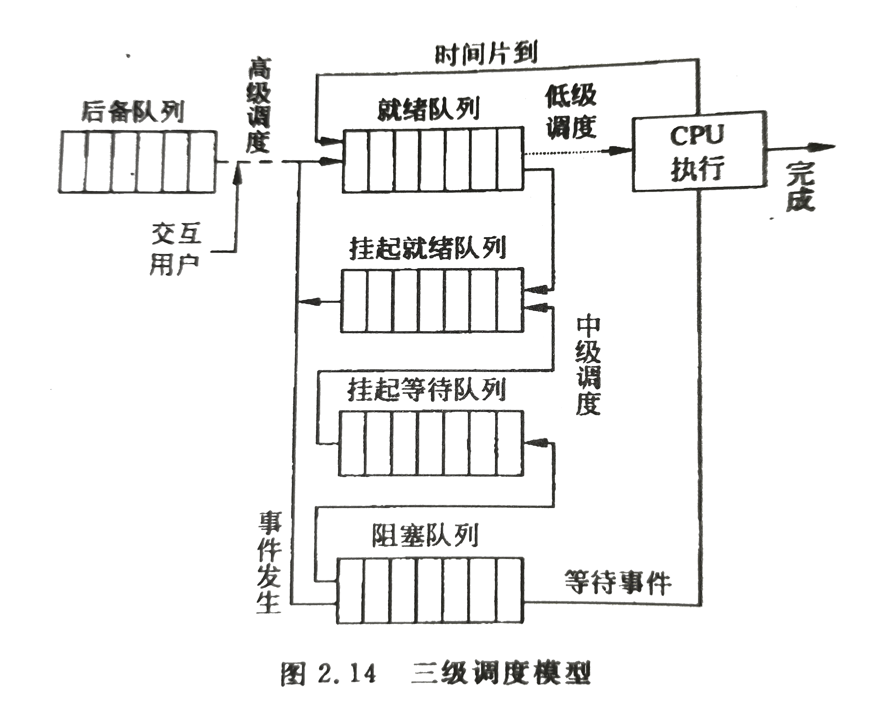
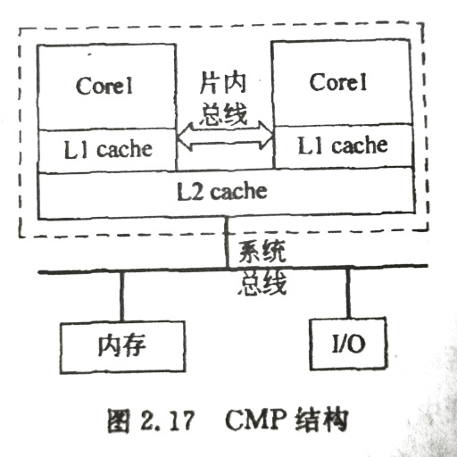

# 进程调度        

在操作系统中，由于进程总数一般多于CPU数，必然会出现竞争CPU的情况，进程调度的功能就是按一定的策略动态地把CPU分配给处于就绪队列中的某一进程执行。      

- 两种基本的进程调度方式：    

有两种基本的进程调度方式，**抢占方式**和**非抢占方式**，又称为剥夺式和非剥夺式调度。    

剥夺原则有优先权原则、短进程原则、时间片原则。就绪队列中一旦出现符合上述原则的进程，系统便立即剥夺当前运行进程的CPU使用权，进行进程切换。    
非剥夺式调度中，一旦CPU分配给某进程，即使就绪队列出现了优先级比它高的进程，系统也不能抢占运行进程的CPU使用权，而必须等待该进程主动让出。      

- 可能引发进程调度的时机总结：    

1. 正在运行的进程运行完毕。    
2. 运行中的进程要求I/O操作。    
3. 执行某种原语操作导致进程阻塞。    
4. 比正在运行的进程优先级高的进程进入就绪队列。    
5. 分配给运行进程的时间片用完。    

- 进程调度策略：    

▷由于进程调度的使用频率高，其性能优劣直接影响操作系统的性能。根据不同的系统设计目标，可能有多种进程调度策略。    
▷例如系统开销较少的静态优先数法，适合分时系统的时间片轮转法以及动态优先数反馈法等。    
▷评价调度算法的好坏，用得较多的是批处理系统中的周转时间、平均周转时间、带权周转时间以及分时系统中的响应时间。    
▷除此之外，系统吞吐量、CPU利用率、各类资源的平衡利用情况也是评价调度算法的标准。    

> 周转时间是指从作业提交给系统开始，到作业完成为止的间隔时间；平均周转时间是指各作业周转时间的平均值；带权周转时间是指周转时间与系统为它提供服务的时间之比。    
> 响应时间是指从键盘命令进入(按下Enter)到开始在终端上显式结果的时间间隔。    

 
 

## 1、进程调度模型    

> 不同的操作系统曹勇不同的调度模型，一级调度模型仅有低级调度，二级调度模型拥有高级调度和低级调度，还有些系统拥有三级调度模型。    

### 高级调度：    

*高级调度(High-Level Scheduling)*又称为作业调度，在分时和实时系统中不需要。    

其主要功能是根据一定的算法，从后备作业中选出若干个作业，分配必要的资源例如内存、外设等，为它建立相应的用户作业进程和为其服务的系统进程(例如输入输出进程)，将其程序和数据调入内存，等待进程调度程序对其执行调度，并在作业完成后善后处理。    

### 中级调度：    

*中级调度(Intermediate-Level Scheduling)*又称为平衡调度，在采用虚拟存储技术的系统中引入，以提高系统吞吐量。    
其功能是在内存使用情况紧张的时候，将一些暂时不能运行的进程从内存对换到外存等待。当内存有足够空间的时候，再将合适的进程重新换入内存等待进程调度。    

### 低级调度：    

*低级调度(Low-Level Scheduling)*又称为进程调度。    

主要功能是根据一定的算法将CPU分配给就绪队列中的一个进程。执行低级调度功能的程序称为*进程调度程序*，由他实现CPU在进程间的切换。    

进程调度的频率很高，在分时系统中往往几十毫秒就要运行一次。进程调度是操作系统中最基本的一种调度。在一般类型的操作系统中都必须有进程调度，而且它的策略优劣直接影响整个系统性能。    

    
> 作业从提交开始直到完成所经历的*三级调度*。    

 
 

## 2、调度算法选择/评价准则        

> 不同的调度策略，对系统性能的影响不同。评价调度算法除了需要从系统性能考虑外，还需要从用户满意的方面进行考虑，充分体现对用户的公平性和系统的高效性，既保证每个用户有合理的处理器时间，又保证系统CPU利用率高。    

### 评价调度算法的准则：    

- (1)处理器利用率    

> 即CPU有效工作时间与CPU总运行时间的比。    

> `CPU利用率 = CPU有效时间 / CPU总运行时间`    
> `CPU总运行时间 = CPU有效时间+ CPU空闲时间`    

> 当CPU的有效时间等于CPU总运行时间，CPU的利用率达到100%。这是一种理想情况，实际应用中总会存在进程切换等工作，而进程切换需要时间。     

- 响应时间(Response Time)    

> 交互环境下用户从键盘提交请求开始，到系统首次产生响应为止的时间，或者到屏幕显示出结果的时间。这是分时系统和实时系统衡量调度性能的一个重要指标。    

> `响应时间 = 从终端键盘输入的请求消息传送到系统的时间 + 系统对用户请求的处理时间 + 生成的响应信息回送到终端显示器的时间`    

- 周转时间(Turnaround Time)    

> 用户作业提交给操作系统开始到作业完成为止的时间，是批处理系统衡量调度性能的重要指标。    
> `周转时间 = 作业在后备队列等待调度时间 + 进程在就绪队列上等待调度的时间 + 进程在CPU上运行时间 + 进程等待I/O或其他事件发生的事件`    

- 带权周转时间    

> `带权周转时间 = 作业周转时间 / 系统为作业提供的服务时间`    
> （带权周转时间总大于1）    

- 平均作业周转时间：    

> `T = (ΣTi) / n`    

- 系统吞吐量(throughput)    

> 单位时间内完成的进程数目。    

- 公平性    

> 确保每个用户和进程获得合理的CPU份额或其他资源份额，不出现饥饿情况。    

 
 

## 3、调度算法    

> CRE：调度算法即调度策略。    

操作系统中存在多种调度算法，有的用于高级调度，有的适用于低级调度，但大多数算法既适合高级调度也适合低级调度。    

### 先来先服务(FCFS)：    

*First-Come-First-Served*算法按照进程就绪的先后顺序来调度进程。获得CPU的进程，未遇到其他情况时，一直运行下去，系统只需要设置一个先进先出队列。    

该算法是一种非抢占式算法，是目前最简单的调度算法，编码非常容易。    

该算法优先考虑的是作业的等待时间，而没有考虑作业的执行时间长短、作业的运行特性、作业的资源要求。    

- 特性：    

1. 对长作业非常有利，对短作业不利，短作业的等待时间和周转时间会很长。    
2. 对CPU繁忙的作业非常有利，对I/O繁忙型的作业非常不利，I/O阻塞状态结束后需要再次排队，周转时间和等待时机很长。    
3. 非抢占式算法，对响应时间要求高的进程不利。    

### 短作业优先(SJF)：    

*Short-Job-First*算法以进入系统的作业所要求的CPU服务时间为标准，总选取估计所需CPU时间最短的作业优先运行。    

- 特性：    

1. 算法易于实现，效率不高，主要弱点是忽视了作业等待时间。    
2. 对长作业不利，如果系统不断接受短作业，可能会出现饥饿现象。    
3. 非抢占式算法，对响应时间要求高的进程不利。    
4. SJF的平均作业周转时间比FCFS小，故它的调度性能比FCFS好。    
5. 实现SJF调度算法需要知道作业所需运行时间，否则调度就没有依据，而精确知道作业运行时间是办不到的。    

### 最短剩余时间优先(SRTF)：    

一个就绪状态的新作业所需的CPU时间如果比当前正在执行的作业剩余任务所需CPU时间还短，*Shortest-Remaining-Time-First*算法将打断正在执行作业，将执行权分配给新作业。    
SRTF算法将SJF算法改为抢占式，因此只要有新作业进入就绪队列，就可能引发进程切换。    

- 特性：    

1. 长进程仍有可能饥饿。    
2. 必须计算运行、剩余时间，系统开销大。    
3. 抢占式调度，系统性能可能会比SJF好。    

### 高响应比优先(HRRF)：    

*Highest-Response-Ratio-First*算法是FCFS和SJF算法的折衷--既考虑了作业等待时间，又考虑了作业运行时间，既照顾了短作业又不使长作业等待过久，改善了调度性能，但仍属于非抢占式算法。    

`响应比 = 1 + (已等待时间 / 估计运行时间)`    

- 特性：    

1. 短作业容得得到较高响应比，长作业等待足够长时间也能得到较高响应比，不会发生饥饿现象。    
2. 需要经常计算响应比，导致额外开销。    
3. 平均周转时间和平均带权周转时间都优于FCFS算法，但是劣于SJF算法。    
4. 虽然平均周转时间和平均带权周转时间劣于SJF算法，但是在现实中它可以实现，结果也比较可靠。    
5. 如果在算法中引入抢占调度，则算法过程会更复杂，因为所有作业的响应比是动态变化的。    

### 优先权(HPF)：    

*Highest-Priority-First*算法根据进程的优先权进行进程调度，每次都是选取优先级高的进程调度，一般是抢占式调度。    

> 进程的优先权通常用一个整数表示。在有些操作系统中，优先数越大，表示进程的优先权越大，而有些操作系统相反。Windows系统有0-31共32个优先级，31最高。UNIX系统中使用-20~19表示优先级，-20优先级最高。    

> 优先权可由系统或者用户给定。系统会按照进程的执行时间长短以及对资源的要求而给定进程的优先权，用户在进程送入系统时，为自己的进程指定一个优先数，优先数反映用户对进程执行的急切程度。    

优先权调度算法综合考虑了进程的执行时间和等待时间长短、进程的缓急程度、进程对外设的使用情况等因素，根据系统设计目标和运行环境而给定各进程的优先权，决定进程调度的先后顺序。系统按照进程优先权高低进行排队，进程调度时选取优先权高的进程优先调度。    

优先权存在两种形式：**静态优先权**和**动态优先权**。静态优先权指进程的优先权在进程进入系统时给定后不再改变，这可能会导致饥饿现象。动态优先权指进程的优先权在进程进入系统时给定，随着进程的运行和等待时间变化而发生变化，该情况与响应比相似。    

### 时间片轮转(RR)：    

*Round-Ribon*算法中，调度程序每次把CPU分配给进程使用一个规定的时间段，称为一个**时间片**（例如100ms）。就绪队列中的进程轮流获得CPU的一个时间片。当时间片结束时，系统剥夺进程执行权，将其排列到就绪队列的尾部等待下一轮调度，属于抢占式调度。。    
只要是处于就绪队列的进程，按照此算法迟早可以获得CPU投入运行，可防止那些很少使用外设的进程过长占用处理器而使得需要使用外设的进程没有机会去启动外设。    

- 时间片长短：    

时间片的长短，影响着进程的进度。当就绪进程很多时，如果时间片很长，就会影响一些需要紧急运行的作业，极端情况下将退化成FCFS。如果时间片过小，则大多数进程都需要轮转多个时间片，从而产生频繁的切换，增大系统开销。因此RR算法需要从进程数、切换开销、系统效率和响应时间等方面综合考虑来确定时间片大小。    

### 多级反馈队列(MFQ)：    

*Multilevel-Feed-Queue*即多级反馈队列，又称为反馈循环队列。是一种基于时间片的进程多级队列调度算法的改进算法。    

系统设置多个就绪队列，最高级就绪队列的优先级最高，随着就绪队列级别降低优先级一次下降，较高级就绪队列的进程获得较短的时间片。    
新建进程首先进入最高优先级队列。随着得到的CPU执行次数增加，该进程逐渐进入较低级就绪队列。    

MFQ算法不需事先知道各进程所需运行时间，因而可行性高，同时综合考虑了进程的时间和优先权因素，既照顾了短进程又照顾了长进程，是一种综合调度算法，被广泛应用于各种操作系统中。    

   
   

## 4、多CPU系统中的调度    

多处理器系统的作用是利用系统内的多个CPU来并行执行用户进程，以提高系统吞吐量或用来进行冗余操作以提高可靠性。系统的多个处理器在物理上处于用一个机壳中，**有一个单一的系统物理地址空间**，**多个处理器共享系统内存和外设等资源**。    

### 多CPU系统的类型主要有两种：    

- ▷ 主从模式：    

只有一个主处理器，运行操作系统，管理整个系统资源，并负责为各从处理器分配任务。    
从处理器有多个，执行预先规定的任务以及由主处理器分配的任务。    

> 这种类型的系统无法做到负载平衡，可靠性不高，很少使用。    

- ▷ 对称处理器模式(Symmetric MultiProcessor)：    

所有处理器都是相同平等的，共享一个操作系统，每个处理器都可以运行操作系统代码，管理系统资源。是目前比较常见的多CPU系统模式。    

### 多CPU系统中有代表性的两种进/线程调度方式：    

- 自调度：    

是直接由单处理器环境下的调度方式演变而来。在系统中设置有一个公共的进/线程的就绪队列，所有处理器在空闲时都可以自己到该队列中取得一个进/线程来运行。    

优点：  
1. 不会出现处理器空闲的情况。    
2. 组织方式和调度算法可以沿用单处理器所用的算法。    
缺点：  
1. 处理器必须互斥地访问该队列，很容易形成系统瓶颈。  
2. 当线程阻塞后又重新就绪时，可能要更换处理器，因而使得高速缓存使用效率低。    
3. 同步协助型的线程很难同时获得处理器而同时运行，会使某些线程频繁切换。    

- 组群调度：    

*组群调度(Gang Scheduling)*是将相关的一组线程组织为一个调度群，分配到一组处理器上去执行。相关进/线程能够并行，有效减少阻塞、减少切换、降低调度频率，改善了系统性能。        

- 专用处理器分配：    

在一个进程执行期间，专门为该进程分配一组处理器，对应每一个线程一个，这组处理器供该进程专用直至结束。    
这实际上是组群调度的极端形式，追求高度并行，避免低级调度，但会造成处理器的严重浪费。    

- 动态调度：    

由操作系统和进程共同进行调度，操作系统负责在进程间分配处理器，进程内的线程调度可由进程负责。    

 
 

## 5、多核CPU中的调度    

多核处理器是指在一枚处理器中集成多个计算引擎(核心/Core)，称为CMP(Chip Multiprocessors)结构，其思想是将大规模并行处理器中的SMP集成到同一芯片，并用高速片内总线互连。    

操作系统会将每个核作为分立的逻辑处理器，各个处理器核心并行调度执行不同的进/线程。通过在多个核之间划分任务，多核处理器可在特定的时钟周期内执行更多任务。    

### CMP的结构：    

> 多级cache会引发一致性问题，目前的CMP系统大多采用基于总线的侦听协议。    

### 多核CPU任务调度：    

- 全局队列调度：    

操作系统维护一个全局的任务等待队列，当系统中有一个CPU内核空闲时，操作系统就从全局等待队列中选取就绪任务开始在此内核上执行。优点是CPU利用率较高。    

- 局部队列调度：    

操作系统为每个核心维护一个局部的任务等待队列，当系统中有一个CPU内核空闲的时候，便从该内核的任务等待队列选取合适的任务执行。优点是任务基本上无需在多个CPU内核上切换，有利于提高缓存命中率。    

> 目前多数多核CPU操作系统采用基于全局队列的任务调度算法。    

### 多核CPU的中断：    

多核的中断处理和单核有很大不同，多核的各处理器之间需要通过中断方式进行通信，所以多个处理器之间的本地中断控制器和负责仲裁各核之间终端分配的全局中断控制器也需要封装在芯片内部。    

### 多核CPU的同步互斥：    

多核CPU是一个多任务系统。由于不同任务会竞争共享资源，因此需要系统提供同步和互斥机制。而传统的用于单核的解决机制不能满足多核，需要利用硬件提供的"读-修改-写"原子操作或其他同步互斥机制来保证。    

### 补充：    

除了上述情况以外，多核CPU与多CPU系统中的调度算法基本一致，毕竟每个处理器内核实质上都是一个简单的微处理器。    

（END）    