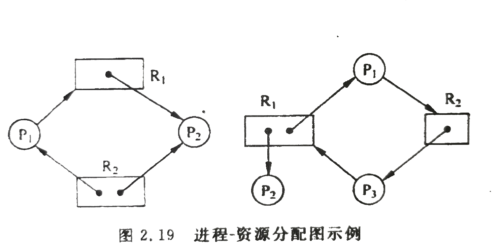

# 死锁    

如果一个进程集合中每个进程都在等待只能由该集合中的另外一个进程才能引发的事件，则称为一组进程或系统此时发生了死锁。    

死锁不仅会发生在两个进程之间，也可能发生在多个进程甚至全部进程之间。死锁不仅会在动态使用外设时发生，而且也可能在动态使用存储器、文件、缓冲区、数据库时发生，甚至在进程通信过程中发生。    

随着计算机资源的增加，系统发生死锁现象的可能性也大大增加，死锁一旦发生会使整个系统瘫痪无法工作。因此系统必须想办法解决死锁问题。    

<br />
<br />

## 1、死锁产生原因    

死锁的产生不仅与系统拥有的资源数量相关，还与资源的分配策略、进程对资源的使用要求以及并发进程的推进顺序有关。总的来说，死锁产生的两个原因是**进程对临界资源的竞争**以及**并发进程推进顺序不当**。    

<br />
<br />  

## 2、死锁产生的必要条件    

### 死锁的四个必要条件：    

- 互斥条件(Mutual exclusion)：    

资源的使用是互斥的。如果一个资源已经被占用，则再请求该资源的进程只能等待。    

- 请求与保持条件(Hold and wait)：    

一个进程得到资源并再次请求资源时，若请求的资源不能得到，已得到的资源也不会释放。    

- 不剥夺条件(No pre-emotion)：    

当进程获得资源后，只能由其自身主动释放，其他进程不能剥夺进程已获得资源。    

- 环路等待条件(Circular wait)：    

系统中若干进程形成环路，每个进程都在等待相邻进程正在占用的资源，形成永久等待。    

### 破坏死锁：    

这四个条件是死锁发生的必要条件而非充分条件。任意一条不满足都不会发生死锁。因此只需要破坏上述几个条件之一就可以防止死锁。    

破坏第一个条件，使资源非互斥访问，可行性不高。    

破坏第二个条件，进程必须获得所需资源才能运行 --静态分配，会严重降低资源利用效率。    

破坏第三个条件，采用剥夺式调度方法 --申请不到新资源则释放已占用资源，此方法只适用于CPU和内存。    

破坏第四个条件，采用按序分配策略，或者层次分配策略。      


### 进程-资源分配图：    

    

注释：

> 进程指向资源类，表示进程正在等待资源；资源点指向进程，表示进程已获得资源。    

结论：    
> 如果图中无环路，则此时系统没有发生死锁。    
> 如果图中有环路，且每个资源类仅有一个资源，则发生了死锁，环路中的进程为死锁进程。    
> 如果图中有环路，但是资源类涉及多个资源，则环路的存在只是产生死锁的必要条件。而非充分条件。    


<br />
<br />

## 3、死锁的避免    

上述死锁的防治方法都会造成系统资源利用率和吞吐率降低。    

*死锁避免法*是通过资源分配算法分析系统是否存在一个并发进程的状态序列，在确定不会出现进程循环等待的情况下，才将资源真正分配给进程，以保证并发进程不会产生死锁。    

死锁避免法能支持更高的进程并发度，动态地决定是否给进程分配资源--如果进程的资源请求方案会导致死锁，系统拒绝执行，反之，如果一个资源的分配会导致死锁，系统拒绝分配。    

### 银行家调度算法：    

> 以银行系统所采用的借贷策略为基础而建立的算法模型。进程相当于贷款客户，系统资源相当于资金，调度程序相当于银行家。    

- ⭕为进程提出以下约束条件：    

1. 每个进程必须事先声明其资源需求。    
2. 每个进程每次提出部分资源申请并获得分配。    
3. 进程获得所需资源，执行完毕后必须及时将所占资源归还。    

- ⭕进程遵守约束条件的基础上，系统保证两点：    

1. 如果一个进程所请求的最大资源数不超过系统所有资源总数，则系统一定分配资源给进程。    
2. 如果系统在收到进程的请求时因资源不足而使进程等待，系统会保证在有限时间内进程获得资源。    


- ⭕银行家算法思路：    

1. 在某一时刻，各进程已获得所需的部分资源。有一进程提出新的资源请求，系统将剩余资源试探性的分配给进程。    
2. 如果此时剩余资源能够满足余下某些进程的需求，则将剩余资源分配给能充分满足的、资源缺口大的进程，运行结束后释放的资源再并入系统的剩余资源集合。（体现了银行家资金运转的原则--尽快回笼以满足更多其它客户的缺口）    
3. 反复执行第2步，直到所有的进程都能获得所需而运行结束，说明第1步的进程请求是可行的，系统处于安全状态，相应的进程执行序列称为系统的**安全序列**。如果所有的进程都试探过而不能将资源分配给进程，即不存在安全序列，则系统是不安全的。    

- ⭕银行家算法所需数据结构：    

> 假设有n个进程，m类资源。    

1. 系统当前资源剩余量向量 `Available[m] = {R1, R2... Rm};`    
2. n个进程对m类资源的需求声明矩阵 `Claim[n][m]` (矩阵元素表示某进程对某类资源的总需求量)        
3. n个进程已获得的各类资源数量矩阵 `Possession[n][m]`（元素表示某进程获得了多少个某类资源）    
4. n个进程的各类资源缺口矩阵 `Shortage[n][m]`（表示某个进程还缺多少个某类资源）    
5. 某进程i在某时刻发出的资源请求向量 `Request[m]` (取值范围随情况而定)    


- ⭕银行家算法细化说明：    

1. 判断请求向量Request的有效性 --超过相应进程总需求量则报错，超过系统剩余量则阻塞。    
2. 就系统资源剩余量对Request进行试分配，其中星号表示所有可能的某类资源。    
```CPP
`Available[*] = Available[*] - Request[*]`;    
Possession[i][*] = Possession[i][*] + Request[*];    
Shortage[i][*] = Shortage[i][*] - Request[*];
```
3. 执行安全性测试算法，若安全则确认试分配方案，否则进程i阻塞。    

- ⭕安全性测试算法细化说明：    

1. 定义工作总量`Rest[*] = Available[*]`、进程集合`Running{P*}`(由参与资源请求的进程构成)、布尔量`possible = true`;    
2. 从`Running`集合中找出Pk，满足条件`Shortage[k][*] < Rest[*]`;    
3. 找到合适的进程`Pk`，则释放其占用的资源(`Rest[*] = Rest[* + Possession[k][*]`)，将其从`Running`集合中去掉，重复步骤2。    
4. 找不到合适的进程`Pk`，`possible`为false，退出安全性测试算法。    
5. 最终检查`Running`集合，为空则返回安全，非空则不安全。    


- ⭕总结：    

银行家算法是一个很经典的死锁避免算法，理论性很强，看起来似乎完美，但是其实现要求进程不相关，并且事先要直到各进程所需资源情况，所以可行性并不高。    


<br />
<br />

## 4、检测与解除    

> 解决死锁的另一种方法是对死锁进行检测，在检测的基础上解除死锁。    

在许多系统中并未刻意去预防和避免死锁，对资源分配不施加任何限制，而是让系统定时运行一个死锁检测程序，判断系统内是否有死锁发生。如果发生了死锁，再采取措施解除死锁。      

### 死锁检测算法：    

死锁的检测算法可以采用基于死锁定理的检测，也可以采用类似银行家算法中的安全性测试算法，如果算法退出时仍有未结束的进程，则系统不安全，那些未结束的进程就是死锁的进程。    
只不过死锁检测的不是试分配后的系统状态，而是当前系统状态，需要考虑检查每个进程还需要的所有资源能否满足要求。    

### 死锁检测的频率：    

在系统中，需要决定死锁检测频率。如果检测太频繁，会花费大量时间检测死锁，浪费CPU的处理时间；如果检测频率太低，死锁进程和系统资源被锁定的时间过长，资源浪费大。    

通常的办法是在CPU的使用率下降到一定的阈值时实施检测。当死锁发生次数过多，死锁进程增加到一定程度时，CPU的处理任务少，CPU的空闲时间多。    

### 解除死锁的方法：    

1. 重启：重新启动死锁进程，甚至重启系统。    
2. 撤销：撤销死锁进程，回收资源，优先选择占用资源最多或者撤销代价最小的。    
3. 剥夺：剥夺死锁进程的进程资源再分配。    
4. 回滚：根据系统保存的检查点，使进程或者系统回滚到死锁前状态。    


（END）    