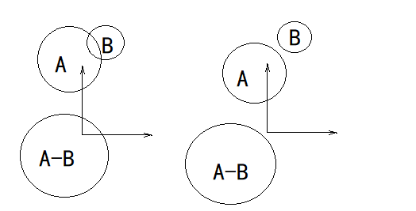

# 碰撞测试和解析几何      

 
 
 

## 1.几种简单形状的相交检测    

碰撞系统应用到*解析几何(analytical geometry)*中三维体积及表面的数学描述，计算形状之间是否相交。    

### 点与球的相交：    

要判断一个点是否在球体中，只需生成一个自球心至该点的分离向量s，然后比较该向量的长度和球体半径。如果s小于球体半径，就说明点和球体相交。    

> 比较向量长度通常是比较长度的平方，可以避免耗时的开方计算。  

### 球体和球体的相交：    

判断球体和球体相交跟判断点和球相交比较类似。需要生成连接两个球心的分离向量s，将其长度和两球半径之和做比较。如果分离向量的长度小于两半径之和，则说明两球相交。    

> 同样可以比较长度平方，避免开方操作。    

### AABB和AABB的相交    

要判断两个AABB是否相交，我们可以使用分离轴定理。由于AABB的面与一组坐标轴平行，所以可以在三个坐标轴之中寻找分离轴。    

### 分离轴定理：    

多数碰撞检测系统会大量使用*分离轴定理(separate axis theorem)*。  

分离轴定理即如果能找到一个轴，两个凸形状在该轴上的投影不重叠，就能确定两个形状不相交。如果这样的轴不存在则可以确定这两个凸形状相交。    

> Cre：对于凹形状，分离轴定理只能排除一部分两凹形状不相交的情况，不能够用来断定两个凹形状相交。    

> Jason：有些形状类型的特性，使我们可以容易地找到潜在的分离轴。要检测两个形状是否相交，可以把两个形状逐一投影到各个潜在分离轴然后检查投影区间是否相交。找到一个合法的分离轴后就可以得知两个形状不相交。    

 
 
 

## 2.检测凸碰撞：GJK算法    

有一非常高效得算法，可以检测任意凸多胞形(即二维得凸多边形，三维得凸多面体)。    

> 该算法的三个发明者是密歇根大学的E.G.Gilbert、D.W.Johnson、S.S.Keerthi，所以称为GJK算法。    

GJK算法依赖一个称为*闵可夫斯基差(Minkowski difference)*的几何运算。即把A图形的所有点，与B图形的所有点成对相减，得出的集合$\{(A_i - B_i)\}$就是闵可夫斯基差。闵可夫斯基差的用处在于，当应用至两个形状，当且仅当两个形状相交，其闵可夫斯基差会包含原点。(很好理解：因为重叠的点相减为零)    

两个凸图形的闵可夫斯基差也是凸图形。我们只关心闵可夫斯基差的凸包，而不是所有内点，GJK的基本程序是从闵可夫斯基差的凸包内尝试找出一个包含原点的四面体，如果能找到，则说明两个图形相交，如果不能找到说明不相交。（四面体是一个三维*单纯形(simplex)*）    

GJK是一个迭代式算法，可以首先从任意四面体开始，在循环的每个迭代中我们从当前的单纯形来判断原点在该单纯体的哪一个方向，然后我们在那个方向搜寻闵可夫斯基差的*支持顶点(supporting-vertex)*（即凸包在该方向最接近原定的顶点）。我们把该点加进单纯形，如果能包含原点，那么任务完成-两个形状相交，如果不能找到比当前单纯形更接近原点的支持顶点，便可知道任务永不能完成-即两个形状不相交。    

 
 
 

## 3.不同形状组合以及分派    

更多的形状对形状组合还有很多，数目非常庞大，事实上对于N种形状，所需的成对测试便需要O(N^2)个。    
碰撞引擎的复杂度，很大程度上是由大量所需处理的相交组合造成的，所以碰撞引擎的作者总是尽量限制碰撞原型数量的原因，这样做可以大幅度减少所需处理的相交组合数目。    
（这也是GJK流行的原因-GJK能一举处理所有凸形状之间的碰撞。而不同形状的唯一区别只在于算法所使用的支持函数(support function)。）    

给定两个任意形状，应该如何实现代码选择合适的碰撞测试函数，这是一个实际问题。许多引擎使用*双分派(double dispatch)*方法。

### 单分派：  

单分派（即虚函数）在运行时使用单个对象类型，决定对某抽象函数调用至哪一个具体实现。    

### 双分派：    

双分派把虚函数的概念扩展至两个对象类型。双分派可以通过二分查找表实现，表的键由两个检测对象的类型组成。    

此外双分派也可以实现为两次虚函数调用。第一次由对象A的类型决定调用哪个具体函数，在该函数中再由对象B的类型决定调用哪个具体函数。    

### 例子：Havok：    

Havok使用*碰撞代理人(collision agent)*处理某特定相交测试。具体的代理人有`hkSphereSphereAgent`类、`hkSphereCapsule`类等。而`hkpCollisionDispatcher`类负责管理一个二维分派表，内含这些代理人的类型，分派器的任务就是高效地查找合适的代理人。    

> Ye：如果二维分派表所存储的是函数指针，可能会更加高效，因为这样能省去一次虚函数调用。    

 
 
 

## 4.检测运动物体之间的碰撞    

物体移动时碰撞测试要比两个静态物体的静态相交测试更加复杂。    

在游戏中运动是离散时间step模拟的。最简单的方法是每个时间step中，将每个刚体的变换当作静止的，然后对这些碰撞世界的快照(snapshot)使用静态相交测试。如果物体的移动速度相对其尺寸不快此方法是可行的。    

然而对于较小的高速物体此方法会失效，该高速物体在其相邻的两个快照之间有一段空隙，如果另一物体正好在空隙之间，就会错过碰撞，发生*隧穿(tunneling)*现象。有以下几种应对方案。    

### 扫掠形状：    

避免隧穿的方法之一是利用*扫掠形状(swapt shape)*。扫掠形状是一个形状随时间移动产生的形状，例如扫掠球体是胶囊体，扫掠三角形是一个三角柱体。    

扫掠形状问题是，对于曲线移动的碰撞体或者旋转的碰撞体，其测试结果一般是不准确的。（扫掠旋转物体不一定产生凸形状）    

### 连续碰撞检测：    

*连续碰撞检测(continuous collision detection,CCD)*技术的目标是对两个移动物体于某时间区间内，求得最早的*冲击时间(time of impact, TOI)*。    

CCD算法一般是迭代式的。我们维护每个碰撞体于上个step和当前step的变换信息，用来各自对变换进行线性插值，以产生此时间区间内任意时刻的变换。然后算法搜寻在移动路径上的最早TOI。最常用的搜寻算法包括：  
1. *保守前进法(conservative advancement)*。  
2. 向闵可夫斯基和(minkowski sum)投射光线。  
3. 考虑每对形状特征的最小TOI。    

（END）    