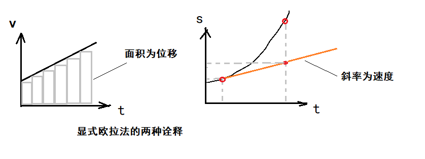

# 基础    

### 单位：    

多数刚体动力学模拟会使用MKS单位（即公制单位）。质量单位为千克(kg)，时间单位为(s)，距离单位为米(m)。    

### 分离线性及旋转动力学：    

无约束刚体，是指可以在三个笛卡尔轴上自由位移，并沿这三个轴自由旋转的刚体，称这种刚体含有6个*自由度(degree of freedom, DOF)*。其运动可以分为两个部分。    

1. 线性动力学(linear dynamics)：描述刚体除旋转外的运动。    
2. 旋转动力学(angular dynamics)：描述刚体的旋转性运动。    

### 质心：    

刚体的质量在所有方向上均匀分布地围绕*质心(center of mass)*。在均匀密度的刚体中，其质心位于刚体的*几何中心(geometry center)*。    

如果刚体的密度非均匀。把刚体切割成非常小的等分，每个小块以其质量为权重，质心就是这些小块位置的加权平均。    

$r_{cm} = {{ ∑_{∀i} m_i r_i} \over {∑_{∀i} m_i}} = {{ ∑_{∀i} m_i r_i} \over {m}}$    

> r称为矢径(radius vector)或者位置矢量(position vector)。    

 
 
 

# 线性动力学    

> 线性动力学得需求来说，刚体得位置完全可以由一个位置矢量$r_{cm}$表示。    

## 1.速度和加速度    

线性速度定义了刚体质心得移动速率和方向。    

$v(t) = {{dr(t)} \over {dt}}$  

线性加速度是线性速度对于时间的一阶导数，位置对于时间的二阶导数。    

$a(t) = {{dv(t)} \over {dt}} = {{d^2r(t)} \over {dt^2}}$  

## 2.力和动量    

*力(force)*定义为任何能使含质量物体改变速度东西。力包含模(magnitude)和方向(direction)。    

牛顿第二定律：$F = ma$    

*动量(momentum)*是线性速度和质量的乘积。    

动量定理：$p = mv$    

 
 
 

# 运动方程求解    

刚体动力学的中心问题是，给定一组施予刚体的已知力，对刚体运动求解。    

## 1.常微分方程    

广义的*常微分方程(ordinary differential equation,ODE)*是涉及一个自变量的函数以及多个该函数导数的方程。    

${d^nx \over dt^n} = f(t, x(t), {dx(t) \over dt} , {d^2x(t) \over dt^2} ...... {d^{n - 1}x(t) \over dt^{n - 1}})$    

> 另一种说法是，x(t)的n阶导数表示为f，函数f的参数为时间t、位置x(t)以及任意数量低于n阶的x(t)导数。    

- 示例：  

力在广义上是时间、位置、速度的函数：$x''(t) = {1 \over m}F(t, x(t), x'(t))$    

## 2.解析解    

在很罕见的情况下，运动的微分方程可以求出*解析解(analytical solution)*。也就是可以找到一个简单的闭合函数，描述所有可能时刻t的位置。    

- 示例：    

自由落体的常微分方程：$y''(t) = g$    

积分得到：$y'(t) = v_0 + gt$    

再次积分：$y(t) = y_0 + v_0t + {1\over2}gt^2$    

- 注意：  

游戏中几乎永远不可能有解析解。不仅因为一些微分方程根本无闭合式解，也因为游戏是一个互动模拟，力的变化不可预知。    

 
 
 

# 数值积分    

由于上述原因，游戏物理引擎改用*数值积分(numerical integration)*。  

使用数值积分我们能对微分方程以*时步(time step)*方式求解，即以上一时步的解求得本时步的解。也就是给定r(t1)、v(t1)、F(t, r, v)，求出r(t2)及v(t2)。时间步长度通常为常数，记为Δt。    

> Jason：最简单的数值积分法是*显式欧拉法*。显式欧拉法误差大稳定性差所以通用的动力学模拟不会使用。对于常微分方程求解还有其他方法例如向后欧拉法（一阶）、终点欧拉法(二阶)、Runge-Kutta方法（四阶的最流行，称为RK4）。    

## 1.显式欧拉法    

对常微分方程最简单的求解方法之一是*显式欧拉法(explicit Euler method)*。    

使用显式欧拉法对常微分方程的近似解为：  

位移：$r(t_2) = r(t_1) + v(t_1) * Δt$  

速度：$v(t_2) = v(t_1) + {{F_{net}(t_1)} \over {m}} * Δt$    

  

 
 

## 2.数值方法的特性    

显式欧拉法不太准确，只有在时间步长趋近0或者匀速运动时才是准确的。    

常微分方程的数值解实际上由三个重要特性：  
1. 收敛性。（时间步长趋于0时近似解是否接近真实解？）  
2. 阶数(order)。（给定常微分方程的某个数值逼近解，误差会与时间步长Δt的某个幂成正比，通常把这些误差写成大O标记法。）    
3. 稳定性(stability)。（如果某数值方法在系统中加进能量，物体速度会爆炸，如果某数值方法在系统中消去能量，会形成阻尼负反馈效果，系统是稳定的。）    

#### 阶数：  

通常在度量数值方法误差时，会比较其逼近方程与常微分方程精确解的*泰勒级数(Tayor series)*展开式。两个方程相减得到的泰勒项表示该数值方法的固有误差，用大O表示法表示。    

- 示例：显式欧拉法：  

精确解的泰勒级数展开式：  
$r(t_2) = r(t_1) + r'(t_1)Δt + {1 \over 2}r''(t_1)Δt^2 + {1 \over 6}r'''(t_1)Δt^3 + .......$    

显式欧拉方程为：  
$r(t_2) = r(t_2) + r'(t_1)Δt$    

显式欧拉法的误差表示为：    

$Error = {1 \over 2}r''(t_1)Δt^2 + {1 \over 6}r'''(t_1)Δt^3 + ....... = O(Δt^2)$    

所以说显式欧拉是一阶方法。  

 
 

## 3.威尔莱积分    

> Jason：游戏引擎最常用的常微分方程数值方法大概是*韦尔莱积分(Verlet Integration)*。此方法有两种变种。          

### 正常韦尔莱积分：    

正常韦尔莱积分特点是高阶（误差小）、简单、求值快。    

正常韦尔莱积分能直接用加速度求出位置，而不用先求速度。    

推导韦尔莱积分的方法是把向前和向后的两个泰勒级数求和：    

$r(t_1 + Δt) = r(t_1) + r'(t_1)Δt + {1 \over 2}r''(t_1)Δt^2 + {1 \over 6}r'''(t_1)Δt^3 + O(Δt^4)$    
$r(t_1 - Δt) = r(t_1) - r'(t_1)Δt + {1 \over 2}r''(t_1)Δt^2 - {1 \over 6}r'''(t_1)Δt^3 + O(Δt^4)$    

求和移项：  
$r(t + Δt) = 2r(t_1) + r(t_1 - Δt) + a(t_1)Δt^2 + O(Δt^4)$    

速度可以用其他不太准确的方法逼近例如：    
$v(t1 + Δt) = {{r(t_1 + Δt) - r(t_1)} \over {Δt}} + O(Δt)$    

### 速度韦尔莱积分：    

更常用的*速度韦尔莱*积分是一个4步骤的过程，会把时间步长切割成两部分去求解。    

1. 计算$r(t_1 + Δt) = r(t_1) + v(t_1)Δt + {1 \over 2}a(t_1)Δt^2$    
2. 计算$v(t_1 + 0.5Δt) = v(t_1) + {1 \over 2}a(t_1)Δt$    
3. 确定$a(t_1 + Δt) = a(t_2) = { F(t2, r(t_2), v(t_2)) \over m }$    
4. 计算$v(t_1 + Δt) = v(t_1 + 0.5Δt) + {1 \over 2} a(t_1 + Δt)Δt$

> Jason：第三步的力函数依赖于下一时间step的位置r(t2)和速度v(t2)。r(t2)已经在第一步求出，v(t2)求近似值即可。    

（END）    

