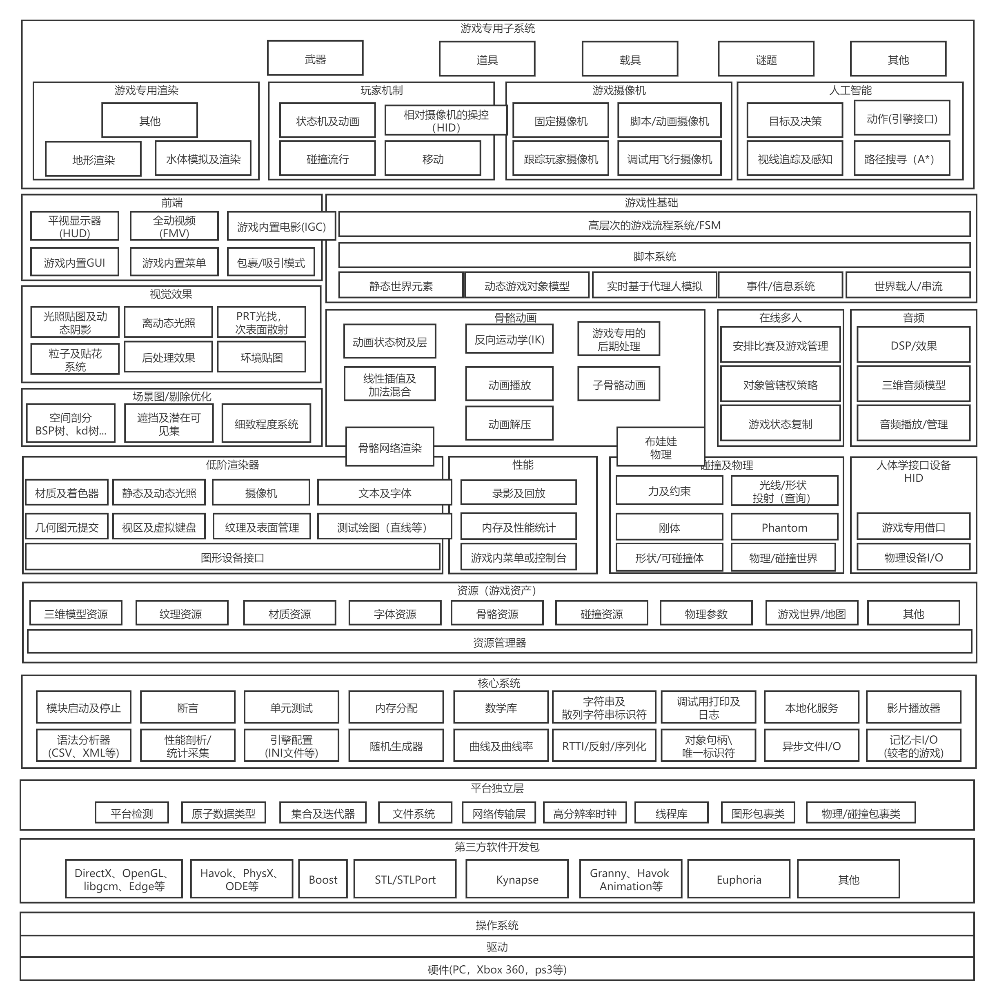

# 概览：运行时引擎架构  

  

游戏引擎通常由工具套件和运行时引擎组件两部分构成。  

游戏引擎和其他软件系统一样是以软件层构建的。必须避免层级的循环依赖和复杂耦合。  

# 一、目标硬件  

孤立的目标硬件层，表示用来执行游戏程序的计算机系统。例如Windows、Linux、IOS、PS、XBOX、Wii等。  

# 二、设备驱动程序  

操作系统和硬件厂商提供的最低阶软件组件。负责管理硬件资源并隔离操作系统和上层引擎，使上层引擎无需理解不同的硬件版本的通信细节差异。    

# 三、操作系统   

在之前的游戏主机上，操作系统只是个轻量级的库，链接到游戏的执行档里面。游戏通常拥有整台机器。  

在PC上操作系统是一直运行的。操作系统协调一台计算机上的多个程序的执行，使用时间片方式，使多个程序共享硬件，称为抢占式多任务。  
所以PC游戏不能假设拥有硬件的全部控制权，需要配合系统中的其他程序。  

# 四、第三方SDK和中间件  

大部分游戏会使用第三方软件开发工具包和中间件。SDK提供基于函数或者类的应用程序编程接口(API)。  
示例:DX、OpenGL、PhysX、STL等。  

### ---数据结构和算法--- 
### STL:  

C++标准模板库提供丰富的算法去管理数据结构、字符串、流的输入输出。  
- STL的弊端：内存分配模式不高效，也导致内存碎片。  
- STL的优点：强大和方便性，一些问题可以变通解决。  

### Boost:  

非常强大的数据结构和算法库，采用STL风格。  

### Loki:  

强大的泛型编程(generic programming)模板库。  

### --- 图形 ---  
### OpenGL：  

OpenGL是广泛使用的跨平台三维图形SDK。OpenGL的API标准控制权现在属于KhronosGroup。  

### DirectX：  

DX是微软的三维图形SDK。  

### libgcm和Edge:  

PS3上的图形低阶直接接口和动画渲染引擎。  

### Vulkan:  

Vulkan是一个跨平台的2D和3D绘图API，由Khronos发表。  

### --- 物理 ---  
### Havok:  
一个流行的工业级物理及碰撞引擎。  

### PhysX:  
NVIDIA提供的另一个工业级物理和碰撞引擎。  

### OpenDynamicsEngine(ODE):  
知名的开源物理及碰撞引擎包。  

### --- 角色动画 ---  
### Granny:  
Granny包含强大的三维模型导出器。Granny也包括负责读取和操作导出模型和动画数据的运行时库，以及强大的运行时动画系统。  
### HavokAnimation:  
Havok物理SDK附送的动画SDK。  
### Edge:  
PS3的动画引擎。  

### --- AI---  
### Kynapse:  
之前的每个游戏都是自己进行AI处理。Kynaose开发了一个AI的中间件SDK，包含寻路、回避、脆弱点辨认等低阶构件。以及AI和动画间接口。  

### --- 生物力学角色模型---  

> 物理和动画的分界线开始变得模糊，在角色动画中结合物理模拟实现更好的角色动作。    

### Endorphin/Euphoria:  
这两个动画套件套件，利用真实人类运动的高阶生物力学模型去产生角色动作。  

 
 

# 五、平台独立层  

大部分游戏引擎都有平台独立层，使游戏能支持多个平台。  

平台独立层包装了常用的标准C语言库、操作系统调用及其他基础API，确保包装了的接口在所有硬件平台一致。因为很多所谓标准库例如标准C语言库也存在平台差异。  

# 六、核心系统  

所有大规模复杂C++应用程序，都需要一些有用的实用软件(Utility)，称为核心系统。  
### 断言(Assertion)：  
断言是一种检查错误的代码。断言会插入代码中捕捉逻辑错误或找出与程序员假设不符的错误。在最终版本中一般会移除断言检查。  
### 内存管理：  
内存分配系统保证高速的内存分配和释放，控制内存碎片的负面影响。  
### 数学库：  
提供矢量、矩阵、四元数等集合操作。  
### 自定义数据结构和算法：  
如果不使用第三方SDK如STL等，则要提供一组工具管理数据结构。  

# 七、资源管理  

资源管理器提供一组或者多组接口，访问任何类型的游戏资产和输入数据。  
例如OGRE的ResourceManager和UE的package。  

# 八、渲染引擎  

渲染引擎设计通常采用分层架构。  

### 低阶渲染器  

包含引擎中全部原始的渲染功能。   
设计着重于高速渲染丰富的集合图元集合。  
不太考虑那些场景是否可见（除了背面剔除和平截头体剔除），无需知道上层使用哪种空间分割或场景图。  

- 图形设备接口：初始化设备，建立后台缓冲/模板/stencil缓冲。  
- 其他渲染器组件：其他低阶组件一起工作，收集要提交的几何图元，把收集的图元尽快渲染。  

### 场景图和剔除优化  

比较大的游戏世界需要基于某些可视性判断算法去限制提交的图元数量。  

空间细分能快速判别潜在可见集(potentially visible set,PVS)，令渲染更有效率。空间分割有多种形式包括二元空间分割树、四叉树、八叉树、kd树等。  

空间分割有时称为场景图，尽管场景图是另一种数据结构，不归入空间分割。  

此渲染引擎软件层也可应用入口(portal)以及遮挡剔除(occulusion cull)等方法。  

### 视觉效果  

- 粒子系统(particle system)  
- 贴花系统(decal system)  
- 光照贴图(light mapping)  
- 动态阴影(dynamic shadow)  
- 后期处理(post processing effect)  
（渲染三维场景至屏外缓冲(off-screen buffer)后使用）  
高动态范围(HDR)光照、敷霜(Bloom)  
全屏抗锯齿(FSAA)  
颜色校正(color correction)、颜色偏移(color-shift)  

### 前端  

内置菜单、控制台等工具。  

图形用户界面(GUI)。  

全动视频和内置电影。  

# 九、分析和调试工具  

有时需要分析(Profiling)游戏性能以便进行优化。  

包含录像回放、内存和性能分析统计、游戏内菜单和控制台、代码内调试(print和stopwatch)等。  

### 市场上的通用软件剖析工具：  
Intel：VTune  
IBM:Quantify / Purify  
Compuware:Bounds Checker  

# 十、碰撞和物理  

游戏引擎的物理系统(physics system)一般指刚体动力学模拟(rigid body dynamics)。因为一般只考虑刚体运动以及力和力矩。研究运动的物理分支是运动学(kinematics)，研究力和力矩的是动力学(dynamics)。  

碰撞和物理一般是紧密联系的，碰撞发生时是由物理积分及约束满足逻辑来解决的。  
很少有游戏编写自己的碰撞及物理引擎，一般是第三方SDK例如Havok或ODE以及PhysX等。  

# 十一、动画  

### 五种基本动画：  
> 精灵/纹理动画(sprite/texture animation)  
> 刚体层级动画(rigidbody hierarchy animation)  
> 骨骼动画(skeletal animation)  
> 每顶点动画(per-vertex animation)  
> 变形目标动画(morph target animation)  

### 骨骼动画：  

> 骨骼动画是最常用的动画方式。动画师用简单的骨骼系统去设定精细角色模型的姿势动作。   

> 游戏引擎的骨骼网格渲染组件是连接渲染器和动画系统的桥梁。动画系统生成骨骼姿势，以矩阵调色盘(matrix palette)形式传入渲染引擎。然后渲染器利用矩阵表去转换顶点，每个顶点用一个或多个矩阵生成最终混合位置(根据权重)。又称为蒙皮(skin)渲染。     

> 使用布娃娃(ragdoll)时，动画和物理系统产生紧密耦合。物体系统决定骨骼位置，动画系统计算矩阵表并把蒙皮模型渲染出来。  

# 十二、人体学输入设备(HID)  

该组件又称为玩家输入输出组件。在架构HID引擎时，通常让个别硬件平台游戏控制器的低阶细节和高阶游戏操作脱钩。  

HID引擎从硬件获取原始数据，检测按钮事件，为控制器的每个摇杆设置死区(deadzone)，去除按钮抖动(de-bounce)，平滑输入等其他处理。  

HID引擎允许玩家调整输入配置，自定义输入映射。  

HID系统可能包含一个系统，负责检测一个弦(chord)(即数个按钮一起按下)和序列(按钮在时限内顺序按下)、手势(轴输入序列)。  

# 十三、音频  

音频引擎的功能差异很大。Quake和UE的音频引擎提供了基本的功能。微软的DX平台提供了一个名为XACT的工具包。EA和索尼等都有自己的音频引擎。  

即使使用既有的音频引擎，也需要大量的开发和整合才可以制作出有高质量音频的最终产品。  

# 十四、多人游戏  

> 单机多人：两个以上的HID接入一台设备的多人游戏。  

> 网络多人：多台计算机用网络联机游戏。  

支持多人游戏，会深切影响多个引擎组件的设计。把一个单机引擎改为多人引擎是个艰巨的任务。  

但是把多人游戏改为单人游戏就非常简单了，单人游戏就是一个玩家参与的多人游戏。  

所以最好在开发之初就设计出多人游戏的功能。很多游戏引擎把单人游戏当作多人游戏的特例，比如雷神之锤的"客户端于服务器上(client-on-top-of-server)"模式。一台计算机同时作为服务器和客户端。  

# 十五、游戏性基础系统  

游戏性(gameplay)通常由两种编程语言实现，除了引擎其他部分的原生语言，也可用高级脚本语言。  

为了连接低阶的引擎和高阶的游戏性脚本代码，多数游戏会引入一个软件层，提供一组功能以便实现游戏性专有逻辑。  

### 游戏对象模型：  

游戏世界的内容多数使用面向对象的方式构建。（面向组件编程？）（ECS?面向数据编程？）  

组成游戏的对象类型集合称为游戏对象模型，包括静态环境物体、动态刚体、玩家、抛射物、光源、摄像机等。  

### 事件系统：  

事件驱动架构(event-driven architecture)常用于典型图形用户界面，也常用于对象间通信。  

在事件驱动系统里，发送者建立一个事件(event)或者消息(message)的小型数据结构，包含消息类型和参数。事件传递给接收对象时，调用接收对象的事件处理函数(event-handler function)。事件可以存储于队列中推迟处理。  

### 脚本系统：  

如果不使用脚本，每次修改游戏逻辑或者数据，都要重新编译链接才能执行程序。  

集成脚本语言至引擎，要修改游戏逻辑只需修改脚本代码并重新载入，有些甚至能在运行时重载脚本。脚本系统大大提升了开发效率。  

### AI系统：  

AI系统一直是为个别游戏单独设计的，一般不隶属于游戏引擎。但是一些AI系统共有的模式逐渐进入游戏引擎范畴。例如路径节点、漫游体积、路径搜寻、动态回避等。  

# 十六、个别游戏的子系统  

子系统在其他低阶引擎组件之上，实现游戏本身的特效。例如玩家机制、AI机制、武器载具、状态机及动画等。  
有些子系统并不都是位于脚本层面以上，有时会涉及引擎底层。  

