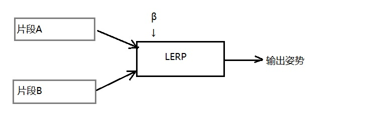
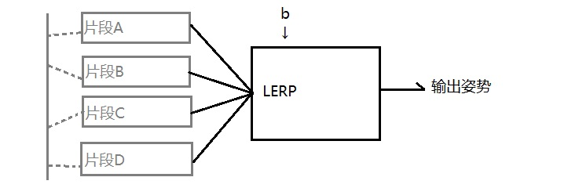
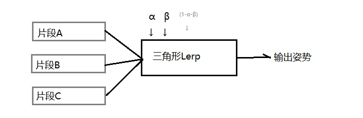
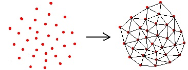
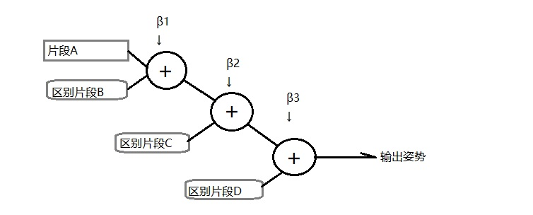
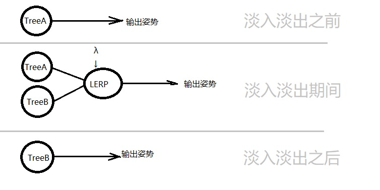

# 概述 动画管道    

底层动画引擎所做的运算，构成了一个把输入(片段和混合设置)变换成输出(局部姿势、全局姿势、矩阵调色板)的管道。    

### 动画管道的各个阶段：  

- Ⅰ.片段解压及姿势提取。    

此阶段中，灭个片段的数据会被解压，并提取所需时间索引的静态姿势。    

此阶段输出是每个输入片段一个局部骨骼姿势。    

此姿势可能是全部关节的姿势，可能是部分关节的姿势(分部姿势)或者用作加法混合的区别姿势。    

- Ⅱ.姿势混合。    

此阶段中，通过全身Lerp混合、分部Lerp混合或加法混合，把输入姿势结合在一起。如果不需要混合两个以上姿势，可以跳过此阶段。     

此阶段的输出是一个对应骨骼中所有关节的局部姿势。    

- （附加）

> 某些不需要使用全局姿势的后期处理可以在ⅡⅢ阶段之间运行。       

- Ⅲ.全局姿势生成。    

此阶段遍历骨骼层次结构，把局部关节串接以产生全局姿势。    

- Ⅳ.后期处理（可选）。    

输出最终姿势前，有机会修改骨骼的局部/全局姿势。    

后期处理用于逆运动学、布娃娃物理、以及其他形式的程序动画。    

- Ⅶ.重新计算全局姿势（可选）。    

很多种类的后期处理需要全局姿势作为输入，但却只生成局部姿势做输出。当执行了这种后期处理步骤，我们必须从修改后的局部姿势重新计算全局姿势。    

- Ⅷ.矩阵调色板生成。    

生成最终的全局姿势后，本阶段把每个关节的全局姿势矩阵乘以对应的逆绑定姿势矩阵，最终输出蒙皮矩阵调色板。    

 
 

## 1.数据结构    

每个动画管道都有不同的架构，但是数据结构是相似的。    

### 共享资源数据：  

1. 骨骼：骨骼描述关节层级结构和绑定姿势。有时很多角色会共用骨骼。  
2. 蒙皮网格：一个或者多个蒙皮至单个骨骼的网格。每个顶点都包含一个或多个关节索引和关节对该顶点的影响力。  
3. 动画片段：为每个角色骨骼制作的动画片段。    

### 逐实例数据：  

1. 片段状态：包含局部时钟和播放速度。局部时钟描述为其局部时间线上一点，用于提取当前姿势。    
2. 混合规格：混合规格描述哪些动画正在播放、以及这些片段如何混合。有两种方式描述片段混合的方式-统一加权平均法和混合树法。混合树的结构是共享资源，而当中的混合权重则是逐实例状态数据。  
3. 骨骼遮罩：即一组关节权重，有些引擎是二元(影响或者完全不影响)的另一些引擎可以设置为0~1之间。    
4. 局部姿势：通常是一个SQT数组格式的数据结构。每个SQT对应一个关节。    
5. 全局姿势：全局姿势可以是SQT或者矩阵的数组，每个元素对应一个关节，存储模型空间最终骨骼姿势。    
6. 矩阵调色板：存储蒙皮矩阵，供渲染引擎使用。  

 
 

## 2.扁平的加权平均表示法    

最简单的入门级游戏引擎也会支持某种形式的动画混合。最简单的方法之一就是使用加权平均。    

每个片段会对应一个权重，权重描述该片段对最终姿势的影响力。引擎维护一个作用动画片段的扁平列表(即非零权重的片段)。我们需要从N个作用片段中，对每个片段在恰当的时间索引上提取姿势，然后计算加权平均得到最终姿势。    

> 例子：OGRE的动画系统完全以这种方式运作。每个橘色玩个实例含一个AnimationStateSet。而AnimationStateSet又维护一组AnimationState，每个AnimationState对象对应一个作用中的动画。    
> 例子：Granny动画系统提供了一个扁平的加权平均混合系统，类似OGRE。    

 
 

## 3.混合树(Blend Tree)    

有些动画引擎不是扁平加权平均描述混合方式的，而是采用混合操作树。    

动画混合树是编译理论中的*表达式树*或*语法树*的例子。树的内节点是运算符，或称*非终止符(non-terminal)*，而叶子节点则是那些运算符的输入*终止符(terminal)*。    

#### 二元LERP混合：    

  

> 二元Lerp混合的二叉表达式树    

#### 泛化一维LERP混合：    

  

> 多个输入片段的泛化一维混合。指定一个混合因子b后，这种树总是可以转换成二元表达式树。    

#### 三角LERP混合：  

    

> 三元表达式树表示的三角LERP混合。  

#### 泛化二维LERP混合：  

  

> 多个输入的表达式树，通过Delaunay三角化总是能把这种树转化为三元树。  

#### 加法混合：    

    

> 加法混合是一个二元操作，因此可表示为二叉树。    

> 加法混合节点必须谨慎处理，因为其输入是不可互换的。    

## 4.淡入淡出结构    

动画淡入淡出有两种架构，视引擎采用扁平加权平均架构还是混合树架构。    

#### 扁平加权平均的淡入淡出：    

此架构中，淡入淡出是由调整片段权重本身实现的。如果希望从片段A平滑过渡到片段B，只需要简单地逐渐提升片段B的权重同时逐渐降低片段A的权重。    

然而，当我们要从一个复杂的混合过渡至另一个复杂的混合，采用加权平均架构的淡入淡出就有点棘手。底层所有片段都是由一个大扁平数组维护的，需要在扁平片段状态数组以上，再维护一些额外元数据，记录片段的逻辑分组。    

#### 表达式树的淡入淡出：    

基于表达式树的动画引擎实现淡入淡出，相比加权平均架构更加直观。无论从一个片段到另一个片段还是一个复杂混合到另一个复杂混合，方法都是一样的，都是在混合树根节点加入一个新的二叉LERP节点。    

  

> 过渡完成后混合节点和树A就完成了任务，剩下的树B变成整个混合树的根节点。    

## 5.动画管道优化    

动画管道的优化通常和游戏运行的硬件架构有关。例如现在的硬件，内存存取模式会大大影响效率，就应该避免缓存命中失败和load-hit-store。例如另一些硬件，浮点运算是瓶颈，应该尽量使用SIMD矢量运行。    

> PS2、PS3、XBOX的优化方式各不相同。    

（END）  

