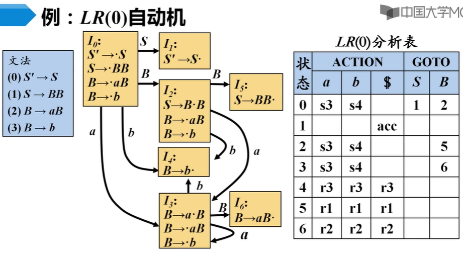

# 简单LR技术    

> 目前最流行的自底向上语法分析器都是基于所谓的LR(k)语法分析的概念。“L”代表从左到右扫描，“R”代表反向构造出一个最右推导序列，“k”代表向前k个看符号。    

> 最简单的构造移入-规约分析器的方法，称为“简单LR技术”（或简称为SLR）。更复杂的方法还有下一章的规范LR和LALR。它们被用于大多数的LR语法分析器中。    

> MOOC：由于可能存在移入/规约冲突和规约/规约冲突，所以上下文无关文法不总是LR文法。      


<br />
<br />

## 为什么使用LR语法分析器    

LR语法分析技术很有吸引力，原因如下：    
1. 对于几乎所有的程序设计语言构造，只要能够写出该构造的上下文无关文法，就能构造出该构造的LR语法分析器。确实存在非LR的文法，但是常见的程序设计语言构造都可以避免使用这样的文法。    
2. LR语法分析方法是已知最通用的无回溯移入-规约分析技术，并且它的实现可以和其他更原始的移入-规约方法一样高效。    
3. 从左到右扫描时尽可能尽早地检测到错误。    
4. 可以使用LR方法进行语法分析的文法类是可以使用预测方法或LL方法进行语法分析的文法类的真超集。LR对文法的要求比LL宽松很多。LR文法比LL文法描述更多的语言。    

LR方法的缺点：    
为一个典型的程序设计语言文法手工构造LR分析器的工作量非常大。需要借助yacc这类工具。      


<br />
<br />


## 项和LR(0)自动机    

- **项(item)**    

一个文法G的一个LR(0)项（简称为*项(item)*）是文法G的一个产生式再加上一个位于它的体中某处的点。    

示例： 
```C 
A -> ·XYZ //移进项  
A -> X·YZ //待约项
A -> XY·Z //待约项  
A -> XYZ· //规约项  

// n个符号的产生式有n+1个项。    
// 同一个产生式的两个项，如果点只差一个位置，那么后者是前者的后继项。    
```

- **规范LR(0)项集族**    

一个称为*规范LR(0)项集族(canonical LR(0) collection)*的一组项集提供了构建一个有穷自动机的基础。该自动机可用于做出语法分析决定。这样的有穷自动机称为LR(0)自动机。    

LR(0)状态集的每个状态代表了规范LR(0)项集族的一个项集。    


- **增广文法(augmented grammar)**    

文法G增广文法的增广文法G'就是在G中加入新开始符号S'和产生式S'->S而得到的文法。引入这个新的开始产生式的目的是告诉语法分析器何时应该停止语法分析并宣称接受输入符号串。（当且仅当要使用S'->S进行规约时代表接受）    

> 增广文法使得开始符号只出现在一个产生式的左边。    


- **项集的闭包**    

> 有些项是等价的。把所有等价项组成一个项目集(I)，称为项目集闭包。每个项目闭包对应自动机的一个状态。    

如果I是文法的一个项集，那么CLOSURE(I)就是根据下面的两个规则从I构造得到的项集：    
1. 一开始，讲I中各项加入CLOSURE(I)中。    
2. 如果A->α·Bβ在CLOSURE(I)中，B->γ是一个产生式，并且项B->·γ不在CLOSURE(I)中，就将这个项加入其中。不断应用这个规则知道没有新项可以加入CLOSURE(I)为止。    


- **内核项和非内核项**    

1. 内核项：点不在最左端的所有项，以及初始项S'->·S。     
2. 非内核项：除了S'->·S之外，所有点在最左端的所有项。    

> 在求闭包时加入的项不可能是内核项。因此，如果我们抛弃所有非内核项，就可以用很少的内存来表示真正感兴趣的项的集合，因为我们已知这些非内核项可以通过闭包运算重新生成。        


- **算法：闭包的计算**    

```C
SetOfItems CLOSURE(I)
{
    J = I;
    repeat
    {
        for(J中的每个项A->α·Bβ)
        {
            for(G的每个产生式B->γ)
            {
                if(项B->·γ不在J中)
                    将B->·γ加入J中;
            }
        }
    }
    until(在某一轮中没有新的项被加入到J中);
    return J;
}
```  

- **LR(0)自动机**    

    

> 一个方框代表一个自动机状态。    
> 状态转换图可以构造状态转换表。    


- **GOTO函数**    

GOTO函数返回项集I对应于文法符号X的后继项集闭包。    

> 直观地讲，GOTO函数用于定义一个文法的LR(0)自动机中的转换。这个自动机的状态对应项集，而GOTO(I,X)描述了当前输入为X时离开状态I的装换。    

- **算法：GOTO函数**    

```C
SetOfOtems GOTO(I, X)
{
    将J初始化为空集;
    for(I中的每个项A->α·Xβ)
        将项A->αX·β加入到集合J中;
    return CLOSURE(J);
}
```

- **算法：构造LR(0)项集族**    

```C
void items(G’)
{
    C = {CLOSURE({[S’ -> ·S]})};
    repeat
        for(C中每个项集)
            for(每个文法符号X)
                if(GOTO(I,X)非空且不在C中)
                    将GOTO(I,X)加入C中;
    until 在某一轮中没有新的项集被加入到C中;
}
```

- **LR(0)自动机的用法**    

> 移入-规约决定可以按照如下的方式做出。假设文法符号串γ使LR(0)自动机从开始状态0运行到某个状态j。那么如果下一个输入符号串为a且状态j有一个在a上的装换，就移入a。否则我们就选择规约动作。状态j的项告诉我们使用哪个产生式进行规约。    


<br />
<br />


## LR语法分析算法    

一个LR语法分析器由一个输入、一个输出、一个栈、一个驱动程序和一个语法分析表组成。    

> 语法分析表包含ACTION和GOTO两个部分。    
> 所有LR语法分析器的驱动程序都是相同的，而语法分析表是随语法分析器的不同而变化的。    

当一个移入-规约语法分析器移入一个符号时，LR语法分析器移入的是一个对应的*状态*，每个状态都是对应栈中该状态之下的内容所含信息的摘要。      

> 分析器的栈存放一个状态序列s0s1..sm，其中sm位于栈顶。在SLR方法中，栈中保存的是LR(0)自动机中的状态，规范LR和LALR方法和SLR方法类似。      
> 每个状态都对应一个文法符号。    

- **LR语法分析表结构**    

语法分析表由两个部分组成，一个语法分析动作函数ACTION和一个转换函数GOTO。    

(1)ACTION函数有两个参数，一个是状态i，另一个是终结符号a，`ACTION[i,a]`的取值可以有下列四种形式：  
1. 移入j，其中j是一个状态。语法分析器采取的动作是把输入符号a高效地移入栈中，但是使用状态j来代表a。    
2. 规约A→β。语法分析器的动作是把栈顶的β高效地规约为产生式头部A。    
3. 接受。接受输入并完成语法分析过程。    
4. 报错。发现错误并执行某个纠正动作。    


(2)我们把定义在项集上的GOTO函数扩展为定义在状态集上的函数：如果$GOTO[I_i,A]=I_j$，那么GOTO也把状态i和一个非终结符号A映射到状态j。    


- **LR语法分析器的格局**    

> 描述LR语法分析行为时，我们需要一个能够表示LR语法分析器完整状态的方法。它的完整状态包括它的栈和余下的输入。    

LR语法分析器的*格局(configuration)*是一个形如$(s_0 s_1 s_2...s_m, a_i a_{i+1} ... a_n\$)$的对。第一个分量时栈中的内容，第二个分量是余下的输入。      

这个格局表示了如下的最右句型：$X_1 X_2 ... X_m a_i a_{i+1} ... a_n$，它表示最右句型的方法基本和一个移入-规约语法分析表示方法相同。唯一不同是栈中存放的状态而不是文法符号，从这些状态能复原出相应的文法符号，每个状态对应一个文法符号（除开始状态外）。      


- **LR语法分析器的行为**    

语法分析器根据当前格局$(s_0 s_1 ... s_m, a_i a_{i+1} ... a_n\$)$决定下个动作时，首先读入当前输入符号$a_i$和栈顶状态$s_m$，然后在表中查询ACTION[$s_m$,$a_i$]。    

① 如果ACTION[$s_m$,$a_i$]=移入s，那么语法分析器执行一次移入动作；它将下一个状态s移入栈中，进入格局$(s_0 s_1 ... s_m s, a_{i+1} ... a_n\$)$  

符号$a_i$不需要存放在栈中，因为需要时（实践中不需要$a_i$）可以根据s恢复出$a_i$。现在，当前的输入符号为$a_{i+1}$。    


② 如果ACTION[$s_m$,$a_i$]=规约A->β，那么语法分析器执行一次规约动作，进入格局$(s_0 s_1 ... s_{m-r} s, a_i a_{i+1} ... a_n\$)$。    

其中，r是β的长度，且s=GOTO[$s_{m-r}$, A]。在这里，语法分析器首先将r个状态弹出栈，使状态$s_{m-r}$位于栈顶。然后语法分析器将s（即GOTO\[$s_{m-r}$, A]的值）压入栈中。    

在一个规约动作中，当前的输入符号不会改变。    

再一次规约动作后，LR语法分析器将执行和规约所用产生式关联的语义动作，生成相应的输出。    

③ 如果ACTION[$s_m$,$a_i$]=接受，那么语法分析过程完成。    


④ 如果ACTION[$s_m$,$a_i$]=报错，则说明语法分析器发现了一个语法错误，并调用一个错误恢复例程。    


> 所有的LR语法分析器都按照这个方式执行，两个LR语法分析器之间的唯一区别是它们的语法分析表的ACTION表项和GOTO表项包含的信息不同。    


- **LR语法分析算法伪代码**    

```
令a为输入缓冲区第一个符号;    
while(true)
{
    令s是栈顶状态;  
    if(ACTION[s,a]==移入t)
    {
        将t压入栈中;
        令a为下一个输入符号;
    }
    else if(ACTION[s,a]==规约A->β)
    {
        从栈中弹出|β|个符号;
        令t为当前的栈顶状态;
        将GOTO[t,A]压入栈中;
        输出产生式A->β;
    }
    else if(ACTION[s,a]==接受)
        break;
    else
        调用错误分析例程;
}
```  


<br />
<br />


## 构造SLR语法分析表      

> 使用SLR语法分析表的的LR语法分析器称为SLR语法分析器。    

SLR方法以LR(0)项和LR(0)自动机为基础。也就是说给定一个文法G，我们通过添加新的开始符号S'得到增广文法G'。我们根据G'得出G'的规范项集族C以及GOTO函数。    

然后，使用下面的算法就可以构造出这个语法分析表中的ACTION和GOTO条目。它们要求我们知道输入文法的每个非终结符号的FOLLOW集。      


- **SLR分析法基本思想**      

已知项目集I:  
$A_1 -> α_1·a_1β_1$  
$A_2 -> α_2·a_2β_2$  
...
$A_m -> α_m·a_mβ_m$  (m个移进项目)  
$B_1 -> γ_1·$  
$B_2 -> γ_2·$  
...
$B_n -> γ_n·$ (n个规约项目)  

如果集合${a_1, a_2, ... a_m}$和FOLLOW(B1),FOLLOW(B2)...FOLLOW(Bn)两两不相交，则项目集I中的冲突可以按以下原则解决：  
设a是下一个输入符号  
👉 若$a∈{a_1, a_2, ... a_m}$，则移进a。    
👉 若$a∈FOLLOW(B_i)$，则用产生式$B_i -> γ_i$规约。  
👉 除此之外，报错。    


- **算法：构造SLR语法分析表**      


构造SLR语法分析表：

1) 构造规范LR(0)项集族。  
2) 根据Ii构造得状态i。状态i的语法分析动作按照下面方法决定：    

    + 如果A->α·aβ在Ii中且GOTO(Ii, a)=Ij，那么将ACTION[i, a]设置为"移入j"。这里a必须是终结符号。    
    + 如果A->α·在Ii中，那么对于FOLLOW(A)中的所有a，将ACTION[i, a]设置为"规约A->a"。这里A不等于S'。    
    + 如果S'->S·在Ij中，那么将ACTION[i, $]设置为“接受”。  
    + （如果上面的规则生成了任何冲突动作，那么这个文法不是SLR(1)的。在这种情况下就无法生成一个语法分析器）

3) 状态i对于各个非终结符A的GOTO转换使用下面的规则构造得到：如果GOTO(Ii,A)=Ij，那么GOTO(i,A)=j。    
4) 规则23没有定义的所有条目都设置为“报错”。  
5) 语法分析器初始状态就是根据S'->·S所在的项集构造得到的状态。   


由该算法得到的由ACTION函数和GOTO函数组成的语法分析表称为文法G的**SLR(1)语法分析表**，使用G的SLR(1)分析表的LR语法分析器称为G的**SLR(1)语法分析器**。一个具有SLR(1)语法分析表的文法称为是SLR(1)的。        

我们常常省略"SLR"后面的"(1)"，因为我们不会在这里处理向前看多个符号的语法分析器。      


- **补充**      

> CRE：构造SLR语法分析表时没有冲突的文法就是SLR文法。    


<br />
<br />

## 可行前缀    


可以出现在一个移入-规约语法分析器的栈中的最右句型前缀被称为*可行前缀(viable prefix)*。    

它们的定义如下：一个可行前缀是一个最右句型的前缀，并且他没有越过该最右句型的最右句柄的右端。    

> 我们总是可以在一个可行前缀之后增加一些终结符号来得到一个最右句型。    


- **项和可行前缀**    

如果存在一个推导过程$S \underset{rm}{\stackrel{\\*}{\Rightarrow}} dαAw \underset{rm}{\Rightarrow} αβ_1β_2w$，我们就说项$A → β_1·β_2$对于可行前缀$αβ_1$有效。一般来说，一个项可以对多个可行前缀有效。    


（END）  