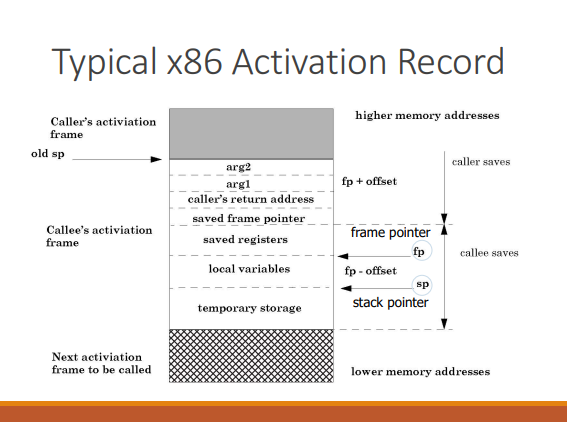

# 空间的栈式分配    

> 过程这个词是函数、过程、方法、子例程的统称。    

 
 

## 活动树    

> 过程的调用也成为过程的活动。    

可以用一棵树来表示整个程序运行期间的所有过程的活动，这棵树称为*活动树(activation tree)*。树中的每个节点对应一个活动，根节点是启动任务执行的main过程的活动。    

 
 

## 活动记录    

过程调用和返回通常有一个称为*控制栈(control stack)*的运行时刻栈进行管理。每个活跃的活动都有一个位于这个控制栈中的*活动记录(activation record)*或者称为*帧(frame)*。    

> 活动树的根位于栈底，栈中的全部活动记录的序列对应活动树中到达当前控制所在的活动节点的路径。活动控制所在的活动的记录位于栈顶。        

> 当一个过程是递归的时候，常常会有该过程的多个活动记录同时出现在栈中。    

- **一个概述性的活动记录**    

|实在参数|
|-|
|控制链|
|访问链|
|保存的机器状态|
|局部数据|
|临时变量|    

> 返回值和实在参数通常尽可能地放在寄存器中，而不是活动记录中，这样会得到更好的效率。    

- **一个x86栈帧**    

  

 
 

## 调用代码序列    

实现过程调用的代码段称为*调用代码序列(calling sequence)*。这个代码序列为一个活动记录在栈中分配空间，并在此记录的字段中填写信息。    

*返回代码序列(return sequence)*是一段类似的代码，它恢复机器状态，使得调用过程能够在结束调用之后继续执行。    

（详细实现参考《编译原理》p281-p281）            

 
 

## 栈中的变长数据    

有些数据对象的大小在编译时刻未知，但是它们是这个过程的局部对象，因而可以被分配在运行时刻栈中。    

> 在现代编译语言中，在编译时刻不能决定大小的对象将被分配在堆区。不过也可以将未知大小的对象、数组以及其他结构分配在栈中。      

解决方法：    
1. 把它们分配在栈中的活动记录的后面。但是在活动记录中只存储它们的指针。    
2. 使用两个指针。一个标记实际的栈顶为止，它指向下一个活动记录将开始的位置。第二个指针用来找到顶层活动记录的局部的定长字段。      

（END）    