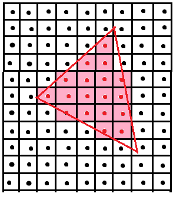

# 光栅化    

## 屏幕(Screen)    

屏幕是一个二维数组，每个元素是一个像素(Pixel)。  

数组的Size即*Revolution(分辨率)*。    

屏幕是一个典型的光栅成像设备。    


## 光栅化(Rasterize)    

把物体画在屏幕上的过程称为光栅化。    


## 规范立方体([-1, 1])到屏幕空间    

Z轴不变，把`[-1,1]`转换为`[0, width][0, height]`。    

使用的视口变换(ViewportTransform)矩阵：      
$\left[ \begin{matrix} 
width/2 & 0 & 0 & width/2 \\
0 & height/2 & 0 & height / 2\\
0 & 0 & 1 & 0 \\
0 & 0 & 0 & 1 \\
\end{matrix} \right]$  


## 采样(Sampling)    

  


```C++  
for(int x = 0; x < xmax; ++x)
{
    for(int y = 0; y < ymax; ++y)
    {
        image[x][y] = inside(tri, x + 0.5, y + 0.5);
    }
}    

//inside函数的实现：三个从顶点指向该点的向量的叉积同号，则在三角形内。    
```  

  

## 包围盒(BoundingBox)    


  

包围盒之外无需光栅化。只在包围盒中采样。    


- 分行列包围盒：  


  

在细长三角形斜放时可以用来提高效率。    


## 走样(Aliasing)  


  

> 光栅化过程中会出现锯齿状的走样。    

## 瑕疵(Artifact)  

1. Jaggies.（锯齿）  
2. Moire.（摩尔纹）  
3. Wagon Wheel Effect.（车轮效应）  


## 反走样(Anti-Aliasing)    


  

基本思路：在采样前先做一个模糊(blur)或者说*滤波*操作。    


（END）    