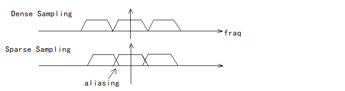

# 时域频域和滤波    

- ▷时域和频域：  

  

> 时域对应图片的空间，频域对应图片的二维频谱。    

> 频域图中间代表低频，四周代表高频，信息量越大越亮。信息主要集中在低频。  

> 频域频谱图的横坐标表示图片横向的灰度变化频率分布。纵向代表图片纵向上的灰度变化频率分布。中间的点代表零频率的信息，即图片的平均灰度值。  

> 横纵两条白线代表图片上下左右边缘不连贯的过渡造成的。  

> 什么方向上的灰度变化明显，频谱上什么方向高频信息就越大，表现为白色越长。  

- ▷高通滤波：  

高通滤波是过滤低频信号，之保留低频信息。效果是只留下边界和细节信息，也就是突变的位置。  

- ▷低通滤波：  

低通滤波过滤高频信息，只保留低频信息。效果是图片模糊化，丢失边界与细节。    

### b.卷积(Convolution)：  

  
  

  

- ▷相关定理：  

时域的卷积等于频域的乘积。  
频域的卷积等于时域的乘积。  

- ▷图片卷积的两种方法：    

  

1. 直接用滤波器在时域上做卷积。  
2. 把图片和滤波器都变换到频域上，把两者相乘得到频域的结果，然后再变换到时域上。  

- ▷滤波器(filter)：   

> Box Filter示例：

    

### c.采样是什么：  

> 采样就是再重复一个原始信号的频谱。(Sampling = Repeating Frequency content)    

 

### d.信号采样过程中的走样现象：  

   

### d.走样的两种解决办法：  

 

1. 提高采样率。  

> 即使用高分辨率显示。问题是受硬件限制。  

2. 反走样。  

> 先滤波滤掉高频部分再采样，无法提高硬件采样率时可以用反走样。  

## 三、几种反走样技术    

### FSAA(Full-Screen AA) / SSAA(SuperSampling AA)：  

FSAA又称为SSAA（超采样抗锯齿）。  

FSAA在影像渲染至比实际屏幕长n倍宽n倍的帧缓冲里，然后再把该帧缓冲缩减采样(downsample)至屏幕像素。    

FSAA开销很大，需要渲染n^2倍像素，消耗正常帧缓冲n^2倍的内存。  

### a.MSAA反走样(MultiSampling AA)：  

MSAA仅是FSAA的一种优化。MSAA中深度和Stencil和深度采用超采样方式，但像素着色是正常采样（即每像素只做一次采样）。最后如同超采样一样把帧缓冲缩减采样至屏幕像素。    

> MSAA的优化能显著减少着色计算。  

> 近年流行的延迟渲染不能使用MSAA，因此多种新的抗锯齿技术应运而生，例如MLAA、DLAA、FXAA、SRAA等。    

### b.FXAA反走样(FastApproximate AA)：  

在已采样的图像层面的抗锯齿。（替换边界像素）  

### c.TAA反走样(Temporal AA)：  

时间上的反走样技术。使用了前一帧的信息。  

（END）    