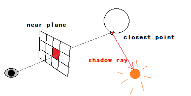

# 光线追踪    

- 间接光照    

> 间接光照：光线在场景中弹射多次后进入眼睛，或者说一个物体反射另一个物体的光。    

- 光栅化和光线追踪    

> 光栅化是一种很快、但质量较低的方法。光线追踪是一种准确但是较慢的方法。    
> 光栅化适用于实时渲染。而光线追踪常用于离线(offline)渲染。    

## 光线(Light Ray)    

1. 光沿直线传播。  
2. 光与光不发生碰撞。   
3. 光从光源传播到眼睛。    

## 光线投射(Ray Casting)    

    

> 最近的交点找到后忽略后面的交点。    
> 完美解决了深度测试的问题。    

1. 从眼睛往near-plane一个像素投射一根视线，打到最近点。    
2. 从该点往光源投射一条shadow-ray，判定有无阻挡来确定是否被照亮。    
3. 根据法线以及上述信息进行着色。（使用各种着色方案例如布林冯等）    

## Whitted-Style光线追踪    

    

> 考虑能量损失，把着色相加。    
> eye-ray分为primary-ray和secondary-ray。    

### 求交点的实现    

- 逆光线方程：  

$r(t) = o + td$    

- 求交点    

逆光线方程和物体方程联立求解，有解则有交点(有正实根)。然后求解关于t的方程。    

- 注意    

隐式表面$f=0$可以联立后写成$f(o+td)=0$求解。    
显式三角面求交点：先求与平面交点，然后在判断是否在三角形内。    

### 相交计算的优化加速    

遍历场景中每个三角形求交点，计算量巨大，需要优化。    

- **引入包围盒**    

引入包围盒把物体包围起来，如果逆光线与包围盒无交点，则与盒内物体也无交点。      

    

- **引入空间划分**    

> Not Recommended：一个物体可能在多个节点出现。    

八叉树、Kd树、BSP树。    

- **引入物体划分(Object Partition)**    

> KD树有很多问题，比如同一个三角形在不同节点出现，所以可以用物体划分。物体划分也是二叉树原理。（Bounding Volume Hierarchy (BVH)）      

特点：    
1. 包围盒可以重叠。    
2. 一个物体只能在一个叶节点中。但是可以处在多个包围盒中。    

注意事项：    
> 每次按包围盒最长的轴来划分是一个不错的办法。    
> 以最中间的三角形为依据划分。可以保证二叉树的平衡。    
> 与一个节点求交点，就要与其子节点求交点。    

## 辐射度量学(Radiometry)    

名词：Radiant flux （辐射通量）  
名词：Intensity    (辐射强度)  
名词：Irradiance    (辐照度)    
名词：Radiance    (光辉)    

（END）    