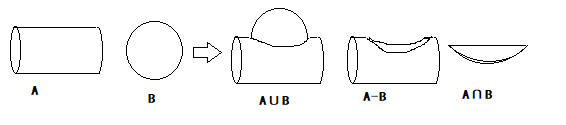
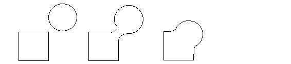

# 几何(Geometry)    

## 隐式几何(Implicit)    

⭐表示满足一定关系(方程)的点坐在曲面（即曲面方程）。    
⭐只表示一定的关系，不给出实际的点。    

- 优势    

判断任意一点在不在面上较容易。    

- 缺点    

判断面的形状较难。    

## 显式几何(Explicit)    

⭐要么直接给出所有顶点。    
⭐要么通过参数映射的方式给出。（即参数方程）    

- 优势    

直观。    

- 缺点    

判断在物体内外更困难。    

## CSG(Constructive Solid Geometry)(隐式)    

通过布尔运算组合隐式几何体。    

  

## 距离函数(Distance Functions)(隐式)    

距离函数为0的点即在物体上面。    
距离函数可以进行Blending，得到几何形体混合的效果。    

  

## 分形(Fractals)(自相似)（隐式）    

递归的思想。  
自身的一部分相似自身。    

## 点云(Point Cloud)（显式）  

点云是点的一个列表。  
点云如果要表示一个复杂模型，需要特别多特别密集的点。    
点云可以表示任意不同类型几何，只要点够多。    
点云通常被转化为多边形面。    

## 多边形网格(Polygon Mesh)(显式)    

用多边形（通常是三角形或四边形）表示复杂的模型/物体。    
最广泛应用的显式表示。    

## 贝塞尔曲线（显式）    

用一系列控制点定义一条曲线。    

(END)    