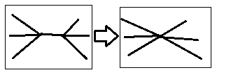

# 曲面细分(Subdivision)    

## Loop曲面细分    

1. 引入更多三角形（表面切分）。    
2. 调整顶点位置。    

> 注：只适合三角面。    

## Catmull-Clark曲面细分    

1. 定义非四边形面和奇异点（度不为4的点）。  
2. 引入新顶点。（所有边取中点，所有面取中点，再把面中点和边中点连起来）    
3. 顶点位置更新。    



面中点：$f = { {v_1 + v_2 + v_3 + v_4} \over {4} }$          
边中点：$e = {{v_1 + v_2 + f_1 + f_2} \over 4}$    
旧顶点：$v = {{f_1 + f_2 + f_3 + f_4 + 2(e_1 + e_2 + e_3 + e_4) + 4v} \over {16}}$    



> 可用作各种面。    

   
   
   
   

# 曲面简化(Mesh Simplification)    

> 曲面简化常用于LOD技术。    

### 边坍缩(Edge Collapsing)    

    

> 二次度量误差(Quadric Error Metrics)：新点到旧的相联面的距离平方和应该达到最小化。    
> 坍缩一个边后的顶点的二次误差作依据对边进行排序，从小到大进行坍缩。（由于坍缩一条边后会对其他边和它们的二次误差造成影响，所以要用到优先队列(堆)，允许求最小且允许动态更新。    

（END）    

