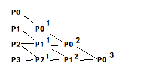

# 贝塞尔曲线    

## De Casteljau算法    

由(n+1)个控制点定义的n次贝塞尔曲线可被定义为由前n个、后n个控制点定义的两条(n-1)次贝塞尔曲线的线性组合。    

$P_0^n  = (1-t)P_0^{n - 1} + t P_1^{n-1}$  

得到递推公式：  

$P_i^k = (1-t)P_i^{k-1} + tP_{i+1}^{k-1} (k=1,2,3,..n)(n=0,1,2...n-k)$     

  

## 曲线方程    

二阶贝塞尔曲线：  
$P_0^2(t) =  (1-t)^2P_0 + 2t(1-t)P_1 + t^2P_2$    

N阶贝塞尔曲线：  
$P_0^n(t) = Σ_{j=0}^n P_jB_j^n(t)$    

## 贝塞尔曲线的性质    

1. 曲线起点终点与控制点重合，与起始、终止线段相切。    
2. 对贝塞尔曲线做仿射变换等同于对控制点做仿射变换。    
3. 凸包性质：贝塞尔曲线一定在控制点的凸包内部。    

## 逐段贝塞尔曲线    

一般用三阶贝塞尔曲线（即4控制点）为一段拼接起来。    

 
 
 
 

# B样条和NURBS   

B样条是贝塞尔曲线的一般化。    
B样条有局部性、几何不变性、凸包性、保凸性。    

（待补充）  

 
 
 
 

# 贝塞尔曲面    

（待补充）  

（END）    