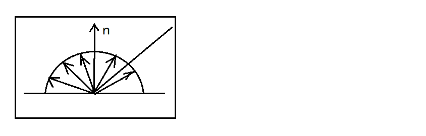
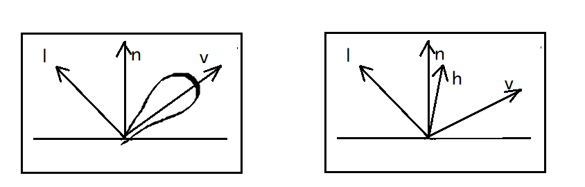

# 第一部分：光照和着色基础    

## ⚪ 材质(Material)    

> Jason：材质是网格视觉特性的完整描述。包括纹理设置，以及一些高级特性例如用什么着色器、着色器的输入参数等。    

> 网格和材质共同组成了"网格-材质对"，又称为渲染包(render packet)。"几何图元(geometric primitive)"一词有时候也有"网格-材质对"的意思。    

- 多材质和子网格：  

三维模型有时会使用多个材质。因此，一个网格通常会切割成子网格(Submesh)，每个子网格对应一个材质。    

## ⚪ 着色(Shading)    

> Yan：着色就是把材质应用给物体的过程。  
> Jason：着色一词通常是光照加上其他视觉效果的泛称。  

## ⚪ 光源模型    

光是电磁辐射，其颜色由强度(intensity)和波长(wavelength)决定。    

#### 光和物体的交互：  

> 一个平面只会吸收某些波长的光，其他的光会被反射。这个特效形成了我们对物体颜色的感知。    
> 光的反射可以是漫反射也可以是镜面反射。  
> 光的反射可以是各向异性的。    
> 光穿过物体时可能被散射(scatter)、吸收(absorb)、折射(refract)。不同波长的光折射角度会有差异。    
> 光能在表面下反弹，再从另一个位置离开表面。称为次表面散射(SubSurfaceScattering, SSS)。    

#### 光源模型种类：  

- 静态光照：

游戏运行之前计算光照，并把结果存储在名为*光照贴图*的纹理上，运行时再把纹理投影在场景中的物体。    

> 不能直接烘焙到主纹理上，因为主纹理通常要密铺或重复。  
> 通常会使用一张光照纹理贴到所有受光源影响的物体上。  
> 光照贴图的分辨率通常低于漫反射纹理，并且纯光照贴图通常更易压缩。  

a. 环境光：  
环境光(Ambient)独立于视角并且不含方向，由单个颜色表示。  

b. 平行光：  
平行光(Directional Light)来模拟距离表面接近无限远的光源，例如太阳。  

c. 点光源：  
点光(Point Light)又称全向光。有特定的位置，向所有方向均匀辐射。光照强度通常设定为以光源距离做平方衰减，超出预设最大有效半径就把强度设为0。     

d. 聚光：  
聚光(Spot Light)等同于发射光线受限于一个圆锥范围的点光源。  

e. 面积光：  
面积光(Area Light)具有非零的面积，产生的阴影含有本影(umbra)和半影(penumbra)。     

f. 自发光物体：  
自发光物体通常会用到*自发光纹理(EmissionTexture)*来渲染。  
也可以结合其他方法来渲染。  

## ⚪ 颜色    

#### 颜色空间和颜色模型：  

- RGB模型：  

> 计算机图形学最常用的颜色模型(color model)是RGB模型。RGB模型中由一个单位立方体表示颜色空间(color space)，其三个轴分别代表红绿蓝光的量度。    
> 这些红绿蓝分量又称为颜色通道(color channel)，每个颜色通道的范围都是[0, 1]，(0,0,0)表示黑色，(1,1,1)表示白色。    
> 颜色存储于位图时，可使用多种不同的颜色格式(color format)。颜色格式的定义，部分由*每像素位数(bits per pixel, BPP)*即每个颜色通道的位数决定的。（常用的格式有RGB888、RGB565等）        
> 调色板格式(palette format)可使用每像素8位索引，用这些索引查找一个调色盘。    

- 其他颜色模型：  

> 可以使用对数LUV颜色模型做高动态范围(high dynamic range, HDR)渲染。  

#### 不透明度和Alpha通道：  

通常在RGB颜色之后补一个名为Alpha的通道，用来度量该像素的不透明度。    

RGB颜色格式可以扩展以包含Alpha通道，称为RGBA或者ARGB。    

## ⚪ 直接光照和间接光照    

模拟光和面/体积交互的数学模型称为*光传输模型(light transport model)*。  

最简单的模型只考虑*直接光照(direct lighting)*。仅仅考虑光对单个物体的局部影响，又称为*局部光照模型(local illumination model)*。    

要达到更写实的效果就要考虑到*间接光照(indirect lighting)*。即光被多个表面反射后进入摄像机，又称为*全局光照模型(global illumination model)*。    

 
 

# 第二部分：标准光照模型    

> 标准光照模型又称Blinn-Phong模型。    

Blinn-Phong模型分为三部分：漫反射、高光、环境光。$L=L_a+L_d+L_s$    

### 漫反射(Diffuse)：  

> 完全的漫反射、与观察方向无关。  
> 面与光的夹角影响面接受的光能，导致了明暗。  

- ▷Lambert模型：  

> Lambert定理：接受的能量与光线方向和法线夹角余弦成正比。  

  

公式：$L_d = K_d I max(0, cosθ)$  

> $K_d$是漫反射系数。(color)    
> I为光照强度。  

- ▷半Lambert模型：  

> Lambert模型中所有背光面颜色一样，都是全黑，觉得不好看可以改用半Lambert模型。    

公式：$L_d = K_d I (0.5 + 0.5cosθ)$    

> 半lambert模型由Valve首次使用在Half-Life2中。    

### 高光(Specular)：  

> Phong模型是计算出射方向和视角方向夹角的。Blinn模型则是半程向量h与法线n的夹角计算，二者都是经验模型，但是使用半程向量更好。  

  

公式：$L_s = K_s I max(0, cosα)^p$  

> 指数P用于修正高光大小。

### 环境光(Ambient)：  

> 环境光是一个简化的假设。  
> 假设任何一点接受来自环境光永远相同。  

公式$L_a = K_a I_a$  

 
 

# 第三部分：着色频率(Shading Frequency)    

### a.平直着色(flat shading):  

> 一个平面只做一次Shading，整个平面都使用这个同一个颜色，称为平直着色。    

### 顶点光滑着色：  

顶点光滑着色又称为高洛德着色(Gouraud)。  

先计算顶点法线，然后做顶点着色，最后做顶点间颜色插值。    

### 像素光滑着色：  

像素光滑着色，又称为冯着色(Phong)。  

先计算顶点法线，然后进行法线插值，最后每个像素都做一次着色。    

 
 

# 第四部分：混合(Blend)和透明(Transparent)    

### 混合方程：  

$C = C_{src} × F_{src} + C_{dst} × F_{dst}$    

> F为混合系数。    

两种颜色：
1. 光栅化像素颜色，即像素着色器返回的颜色，称为源像素(src clr)。  
2. 后台缓冲区像素，称为目标像素(dst clr)。  

### 几种混合模式：  

1. 不透明效果：  
$F_{src} = 1$; $F_{dst} = 0$;  

2. 半透明效果：  
$F_{src} = Alpha_{src}$; $F_{dst} = 1 - Alpha_{src}$;  

> 最常用混合模式，适用于大多数半透明效果。  

3. 滤色模式：  
$F_{src} = 1$; $F_{dst} = 1 - C_{src}$;  

> 常用于粒子效果。

4. 正片叠底：  
$F_{src} = C_{dst}$; $F_{dst} = 0$;  

> 即相乘。  
> 一种常用的变暗模式。  

### 注意事项：  

1. 场景中有半透明物体和不透明物体时，应该先渲染不透明物体，再渲染半透明物体。(CRE: Unity中使用Queue渲染队列。先渲染不透明物体，再渲染AlphaTest物体，然后再渲染半透明物体)    

2. 混合通常仍然需要深度测试，但是不需要写入深度，只缓冲最近的不透明深度，远于该深度的不渲染。但是需要从远到近渲染半透明物体，或者使用顺序无关透明渲染技术(OIT)。    

