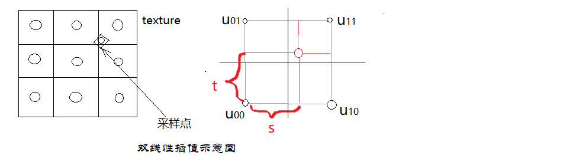
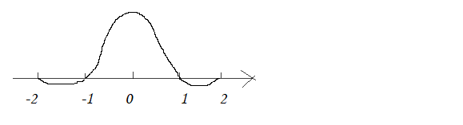
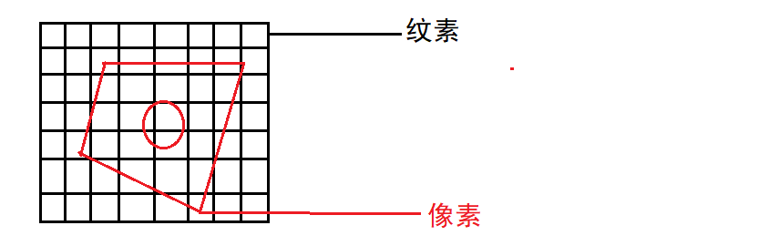
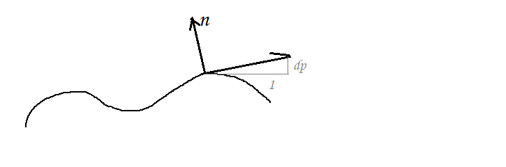

# 第一部分：纹理    

# 一、纹理概述    

### 纹理的作用：  

> 纹理(Texture)通常是一个包含颜色信息的位图影像。    

> 纹理最常见的用法是投射在网格上来表示漫反射颜色。  

> 纹理也可以存储颜色以外的视觉特性，而且纹理也不一定用来投射在网格上。    

### 注意事项：  

> 纹理中每一个单独像素应该称为*纹素(texel)*，用来区分屏幕上的像素。  

> 但某些图形硬件要求纹理尺寸必须为2的n次幂。有些图形硬件要求纹理必须是正方形。所以一般纹理尺寸会是256x256、512x512、1024x1024等。    

 
 

# 二、纹理映射相关    

## 1. 纹理坐标    

> 每个三角形顶点都对应到纹理上的一个坐标(uv或称st)。  

> 纹理坐标通过三角形顶点属性插值得到。(见0-1顶点格式和顶点插值)    

- Wrap模式（DirectX称为Address模式）：  

1. Wrap模式：纹理在各方向无限重复。  
2. Mirror模式：和Wrap模式一样无限重复，但是奇数倍上的纹理会形成镜像。  
3. Clamp模式：坐标在[0, 1]范围之外时，纹理的边缘像素会简单地延申。  
4. BorderColor模式：用户指定一个颜色，在[0, 1]范围外使用。  

## 2. 纹素密度    

### 屏幕空间纹素密度：  

即屏幕空间上纹素相对像素的密度。

> 屏幕空间纹素密度不是常量，它随着摄像机距离改变。  

> 当屏幕空间纹素密度远低于1时，就会出现纹理放大(Magnification)问题。   
 
> 当屏幕空间纹素密度远高于1时，就会产生摩尔纹(moire banding pattern)以及浮动闪烁状的走样。    

### 世界空间纹素密度：  

世界空间表面上的纹素密度。

> 在物体贴上纹理时，应尽量使用大概一致的世界空间纹素密度。否则很容易察觉出来。  

> 游戏工作室会为美术团队指定指引，并会提供引擎内纹素密度可视化工具。  

 
 

# 三、纹理放大问题(Magnification)    

> CRE：纹理Magnification即大片的马赛克纹理。  
> 解决方法有双线性插值和双三次插值等。   

### 双线性插值(BilinearInterpolation)：  

  

公式：$f(x, y) = lerp(t, lerp(s, u00, u10), lerp(s, u01, u11))$  

### 双三次插值(BicubicInterpolation)：  

> 函数f在(x,y)的值可以通过矩形网格中最近十六个采样点的加权平均得到，在这里需要用两个多项式插值三次函数，每个方向使用一个。  

Bicubic函数：  
$W(x) = \left\{\begin{matrix}
(a + 2)|x|^3 - (a + 3)|x|^2 + 1 & (|x| <= 1) \\ 
a|x|^3 - 5a|x|^2 + 8a|x| - 4a & (1 < |x| < 2) \\  
0 & (otherwise)
 \end{matrix} \right.$  

 Bicubic函数图像：  

   

 # 四、纹理走样问题(Aliasing)    

 ### 多重采样反走样：  

> 代价较大，不建议使用。  

 ### MipMap范围查询：  

> 特点：快速(fast)、近似(approx)、方形范围(square)。  

1. 预先生成不同层级的MipMap。   
2. 近似求出一个像素在UV上的面积（近似为边长为L的正方形）。  
3. 根据D=log_2L求出层级D。  

### 三线性插值(TrilinearInterpolation)：  

三线性插值就是双线性插值结合Mipmap间插值。  

$\left. \begin{matrix} 
Bilinear Result(Mipmap Level D)  \\ 
Bilinear Result(Mipmap Level D + 1)
\end{matrix} \right\} LinearInterpolation$    

> 三线性插值可以淡化不同Mipmap层级的交界形成连续的过渡。    

### 各向异性问题：  

> Mipmap是长宽同时压缩，只适用于像素在纹理UV上近似正方形时。  
> 如果视线和面的夹角过小即像素在纹理UV上呈长条状时，会过于模糊。  

> Ripmap是Mipmap的扩展，在横向和纵向分别对纹理进行压缩。    

> 以及其他的手段例如在梯形范围内的纹理采样。    

 
 

# 五、纹理过滤总结    

1. 最近邻(Nearest Neighbor)：粗糙的方法。挑选一个最理想的Mipmap。并挑选最接近像素中心的纹素。  
2. 双线性(Bilinear)：挑选一个最理想的Mipmap。围绕像素中心的4个纹素进行采样并计算加权平均。  
3. 三线性(Trilinear)：把双线性过滤施于两个Mipmap，然后做线性插值。  
4. 各向异性(Anisotropic)：根据视线角度，对一个梯形范围内的纹理采样。    

 
 

# 六、纹理的种类      

## 1. 漫反射贴图(diffuse map)：  

最常见的纹理类型。又称为反照率贴图(albedo map)。存储了表面的漫反射颜色。  

## 2. 法线贴图和高度贴图：  

#### 法线贴图：  

法线贴图(normal map)中，每个纹素代表表面法向量的方向。利用法线贴图，无须把模型高度细分就可以细致描述表面的形状。    

法向量通常会在纹理的RGB颜色通道上编码。最常见的法线贴图是存储切线空间的法向量。    

#### 高度贴图：  

高度贴图(height map)是用来编码高于或者低于三角形表面的理想高度，通常是灰度图。    

高度贴图常用于*视差贴图法(parallax mapping)*和*浮雕贴图(zrelief mapping)*技术。这两种技术都能令平面显得有强烈的高度变化，能制造出*自遮挡(self-occlusion)*的效果。    

> 高度贴图可以用于快速生成法向量。此技术用于早期的凹凸贴图，现在大多数引擎都直接把法向量存储于法线贴图而不会通过高度贴图去计算。    

> 公式:$n = Normalize(-dp / du, -dp/dv, 1);$    

## 3.镜面/光泽贴图    

光滑表面的反射称为镜面(specular)反射。许多镜面并不是均匀光滑的，例如人脸上的汗，湿润的区域显得有光泽，而干燥的区域显得暗哑。可以把非常细致的镜面信息编码进一张贴图中，称为*镜面贴图(specular map)*。    

如果纹素存储Ks值，就能控制每个纹素位置能造成多数镜面反射，这种称为*光泽贴图(gloss map)*或者*镜面遮罩(specular mask)*。    

如果纹素存储光滑度α的值，就能控制每个纹素位置高光集中度，这种称为*镜面幂贴图(specular power map)*。   

## 4. 环境光纹理  

环境贴图(environment map)如同以场景中某物体的视点拍摄其四周环境的全景照片。环境贴图可作为物体四周光照环境的通用描述。    

最常见的两种环境贴图是*球面环境贴图(spherical environment map)*和*立方环境贴图(cubic environment map)*。    

> 球面环境贴图相比6面立方贴图有很强的扭曲问题。    

> Jason：环境贴图常用于低成本反射/折射渲染。Ye：但是只适用于曲面物体，不适用于大面积平面物体。    
> CRE：类似Unity的反射探头可以使大面积平面实现准确的反射效果？    

## 5. 置换贴图    

> 也叫位移贴图，直接改变顶点位置。  
> 相比法线贴图，有自遮挡效果，能改变物体轮廓。  
> 需要模型很细致，或者使用表面细分。  

## 6. 环境光遮蔽贴图(AO)    

> 场景中角落、缝隙、褶皱收的环境光由于自遮挡回很少。  
> 用提前计算好的环境光遮蔽贴图来代替实时计算。  

## 7. 三维纹理(程序化噪声)    

> 没有具体的纹理图，是三维空间中的函数。  
> 用于模拟大理石纹理等。  

## 8. 补充：  

> 事实上纹理贴图可以存储任何在计算着色时所需信息。例如用一维纹理存储复杂数学函数的采样值、颜色对颜色的映射表、或者其他查找表(LookUpTable,LUT)。    

# 七、纹理的位图格式  

> 纹理位图可在磁盘上存储为任何格式的文件，只要引擎含有读取该文件至内存的代码即可。  
> 纹理存于内存时，通常会表示为二维像素数组，像素颜色格式可以是RGB888、RGBA8888、RGB565等。    

### 常见纹理文件格式：  

常见的文件格式：Targa(TGA)、便携式网络图形(PNG)、Windows位图(BMP)、标记图像文件格式(TIFF)。    

### 压缩纹理(Compressed texture)：  

多数显卡以及图形API都会支持压缩纹理。  

> (DirectX支持一系列称为DXT或S3的压缩格式)  

压缩纹理的优点是比无压缩纹理使用较少的内存。并且压缩纹理通常渲染也更高效。    

> 例如S3TC纹理纹理之所以能够提速，因为其内存存取模式更缓存友好。每个小块把4x4个相邻像素存储至单个64或128位字，能够充分利用缓存。    

压缩纹理会导致一些失真，当失真严重到不能够接受的话可用无压缩纹理替代。    

