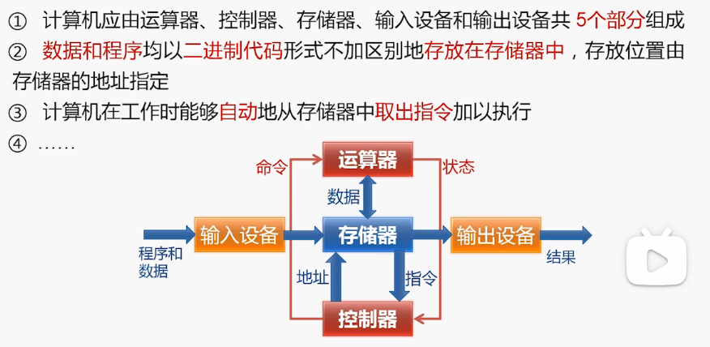
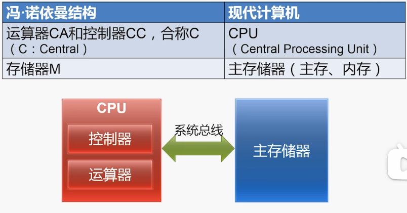
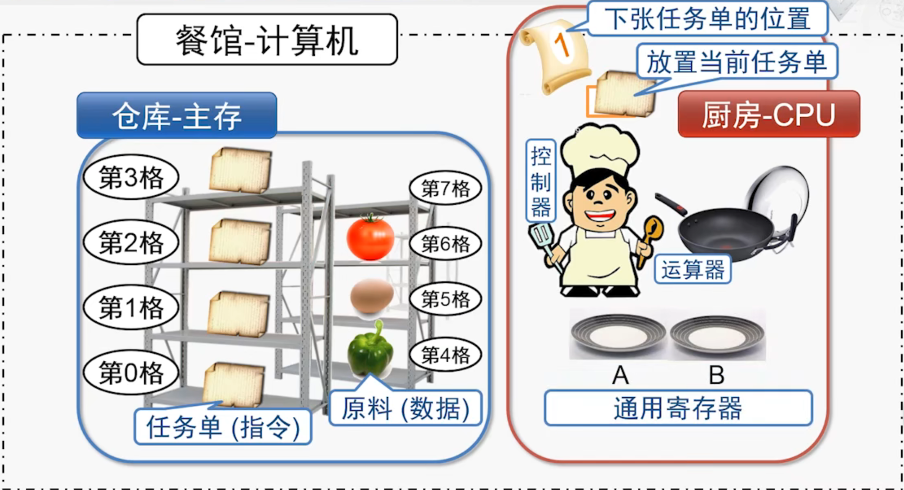
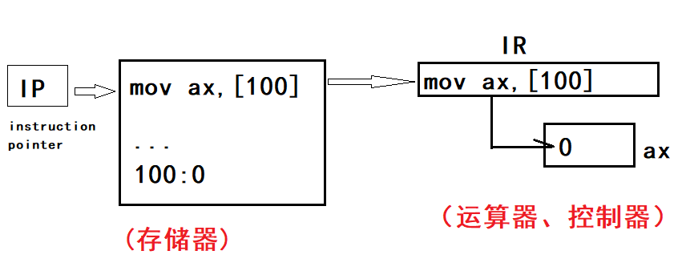

# 冯·诺依曼结构    

 
 

## 1、冯诺依曼结构的重要设计思想    

- 🔸存储程序：    

将程序和数据存储在计算机的存储器中。（而不是使用开关连线）    

计算机在运行时能自动地从存储器取出指令加以执行。（取指执行）    

- 🔸二进制：    

使用二进制而不是十进制。    

- 🔸五大部分：    

*运算器(central arithmetical, CA)*    
*控制器(central control, CC)*    
*存储器(memory, M)*  
*输入设备(input, I)*   
*输出设备(output, O)*    

 
 

## 2、冯诺依曼结构要点    

- 🔸示意图：   

  

- 🔸计算机执行一条指令的过程：   

1. 取指(Fetch)    
2. 译码(Decode)    
3. 执行(Execute)    
4. 回写(Write-Back)    

 
 

## 3、冯诺依曼结构和现代计算机    

  

 
 

## 4、简单类比    

  

 
 

## 补充      

  

（END）    