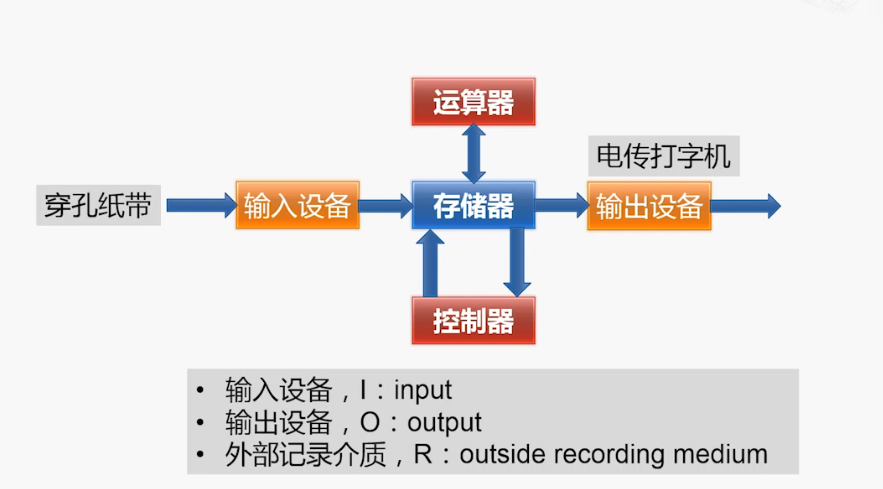

# 计算机结构的简化模型    

    

## 1、模型机的存储器    

    

 
 

## 2、模型机的控制器    

    
   

 
   

## 3、模型机的运算器    

> 运算器用于算术运算（加减乘除）和逻辑运算（与或非）。    

   

 
   

## 4.内部总线    

> 内部总线用于在CPU内部各部件之间传递数据。    

> Cre：总线(BUS)的特点是分时共享。    

## 5.计算机输入输出    

- 冯诺依曼计算机的输入输出：    

   
    

- 在模型机上增加一个输入输出设备：    

    

- 现代PC的各种输入输出设备：   

    

（END）    