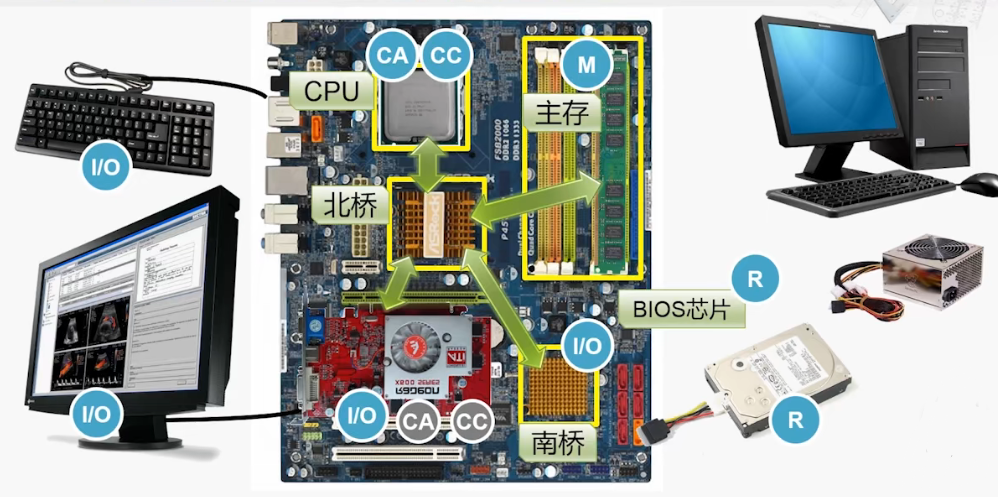
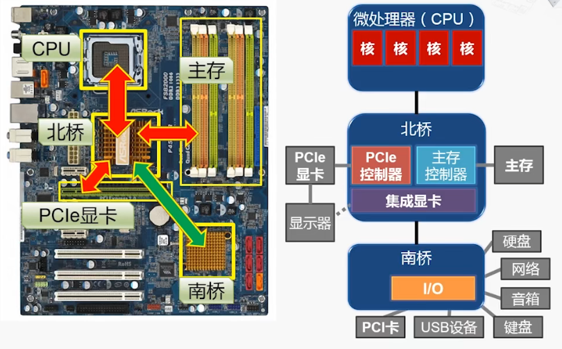
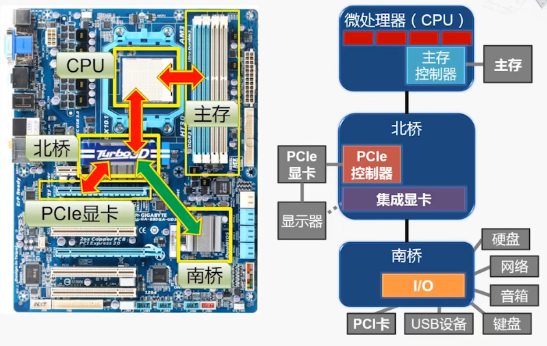
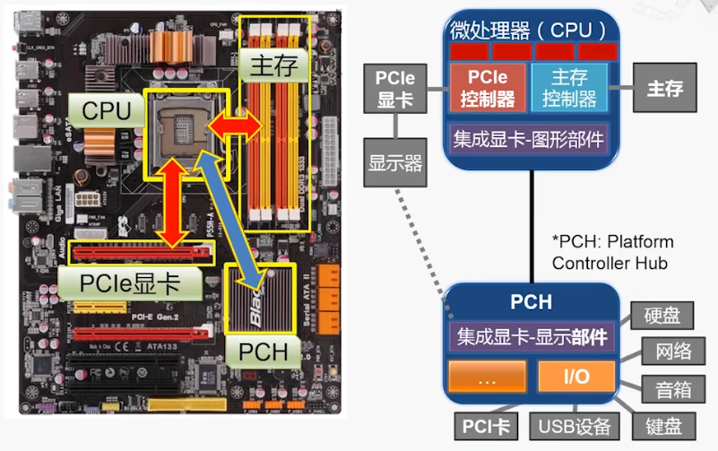

# 冯诺依曼结构在现代计算机的实现    

   

## 1、对应关系    

  

> CC：控制器    
> CA：运算器    
> M：存储器  
> I/O：输入、输出  
> R：外部记录介质  

### 注意事项：    

> BIOS(基本输入输出系统)也是外部记录介质。（和早期穿孔纸带同一类别）      
> CPU从BIOS取出第一条指令。    

> 北桥提供了各个芯片之间互相访问的通道。    
> 南桥芯片集中了很多输入输出的控制器。    
> 整个南北桥的结构一直在发生着变化。    

   
   

## 2、主板架构的演变    

### 南北桥架构的演变(1)：    

  

### 南北桥架构的演变(2)：    

  

### 南北桥架构的演变(3)：    

  

### 系统芯片(System-on-a-Chip, SoC)：    

  

(END)    