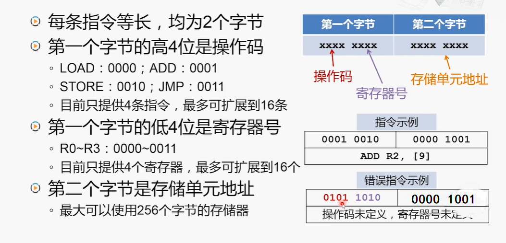

# 设计自己的计算机 -- 一个简单的指令系统      

> Baike：指令系统是计算机硬件的语言系统，也叫机器语言，指机器所具有的全部指令的集合，它是软件和硬件的主要界面，反映了计算机所拥有的基本功能。    

<bt />

## 1、指令类型    

> M、L为存储器地址，R为寄存器编号。    

### 运算类指令：    
ADD R,M     将R的内容与M的内容相加后存到R    

### 传送类指令：    
LOAD R,M        将M的内容装入R    
STORE M,R       将R的内容存入M    

### 转移类指令：    
JMP L       无条件转向L处    

<bt />
<bt />

## 2、指令格式    

 
 

## 3、指令执行过程        

### 存储器中的程序：    

  

### CPU执行指令：    

  

（END）    